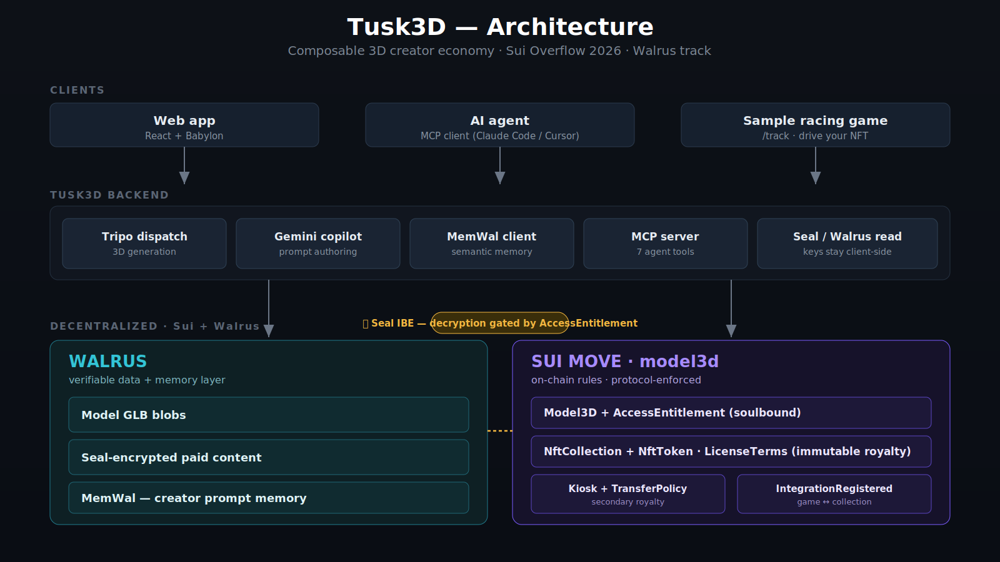

# Tusk3D

**Carve. Mint. Riff.** — a Sui-native composable creator economy for 3D game assets.

Tusk3D is a Sui-native rights layer for 3D game assets: the license is enforced on-chain by Move — not by a platform's terms of service — and travels with the file. A creator publishes a base model (from a text prompt or a GLB upload) to [Walrus](https://docs.wal.app/) under terms they set. Anyone can buy access **once** for a **soulbound entitlement** that can't be resold or revoked — and that same entitlement is both the consumer view _and_ the right to **fork** the base into a tradeable collection of repainted variants, batched into Walrus quilts. Restricted bases are encrypted with [Seal](https://seal-docs.wal.app/) and unlock only for the on-chain entitlement holder. The 3D generator (Tripo) is a swappable upstream commodity; the durable product is the contract. The goal: make it easy for creators to bring tokenized 3D into their own games and experiences, give holders a reason to _use_ — not just hold — what they bought, and let a community grow around the content itself. AI is first-class here: a copilot backed by **Walrus-native memory** helps authors create, and the whole protocol is exposed to **AI agents over MCP**.

> **Status**: Sui Overflow 2026 submission, **Walrus track**. Live on **Sui testnet** — package `0xbf0affb8…02d1`. Security-audited (D-085…D-089). Demo recording in progress.
> Built for [Sui Overflow 2026](https://overflow.sui.io/). Submission deadline **2026-06-21**.

---

## What it does

Most "NFT collection" products ship N variants of one base mesh (think BAYC traits) but pay for it with N storage uploads and a wall of wallet popups, and they gate access with mutable off-chain metadata. Tusk3D makes both protocol-native on Sui + Walrus:

- **One base, paid access, real forks.** A creator publishes a `Model3D` (the base content) once. Buyers pay an `access_fee` **a single time** for a soulbound `AccessEntitlement` — a permanent, non-transferable receipt. That entitlement is both the consumer view _and_ the precondition to forking.
- **Forks are tradeable collections.** An entitlement holder pays a per-launch derive fee to `launch_collection`, receives a soulbound creator cap, and mints `NftToken`s — paint-variants of the base mesh batched into **Walrus quilts** (up to 4 variants share one blob as internal byte-range patches; `⌈N/4⌉` quilts overall — **4× fewer stores** than one-blob-per-variant). Tokens are Kiosk-placeable and resell under their own `TransferPolicy`.
- **Owned assets are made to be used.** Because every variant lives at a stable Walrus patch URL, a creator can pull tokenized 3D straight into their own game or experience — our demo loads owned variants into a Havok [Tiny Racetrack](#the-demo-arc) and drives them as rigid bodies, with creator download-and-adapt on the roadmap.
- **Restricted content is actually private.** `allow_list` / `restricted` bases are encrypted with Seal envelope encryption; decryption is gated by the on-chain `AccessEntitlement`, not by a server check.
- **Agent-native commerce.** The whole protocol is also exposed as an MCP server — an AI agent with its own wallet can search models, read on-chain license terms, buy access, and decrypt content, with no backend key exposure.

### Architecture (live on testnet)

<p align="center">
  
</p>

```
L1  Model3D              Creator publishes a base GLB to Walrus + sets LicenseTerms
    + AccessEntitlement    (policy: permissionless | allow_list | restricted, access_fee,
                           derivative_mint_fee, royalty_bps). allow_list/restricted bases
                           are Seal-encrypted. A buyer pays access_fee ONCE → soulbound
                           AccessEntitlement (key-only, non-transferable) that unlocks Seal
                           decryption AND authorizes a fork.
        │ fork  (hold entitlement + pay per-launch derive fee)
        ▼
L2  NftCollection        A holder launches a collection (1-layer max), holds a soulbound
    + NftToken             NftCollectionCreatorCap, and mints tradeable NftTokens. N paint-
                           variants share ONE Walrus quilt blob (N patches). base_royalty_bps
                           is snapshot at launch, hard-capped ≤ 30%. NftTokens are key+store →
                           Kiosk-placeable, resellable under their own TransferPolicy.
        │ register  (gameDev pays register_fee)
        ▼
    IntegrationRecord    Games register a B2B integration against a collection. The same
                           Walrus patch URL drives the marketplace thumbnail and the game asset.
```

`AccessEntitlement` is a one-time, soulbound (`key` only, no `store`) L1 receipt — **not** a third tier. It gates `seal_approve_entitlement` decryption and `launch_collection_with_entitlement`. The old "L3 Access" framing is retired (D-078).

---

## AI layer

AI is core to Tusk3D, not garnish — and it leans on Walrus for the part that's usually missing: **memory**.

- **Riff Copilot.** A Gemini-backed conversational copilot at `/create` turns a rough idea into a precise generation prompt, so authors don't have to guess at prompt syntax (D-080 / D-081).
- **MemWal — Walrus-native memory.** Every published prompt is stored to [MemWal](https://www.npmjs.com/package/@mysten-incubation/memwal), a verifiable memory layer on Walrus. Back at `/create`, a creator sees their own past work as clickable "riff on your past creations" chips plus prompts from the community — and the copilot folds that memory into its context, so it riffs in your style. This is the "memory" half of Walrus's _verifiable data **and** memory_ layer.
- **Agent interface (MCP).** The whole protocol is exposed as a 7-tool MCP server, so an AI agent with its own wallet can discover models, list fork collections, read license terms, buy access, and decrypt content — agent-native commerce on Sui, no backend key exposure. `claude mcp add tusk3d https://api.tusk3d.store/mcp`
- **Vision captioning.** GLB uploads are auto-captioned for search and discovery (D-082).
- **Honest degradation.** Every AI surface degrades _visibly_ to "AI UNAVAILABLE" rather than silently disappearing (D-084).

---

## What's Sui / Walrus-specific

Four things that are load-bearing here and would not port cleanly to other chains:

1. **Walrus quilt batching.** Up to 4 collection variants share **one** Walrus blob, each addressable by a byte-range patch id — `⌈N/4⌉` quilts for N variants, **4× fewer stores** than one-blob-per-variant. The same patch URL feeds both the marketplace preview and the in-game mesh.
2. **Soulbound by Move ability, not by runtime guard.** `AccessEntitlement` and `NftCollectionCreatorCap` are `has key` only — _no_ `store`. Non-transferability is a type-system guarantee; the equivalent on an account-based chain needs a custom transfer-guard contract.
3. **Seal decryption gated on an on-chain object.** `seal_approve_entitlement` proves you hold the entitlement before the key unwraps. Encryption is _derived_ from the license policy at publish (not a decorative flag), and the `seal_id` is fixed at 32 bytes to close a prefix-truncation bypass (D-085).
4. **Memory lives on Walrus, not a vendor silo.** MemWal keeps creator prompt-memory as a verifiable layer on Walrus — the copilot's recall is portable and outlives any single app, which a centralized embedding store can't promise. The "memory" in Walrus's data-and-memory pitch, used literally.

---

## Stack

- **Smart contract**: Sui Move 2024 — `model3d::model3d` package (testnet `0xbf0affb8d02ab9133ebe308cef7e163a6ea0010f823123481720773ff32802d1`)
- **Storage**: [Walrus](https://docs.wal.app/) — `@mysten/walrus@1.1.7` + `@mysten/walrus-wasm@0.2.2`, browser upload via relay. L2 collections use **quilt batching** (1 blob, N byte-range patches). Read path accelerated via a Cloudflare Worker at `cdn.tusk3d.store` (D-073)
- **Encryption**: [Seal](https://seal-docs.wal.app/) — `@mysten/seal@1.1.3`. Envelope encryption (AES-256-GCM data key wrapped by Seal threshold IBE); encryption derived from license policy; decryption gated by the soulbound `AccessEntitlement`
- **Frontend**: React + Vite + [Babylon.js](https://www.babylonjs.com/) (imperative wrapper, no `react-babylonjs` per D-007) + [`@babylonjs/havok`](https://doc.babylonjs.com/features/featuresDeepDive/physics/) for the racetrack physics
- **Auth**: `@mysten/dapp-kit@1.0.6` + `@mysten/slush-wallet@1.0.5` (Slush is the primary wallet path; zkLogin via [Enoki](https://docs.enoki.mystenlabs.com/) `@mysten/enoki@1.0.7` Google sign-in is **planned**, not yet wired)
- **Sui SDK**: `@mysten/sui@2.16.2`
- **Backend**: Node 22 LTS + [Hono](https://hono.dev/) + [`@gltf-transform/core`](https://gltf-transform.dev/) — base-mesh material-swap for variant authoring; Tripo dispatch
- **Generator**: [Tripo](https://www.tripoai.com/) — prompt → base GLB (`text_to_model` → `mesh_segmentation`, two-step, server-chained per D-045). SUI-fee-gated (D-034)
- **Riff Copilot** (L2 authoring): Gemini via `@ai-sdk/google`, with a Walrus-backed agent-memory layer ([MemWal](https://www.npmjs.com/package/@mysten-incubation/memwal) `@mysten-incubation/memwal@0.0.6`, D-080/D-081). Vision captioning for uploads (D-082). Degrades visibly to "AI UNAVAILABLE" — never silently hidden (D-084)
- **Agent interface (MCP)**: a deployed [Model Context Protocol](https://modelcontextprotocol.io/) server at `/mcp` (7 tools — `search_models`, `get_model`, `get_license_terms`, `get_preview`, `list_fork_collections`, `build_purchase_tx`, `download_content`) lets an AI agent discover, license, buy, and decrypt assets directly — keys stay client-side. Advertised via `/llms.txt`; add with `claude mcp add tusk3d https://api.tusk3d.store/mcp`
- **Marketplace** (in progress): Sui Kiosk + `TransferPolicy` — protocol-level royalty enforcement on `NftToken` resales

---

## The demo arc

The full loop runs across these routes (no `/forge` — L1 publish and L2 launch are separate steps):

| Route                | Tier | What happens                                                                                                                             |
| -------------------- | ---- | ---------------------------------------------------------------------------------------------------------------------------------------- |
| `/`                  | —    | Landing — the L1 → L2 lifecycle story                                                                                                    |
| `/create`            | L1   | Carve a base: Tripo prompt **or** GLB upload → tag parts → set license → Seal-encrypt (if gated) → Walrus → `publish` a shared `Model3D` |
| `/browse`, `/market` | —    | Browse published bases and launched collections                                                                                          |
| `/model/:objectId`   | L1   | Base detail → buy access (mint soulbound `AccessEntitlement`)                                                                            |
| `/launch`            | L2   | Hold an entitlement → pick paint-variants → 1 Walrus quilt + 1 PTB → `NftCollection` + `NftToken`s                                       |
| `/collection/:slug`  | L2   | Collection detail → variant grid → buy / collect tokens                                                                                  |
| `/integrate`         | —    | Register a game integration against a collection                                                                                         |
| `/track`             | —    | Babylon + Havok racetrack — WASD-drive the variants you own, loaded from the same Walrus quilt patch                                     |
| `/mcp` (API)         | —    | AI-agent path — search → read license → buy access → decrypt, via 7 MCP tools (`claude mcp add tusk3d https://api.tusk3d.store/mcp`)     |

---

## Use it from an AI agent (MCP)

The whole protocol is exposed as a [Model Context Protocol](https://modelcontextprotocol.io/) server (Streamable HTTP, protocol `2025-11-25`). Point any MCP client at it:

```bash
# Claude Code
claude mcp add tusk3d https://api.tusk3d.store/mcp
```

Then ask in plain language. **Discovery / read tools are public — no auth, no payment:**

- _"Search Tusk3D for low-poly race cars"_ → `search_models`
- _"Show the price and license terms for model 0x…"_ → `get_model` / `get_license_terms` / `get_preview`
- _"List the fork collections built on that base"_ → `list_fork_collections`

**Buy + decrypt tools** (`build_purchase_tx`, `download_content`, and personal-scope `search_models`) need a one-time bearer token — _no payment, just a signature_:

1. `POST /api/auth/challenge` → nonce
2. Sign the nonce as a personal message with your agent's Sui keypair
3. `POST /api/auth/verify` → JWT
4. Reconnect passing the header, e.g. `claude mcp add tusk3d --header "Authorization: Bearer <jwt>" https://api.tusk3d.store/mcp`

`build_purchase_tx` returns an **unsigned, dry-run-validated PTB** the agent signs itself; `download_content` returns only Seal decrypt material — the backend never holds a key. The agent's keypair must carry testnet SUI to pay an `access_fee`.

Full machine-readable manifest: <https://api.tusk3d.store/llms.txt>

---

## Run locally

**Prerequisites**: Node 22 LTS (via [nvm](https://github.com/nvm-sh/nvm)) + pnpm + (for the contract) Sui CLI.

```bash
nvm use                                        # picks up .nvmrc
pnpm install                                   # installs all workspaces
cp backend/.env.example backend/.env           # then set JWT_SECRET (see below)
cp frontend/.env.example frontend/.env.local   # VITE_MODEL3D_PACKAGE_ID is the testnet id above
pnpm dev                                        # backend (:3001) + frontend (:5173)
```

Generate a JWT secret:

```bash
node -e "console.log(require('crypto').randomBytes(48).toString('hex'))"
# paste into backend/.env as JWT_SECRET=...
```

Open <http://localhost:5173>. Browsing the marketplace needs no auth. The full carve → publish → buy → fork → drive loop needs a wallet (Slush works without extra setup) plus, for the prompt-generation and AI-copilot paths, these backend keys:

```bash
# Append to backend/.env:
TRIPO_ENABLED=true
TRIPO_API_KEY=<your_tripo_key>     # base-mesh generation (prompt mode is SUI-fee-gated)
GOOGLE_GENERATIVE_AI_API_KEY=<key> # Riff Copilot + upload captioning (degrades to "AI UNAVAILABLE" if absent)
```

### Tests

```bash
cd contracts/model3d && sui move test      # 87 Move unit tests (entry-fn coverage + red-team cases)
cd backend  && pnpm vitest run             # 34 test files (421 cases)
cd frontend && pnpm vitest run             # 111 test files (1248 cases)
```

---

## Repository structure

```
.
├── CLAUDE.md            # Session protocol for AI agents
├── docs/
│   ├── spec.md          # Full specification (architecture, decisions, plan)
│   ├── decisions.md     # ADR log (D-001 … D-112)
│   ├── phase-progress.md# Current progress
│   ├── process.md       # Architecture snapshot (endpoints, env, flow)
│   ├── open-questions.md
│   ├── brainstorms/  plans/  solutions/
├── shared/              # types shared by browser + backend
├── backend/             # Node 22 + Hono — Tripo dispatch, variant material-swap, Riff Copilot
├── frontend/            # React + Vite + Babylon (imperative) + Havok
├── contracts/           # Sui Move 2024 — model3d::model3d
└── pitch/               # demo-video-rundown.md, demo-vo-script(-en).md, architecture-diagram.svg, brand/
```

---

## License

[Apache-2.0](LICENSE) — © 2026 Tusk3D Contributors.

---

## Submission details

- **Network**: Sui testnet
- **Package ID**: `0xbf0affb8d02ab9133ebe308cef7e163a6ea0010f823123481720773ff32802d1`
- **Sui Scan**: https://suiscan.xyz/testnet/object/0xbf0affb8d02ab9133ebe308cef7e163a6ea0010f823123481720773ff32802d1
- **Demo URL**: https://tusk3d.store
- **Demo video** (≤ 5 min, YouTube): https://www.youtube.com/watch?v=so_VItiy3fg
- **Mainnet package ID**: TBA
- **Contact**: talon.takashi@gmail.com
