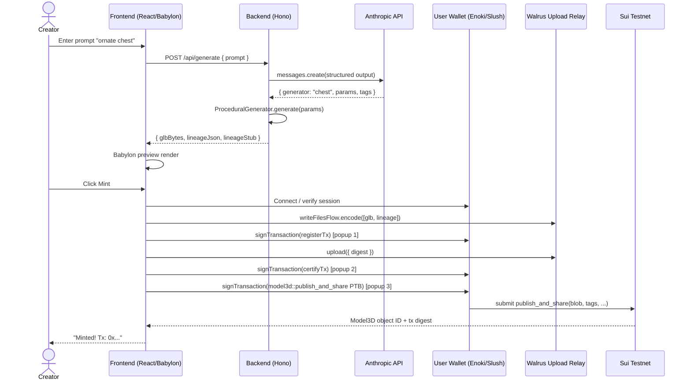
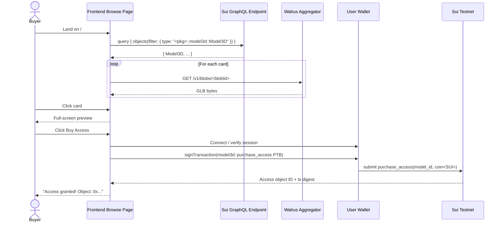

# Phase 2 — Sui Integration

## Summary

Wire the Phase 1 local-only scaffold into Sui testnet end-to-end: write and deploy the `model3d::model3d` Move package, drive Walrus uploads from the browser via `writeFilesFlow`, sign users in with Enoki Google zkLogin or Slush wallet, replace `HardcodedRouter` with an `AnthropicRouter` that uses structured output, slot in a `TripoGenerator` behind the `Generator` interface (env-gated, seed-only for demo per D-014), and ship the **Browse-first marketplace** UI that lets any visitor browse on-chain `Model3D` objects and buy `Access` to one. By end of Phase 2, a creator types a prompt and ends up with a Model3D NFT on testnet, and a separate buyer with a different wallet can Browse, click a card, and end up with a soulbound `Access` receipt.

This is the largest single phase in the 5-phase plan. The Phase 1 architecture seams (`Generator` interface, `Router` interface, `LineageRecord` shape in `shared/src/types.ts`) were designed to absorb exactly this work without refactoring the boundary between browser, backend, and shared types.

---

## Problem Frame

Phase 1 closed today with a working local loop: shape picker → procedural GLB → Babylon preview, no chain, no Walrus, no LLM. Phase 2 must convert this into a real demo that satisfies the Sui Overflow 2026 Walrus track on three dimensions:

1. **Real on-chain artifacts** — judges open Sui Explorer, see a `Model3D` object owned by the creator wallet and an `Access` object held by a buyer wallet, both linked to a Walrus blob ID that resolves to a renderable GLB.
2. **Agentic surface (D-011 framing)** — judges see a prompt → LLM router → generator selection → lineage record on Walrus, not just a slider UI calling an API.
3. **Real marketplace behavior (D-014 reframe)** — judges land on the Browse page first (not the Generate page), see other users' published models, and can pay test SUI to buy Access. Creator-side generation is a secondary CTA, not the primary demo path.

The risk Phase 2 mitigates: discovering on demo day that any of these — Walrus WASM in Vite, Enoki sponsored tx quota, the Anthropic structured output parser, the Sui GraphQL indexer's testnet uptime, Move package type drift, Tripo polling timeout — is broken in a way that takes a day to debug. Each is wired as its own implementation unit with its own verification path so failures stay isolated.

---

## Scope Boundaries

**In scope (Phase 2):**

- Move package `model3d::model3d` in `contracts/model3d/` covering L1 (Model3D + Access) per spec §2.8, with `tags: vector<String>` added per D-014. L2 Derivative structs designed in spec but not implemented (D-013).
- Backend route refactor: `POST /api/generate` returns GLB bytes + lineage JSON + lineageStub inline; `GET /api/preview/:id` removed; `backend/tmp/` disk store removed.
- Frontend Walrus integration via `@mysten/walrus@1.1.7` + `@mysten/walrus-wasm@0.2.2` + `writeFilesFlow`, configured to use Mysten testnet upload relay (D-010).
- Auth via `@mysten/dapp-kit@1.0.6` + `@mysten/enoki@1.0.7` (Google zkLogin) + `@mysten/slush-wallet@1.0.5`. Backend issues JWT via signed-challenge verification.
- `AnthropicRouter` implementation of `Router` interface using `@anthropic-ai/sdk` + zod-validated structured output. Replaces `HardcodedRouter`.
- `TripoGenerator` implementation of `Generator` interface with async polling. Gated by `TRIPO_ENABLED` env; default off in dev/CI.
- Lineage emission: backend builds `lineage.json` per generation (prompt, LLM decision, params, generator source); returned alongside GLB bytes; frontend uploads as second blob in same Walrus write batch.
- Creator end-to-end flow: prompt → LLM route → generate → preview → Connect Wallet → Walrus upload (GLB + lineage) → PTB call `model3d::publish(blob, tags, ...)` → wallet shows `Model3D`.
- Browse page at `/` (replaces Generate at `/`): Sui GraphQL query for all `Model3D` of testnet package; grid cards with Walrus aggregator preview, creator address, price, tags.
- Buyer end-to-end flow: click Browse card → Connect Wallet → PTB call `model3d::purchase_access(model_id, payment)` → wallet shows soulbound `Access`.
- 3 new procedural generators: `sword`, `hammer`, `platform` (catalog now 7 procedural shapes).
- Per-generator normal-direction tests for new shapes (mandatory per Phase 1 cylinder-bug lesson, see phase-progress.md "Notes for Next Session").
- Testnet only — no mainnet deploy this phase (D-009; mainnet in Phase 4).

**Out of scope (deferred to Phase 4 per D-009 / D-013):**

- Sui Kiosk + TransferPolicy royalty enforcement. Phase 2 buyer flow uses direct `purchase_access` against shared Model3D; Phase 4 wraps this with a Kiosk-listing variant.
- Mainnet contract deploy + real WAL acquisition + production aggregator endpoints.
- Enoki Pro plan ($120/mo) decision for sponsored tx — Phase 2 uses Enoki sandbox testnet free tier.
- Seal encryption (`is_encrypted=true` path). Phase 2 ships `is_encrypted=false` only (spec §2.9).

**Out of scope (deferred to v1.1 per D-013):**

- L2 `Derivative` / `DerivativeApproval` Move structs and `mint_derivative_*` entry functions. Designs preserved in spec §2.8.
- Semantic catalog search via embeddings (OQ-012). Phase 2 ships tag-only filter on Browse.
- Server-side keypair lineage signing (D-011 originally proposed). v1 lineage is creator-wallet-uploaded metadata; no server identity layer.
- Forensic watermark (Phase 4 Stretch B per spec §6).

**Outside this product's identity (covered by docs/spec.md):**

- User-uploaded GLBs from external sources. Service always generates from a Generator implementation.
- Free-form NL beyond the catalog the AnthropicRouter knows. LLM either routes to a known procedural shape, routes to Tripo, or declines.
- Multi-network UI switcher. Phase 2 is testnet-only; Phase 4 adds switcher.

**Deferred to Follow-Up Work (Phase 3 per spec §6):**

- Multi-step batch agent demo ("5 dungeon props" prompt). Phase 3 adds the agent decomposition layer on top of Phase 2 router.
- Backend rate limit by Sui address (Redis) — Phase 3 production hardening.
- Production deploy (Vercel for frontend, Fly.io for backend) — Phase 3.

---

## Requirements

The acceptance criterion for Phase 2: **two separate wallets, two end-to-end flows, both visible on Sui Explorer + Walrus aggregator.**

- **Creator** (Wallet A): types "ornate wooden chest with brass fittings" → AnthropicRouter routes to procedural `chest` → preview renders in Babylon → clicks Mint → Walrus upload returns blob ID → PTB calls `model3d::publish` → Sui Explorer shows new `Model3D` object owned by Wallet A.
- **Buyer** (Wallet B): lands on `/` → sees Wallet A's chest in the grid → clicks → previews from Walrus aggregator → clicks Buy Access → pays 0.1 SUI testnet → wallet shows `Access` object whose `target_id` points to Wallet A's `Model3D`. Object is soulbound (no transfer entry).

Phase 2 advances these from `docs/spec.md`:

- §1.7 — three-layer Model3D / Access architecture **shipped on testnet** (L1 + Access only; L2 Derivative remains v1.1 deferred per D-013).
- §2.4 — browser uploads via Walrus relay (D-010); end-to-end measured against testnet relay.
- §2.5 — `writeFilesFlow` integration in browser (encode → register → upload → certify); `walrus()` SuiClient extension wired.
- §2.6 + §2.7 — Move `Model3D` wraps `walrus::blob::Blob` directly, following `SharedBlob` reference pattern (Walrus repo).
- §2.8 — Move struct and event design (Model3D + Access only for v1, plus `tags: vector<String>` field per D-014). Public `publish` + `purchase_access` entry functions plus events `ModelPublished` + `AccessPurchased`.
- §6 Phase 2 — all 10 listed workstreams (Move, Walrus, Auth, LLM router, Tripo, Lineage, Creator flow, Browse marketplace, Buyer flow, procedural generator catalog expansion).

Phase 2 also resolves these open questions inline (not in advance):

- OQ-004 — `@mysten/dapp-kit@1.0.6` actual import paths (U4 verifies on first dev day).
- OQ-005 — Walrus package ID resolution via MVR alias in `Move.toml` (U2 confirms).

---

## Key Technical Decisions

Phase-local decisions only — all major product/architecture decisions are upstream in D-001..D-014.

| # | Decision | Rationale |
|---|---|---|
| P1 | `publish_and_share` entry function wraps `publish()` + `transfer::share_object(model)` | Phase 2 buyer flow needs shared-object Model3D so any buyer wallet can call `purchase_model_access` against it. Phase 4 will add a parallel `publish_to_kiosk` variant; **caveat** (per doc-review adv-011): Sui Kiosk takes object ownership, so shared-object Model3Ds from Phase 2 cannot be retroactively placed in a Kiosk. Phase 4 either (a) accepts a bifurcated catalog (Phase 2 shared + Phase 4 kiosked coexisting in Browse) or (b) ships a migration helper that re-mints Phase 2 models. Decision deferred to Phase 4 ADR. |
| P2 | `purchase_model_access` takes `&Model3D` (not `&mut`) | Only reads `direct_access_price` + `creator`; no mutation. Allows parallel purchases on Sui (no serialization on the shared object). Function name matches spec §2.8 (was `purchase_access` in earlier draft; renamed for parity with future `purchase_derivative_access` v1.1). `duration_ms` parameter retained in signature (always 0 in Phase 2) so subscription support doesn't require Move redeploy. |
| P3 | `POST /api/generate` returns `{ glbBytes, lineageJson, lineageStub }` inline; drop `GET /api/preview/:id` and `backend/tmp/` disk store | Phase 2 frontend uploads to Walrus directly; backend stays stateless. Confirmed via call-out: "Frontend uploads directly to Walrus". |
| P4 | Auth flow: backend issues JWT after `POST /api/auth/challenge` + `POST /api/auth/verify`; frontend stores in localStorage and sends via `Authorization: Bearer` | Lightweight, demo-scale, CSRF-safe by construction (no cookies). Hono ecosystem has built-in JWT support. |
| P5 | JWT library: `hono/jwt` (built-in) with HS256 + 24h expiry | Zero extra dep; signed-challenge → verify-signature → issue-JWT pattern is well-trodden in Sui ecosystem. |
| P6 | `TRIPO_ENABLED` env flag gates Tripo route in `AnthropicRouter`; defaults to `false` | D-014 demo posture: Tripo seed-only. Same route exposed for future v1.1 creator-on-demand path. |
| P7 | Sui indexer: official Sui GraphQL endpoint `https://sui-testnet.mystenlabs.com/graphql` for Browse | Simplest path for `objects(filter: { type: "<pkg>::model3d::Model3D" })`. Fallback to `suix_queryEvents` if GraphQL endpoint is flaky. |
| P8 | Anthropic model: `claude-haiku-4-5-20251001` (per spec.md line 1149) | ~$0.001/call; demo budget trivial. Structured outputs supported. |
| P9 | Zod schema for AnthropicRouter structured-output response lives in `shared/src/types.ts` | Single source of truth; backend uses for validation, frontend can use for typing the router's decision trace in lineage preview. Matches D-012 type-sharing pattern. |
| P10 | Lineage upload uses creator's wallet (same write batch as GLB); no server-side keypair signing in v1 | Per D-014 reframe: creator owns the artifact end-to-end. Server-side signing keypair deferred to v1.1+ to keep Phase 2 surface lean. |
| P11 | `Move.toml` uses MVR alias `@walrus/core` for Walrus package address (no hardcoded address per spec §2.6 + OQ-005) | Survives Walrus package upgrades; works on both testnet and mainnet without code changes. |
| P12 | Move test suite uses `sui move test` for unit coverage of `publish`, `purchase_access`, royalty cap, soulbound Access; testnet deploy verifies the same flows against a live full node | Two layers: local unit tests catch type/logic errors fast; testnet integration catches real-world quirks (gas, object ID resolution, event indexing). |

---

## High-Level Technical Design

> *Diagrams illustrate the intended approach and are directional guidance for review, not implementation specification. The implementing agent should treat them as context, not code to reproduce.*

### Creator flow (U7)



### Buyer flow (U9)



### Boundary preservation from Phase 1

The three Phase 1 seams are preserved exactly:

- `Generator` interface (`shared/src/types.ts:59-61`) — `ProceduralGenerator`, `TripoGenerator` both implement it without changing the contract.
- `Router` interface (`shared/src/types.ts:74-76`) — `AnthropicRouter` replaces `HardcodedRouter` behind the same signature; the route handler in `backend/src/routes/generate.ts` is the only caller and doesn't need to change.
- `LineageRecord` (`shared/src/types.ts:44-52`) — Phase 1 returned `{}`; Phase 2 fills `prompt`, `llmDecision`, `generatorSource`. Schema unchanged.

The only Phase 1 contract that changes is the HTTP API endpoint shape (P3), and that change is contained within `backend/src/routes/generate.ts` + `frontend/src/lib/api.ts`.

---

## Output Structure

New directories and files created in Phase 2:

```
contracts/
└── model3d/                            # U2 — Sui Move package
    ├── Move.toml
    ├── sources/
    │   └── model3d.move                # publish, purchase_access, events
    └── tests/
        └── model3d_tests.move          # local unit tests

backend/src/
├── agent/
│   └── router.ts                       # U5 — AnthropicRouter replaces HardcodedRouter
├── generators/
│   ├── tripo.ts                        # U6 — async polling Tripo client
│   ├── tripo.test.ts
│   ├── sword.ts                        # U9 — new procedural shapes
│   ├── sword.test.ts
│   ├── hammer.ts
│   ├── hammer.test.ts
│   ├── platform.ts
│   └── platform.test.ts
├── lib/
│   ├── lineage.ts                      # U1 — lineage.json builder
│   └── tripo-client.ts                 # U6 — submit/poll/download HTTP client
└── routes/
    └── auth.ts                         # U4 — challenge/verify/JWT endpoints

frontend/src/
├── auth/                               # U4
│   ├── WalletProvider.tsx              # dApp Kit + Enoki + Slush
│   └── useSession.ts                   # JWT lifecycle
├── browse/                             # U8 — Browse page
│   ├── BrowsePage.tsx
│   ├── ModelCard.tsx
│   └── useModelIndex.ts                # Sui GraphQL query
├── buy/                                # U9 — Buyer flow
│   └── BuyAccessButton.tsx
├── creator/                            # U7 — Creator orchestration
│   └── CreatorFlow.tsx
├── walrus/                             # U3
│   ├── walrusClient.ts                 # SuiClient .$extend(walrus(...))
│   └── useWalrusUpload.ts              # writeFilesFlow hook
└── sui/
    ├── publishPtb.ts                   # U7 — PTB builder for publish_and_share
    └── purchaseAccessPtb.ts            # U9 — PTB builder for purchase_access

shared/src/
└── types.ts                            # Extended with RouterDecision (zod schema), Model3DSummary
```

The tree is a scope declaration showing the expected output shape; the per-unit `**Files:**` sections remain authoritative for what each unit creates or modifies.

---

## Implementation Units

### U1. API contract refactor (inline bytes + lineage in response)

**Goal:** Replace Phase 1's `POST /api/generate → {id}` + `GET /api/preview/:id → bytes` two-call shape with `POST /api/generate → { glbBytes, lineageJson, lineageStub }` single-call shape, and remove `backend/tmp/` disk store. Frontend updated to render from inline bytes.

**Scope note (added 2026-05-14 doc review):** This unit is a **plan-local** architectural refactor required by call-out P3 (frontend uploads to Walrus directly). It is *not* one of the 10 origin workstreams from `docs/spec.md §6 Phase 2`; it is technical scaffolding that enables U3 + U7 + U8 + U9 to interact with a stateless backend. Kept as a standalone unit (rather than folded into U7) because the API surface change affects the test fixtures all later units inherit.

**Requirements:** P3 (call-out resolution). Enables U3 + U7 + U8 + U9 to work without backend disk dependency.

**Dependencies:** None — foundational refactor, blocks U7 / U8 / U9 from working cleanly.

**Files:**
- Modify `backend/src/routes/generate.ts` — change response shape, drop disk write
- Delete `backend/src/routes/preview.ts` — endpoint removed
- Modify `backend/src/lib/schema.ts` — extend zod response schema
- Modify `backend/src/server.ts` and `backend/src/app.ts` — drop preview route mount, drop tmp dir bootstrap if any
- Modify `backend/src/routes/routes.test.ts` — update existing tests to assert new shape
- Modify `frontend/src/lib/api.ts` — `generate(...)` now returns bytes directly
- Modify `frontend/src/App.tsx` — wire bytes from `generate()` directly to Babylon loader instead of fetching from preview URL
- Modify `frontend/src/babylon/PreviewCanvas.tsx` (if needed) — accept `Uint8Array` source
- Create `backend/src/lib/lineage.ts` — `buildLineageJson({prompt, llmDecision, params, generatorSource})` builder
- Modify `shared/src/types.ts` — extend `GenerateResponse` with `glbBytes: string (base64)`, `lineageJson: string`, drop the `id` field

**Approach:**
- Server returns GLB as base64-encoded string in JSON (simpler than multipart; ~33% size overhead acceptable for a Phase 2 prototype — revisit if asset sizes balloon)
- Lineage emitted as JSON string for ease of transit; frontend converts to `Uint8Array` for Walrus upload
- `backend/tmp/` directory removed from `.gitignore` and `backend/src/server.ts` startup; no migration of existing tmp files (they were never committed)
- Frontend reads `glbBytes` base64 string, decodes to `Uint8Array`, passes straight to Babylon's `LoadAssetContainerAsync` via blob URL

**Patterns to follow:** `backend/src/routes/generate.ts` Phase 1 pattern stays — only the response builder changes. Keep zod validation on the request body.

**Test scenarios:**
- Happy path: `POST /api/generate { shape: "box", params: {width:1,height:1,depth:1} }` returns `{ glbBytes: <base64>, lineageJson: <json string>, lineageStub: {...} }` with `glbBytes` decoding to a valid GLB (starts with magic bytes `glTF`)
- Lineage shape: `lineageJson` parses as JSON and matches `LineageRecord` schema (`id`, `shape`, `params`, `generatorSource`, `createdAt`)
- Edge case: oversized response (chest with high lid radius) still returns within 5s timeout
- Error path: invalid `shape` value still returns 400 with zod error
- Removed endpoint: `GET /api/preview/:id` returns 404 (route removed)
- Integration: frontend `App.tsx` no longer makes a second fetch — assert single network call in browser DevTools (manual verification, document in PR)

**Verification:** All 26 Phase 1 route tests + 2 new tests for the new response shape pass. Frontend renders a generated box in Babylon with one API call. `backend/tmp/` no longer created on startup.

---

### U2. Move contract `model3d::model3d` + testnet deploy

**Goal:** Write the Sui Move package per spec §2.8 (L1 only — Model3D, Access, LicenseTerms, events) plus `tags: vector<String>` (D-014), test locally with `sui move test`, deploy to testnet, record `MODEL3D_PACKAGE_ID` in an env file.

**Requirements:** §2.8 Move design, D-001 (composable creator economy framing), D-002 (3-tier architecture, L1+Access shipped, L2 deferred), D-003 (license policy field exists; default `PERMISSIONLESS`), D-004 (royalty cap enforced in `publish`), D-013 (no L2 Derivative entry functions), D-014 (tags field).

**Dependencies:** None — independent workstream.

**Files:**
- Create `contracts/model3d/Move.toml` — package manifest with MVR alias `@walrus/core` and Sui framework dep
- Create `contracts/model3d/sources/model3d.move` — module `model3d::model3d` with structs Model3D, Access, LicenseTerms, events ModelPublished + AccessPurchased, entry functions `publish_and_share` + `purchase_access`
- Create `contracts/model3d/tests/model3d_tests.move` — unit tests
- Create `.env.testnet` (gitignored) — `MODEL3D_PACKAGE_ID=0x...` after deploy
- Modify `.gitignore` — ensure `.env*` excluded
- Modify `backend/src/server.ts` — load `MODEL3D_PACKAGE_ID` from env (used later by U7 + U8 + U9)
- Modify `frontend/src/sui/` (create dir) — `constants.ts` exporting `MODEL3D_PACKAGE_ID` from `import.meta.env.VITE_MODEL3D_PACKAGE_ID`
- Modify `frontend/vite.config.ts` — confirm `VITE_*` env vars are exposed
- Create `contracts/model3d/README.md` — local test + deploy commands

**Approach:**

Move structs per spec §2.8 (L1 subset). Add **two new fields** to `Model3D` beyond spec:
- `tags: vector<String>` (per D-014)
- `lineage_blob_id: String` (per doc-review feasibility finding — Walrus blob ID for the lineage.json companion blob; enables on-chain provenance verification, satisfies D-011 "verifiable memory layer" claim)

Spec §2.8's `publish()` function is amended in U2 to accept the two new fields (this is a spec update — track in `docs/spec.md` and add D-015 ADR noting the §2.8 schema change).

Public entry functions:

- `publish_and_share(blob: Blob, shape_type: String, params_json: String, name: String, tags: vector<String>, lineage_blob_id: String, direct_access_price: u64, is_encrypted: bool, license: LicenseTerms, clock: &Clock, ctx: &mut TxContext)` — calls internal `publish()` (which now accepts tags + lineage_blob_id), then `transfer::share_object(model)`. Per P1.
- `purchase_model_access(model: &Model3D, mut payment: Coin<SUI>, duration_ms: u64, clock: &Clock, ctx: &mut TxContext)` — function named per spec §2.8 (was `purchase_access` in earlier draft; renamed for parity with future `purchase_derivative_access` in v1.1). Asserts `payment.value >= model.direct_access_price`, transfers payment to `model.creator`, transfers soulbound `Access { target_id: object::id(model), holder: ctx.sender(), expires_at_ms: if (duration_ms == 0) 0 else clock.timestamp_ms() + duration_ms }` to sender, emits `AccessPurchased`. Per P2 takes `&Model3D` not `&mut`. `duration_ms` parameter kept in signature (Phase 2 frontend always passes `0` = permanent) so Phase 4 subscription support doesn't require Move package redeploy.

**Move-level input assertions** (per doc-review security finding — Move contract enforces independently of frontend zod):
- `assert!(vector::length(&tags) <= 16, ETooManyTags);`
- `assert!(string::length(&params_json) <= 4096, EParamsJsonTooLong);`
- Per-tag: `assert!(string::length(&tag) <= 32, ETagTooLong)` (iterate)
- `assert!(string::length(&name) <= 128, ENameTooLong);`
- `assert!(string::length(&lineage_blob_id) <= 128, EBlobIdMalformed);` (Walrus blob IDs are ~50 chars; 128 leaves headroom)

Add new error constants: `ETooManyTags = 10`, `ETagTooLong = 11`, `EParamsJsonTooLong = 12`, `ENameTooLong = 13`, `EBlobIdMalformed = 14`.

L2 Derivative structs (`Derivative`, `DerivativeApproval`, `mint_derivative_*` functions) **not in this unit** (D-013).

Royalty cap enforced inside `publish_and_share` via the existing `publish` assertion (`ERoyaltyTooHigh` per spec §2.8).

`is_encrypted` field shipped as `false` always for Phase 2 per spec §2.9 (Seal deferred to Phase 4 Stretch A).

`Move.toml` uses MVR alias `@walrus/core` (resolves OQ-005). Address resolution at compile time.

**MVR sanity check (per doc-review adv-005):** after `sui move build`, run `sui client object <MODEL3D_PACKAGE_ID>` and grep for `walrus_pkg::blob::Blob` in the dependency manifest. If the linked `Blob` type is from a different package address than the one published on Walrus testnet docs, abort deploy. Record the check + the resolved Walrus package address in `contracts/model3d/README.md`.

**UpgradeCap retention (per doc-review security RR-002):** deploy with `sui client publish --gas-budget 100000000`; the UpgradeCap is transferred to the publisher by default. Transfer to a known team-controlled address (NOT the publish wallet, which may rotate) immediately after deploy. Record the UpgradeCap object ID in `.env.testnet`.

**Patterns to follow:**
- `SharedBlob` from Walrus repo (spec §2.7 option A) — wraps `Blob` directly with `has key, store`, uses `share_object` for accessibility. Mirror this pattern for `Model3D`.
- `LicenseTerms` `has store, copy, drop` per spec §2.8 — needed because it's a value field of `Model3D`.
- `Access has key` only (no `store`) — soulbound by Move type system per D-002.

**Test scenarios** (Move unit tests with `sui move test`):
- Happy path: `publish_and_share` with valid LicenseTerms creates a shared Model3D, emits `ModelPublished` event with correct creator + price + policy + lineage_blob_id
- Happy path: `purchase_model_access` with `duration_ms=0` and sufficient payment creates Access owned by buyer with `expires_at_ms=0`, transfers payment to creator, emits `AccessPurchased`
- Happy path: `purchase_model_access` with `duration_ms=86400000` (24h) creates Access with `expires_at_ms == clock_now + 86400000`
- Edge case: `publish_and_share` with `derivative_royalty_bps = 3001` (above cap) aborts with `ERoyaltyTooHigh`
- Edge case: `purchase_model_access` with `payment.value < direct_access_price` aborts with `EInsufficientPayment`
- Edge case: `publish_and_share` with empty `tags` vector succeeds (tags optional)
- Edge case: `publish_and_share` with 10-element `tags` vector succeeds
- **Input bound assertions (new per doc review):**
  - `publish_and_share` with 17-element tags vector aborts with `ETooManyTags`
  - `publish_and_share` with one tag of 33 chars aborts with `ETagTooLong`
  - `publish_and_share` with `params_json` of 4097 chars aborts with `EParamsJsonTooLong`
  - `publish_and_share` with `name` of 129 chars aborts with `ENameTooLong`
  - `publish_and_share` with `lineage_blob_id` of 129 chars aborts with `EBlobIdMalformed`
- Soulbound invariant (compile-time, not runtime test): Move compiler refuses to compile a function that calls `transfer::transfer<Access>(...)` outside this module (verified by attempting to write such a function in a test file and observing compile failure — document outcome in PR)
- Free access: `purchase_model_access` with `direct_access_price = 0` and `duration_ms = 0` succeeds with empty payment coin
- Boundary: `purchase_model_access` with `payment.value == direct_access_price` exactly succeeds

**Verification:**
- `sui move test` passes all unit tests locally
- `sui client publish --gas-budget 100000000` to testnet succeeds; package ID captured in `.env.testnet`
- Sui Explorer URL for the deployed package documented in `contracts/model3d/README.md`
- One manual e2e publish + one manual e2e purchase_access via `sui client call` succeed against testnet, producing visible Model3D and Access objects in Explorer

---

### U3. Walrus frontend wiring (WASM + writeFilesFlow + upload relay)

**Goal:** Wire `@mysten/walrus@1.1.7` + `@mysten/walrus-wasm@0.2.2` into the frontend so the creator flow (U7) can upload GLB + lineage to Walrus testnet from the browser via the Mysten upload relay (D-010).

**Requirements:** D-008 (SDK version lock), D-010 (upload relay), spec §2.4 + §2.5 (`writeFilesFlow` API), spec §2.11 (Vite WASM bundling gotchas).

**Dependencies:** None — independent setup; U7 will consume the hook.

**Files:**
- Modify `frontend/package.json` — add `@mysten/walrus@1.1.7`, `@mysten/walrus-wasm@0.2.2`, `@mysten/sui@2.16.2`
- Modify `frontend/vite.config.ts` — configure WASM URL import per spec §2.5 (e.g., `assetsInclude: ['**/*.wasm']` or equivalent); confirm Vite serves the WASM correctly
- Create `frontend/src/walrus/walrusClient.ts` — exports `getWalrusClient(network: 'testnet')` returning a `SuiClient` with `.$extend(walrus({...}))` configured for testnet relay `https://upload-relay.testnet.walrus.space` with `sendTip: { max: 1_000 }`
- Create `frontend/src/walrus/useWalrusUpload.ts` — React hook returning `uploadFiles(files: File[] | Uint8Array[], wallet: WalletAccount) => Promise<{ blobIds: string[], blobObjects: BlobObject[] }>`. Internally drives `writeFilesFlow`: encode → executeRegister (popup 1) → upload → executeCertify (popup 2). Returns blob IDs and the Walrus `Blob` move objects (needed by U7 to feed into `publish_and_share`)
- Create `frontend/src/walrus/walrusClient.test.ts` — unit tests with mocked SDK
- Modify `frontend/src/test/setup.ts` if needed — mock `@mysten/walrus-wasm` for Vitest

**Approach:**
- WASM URL import per spec §2.5: `import walrusWasmUrl from '@mysten/walrus-wasm/web/walrus_wasm_bg.wasm?url'`
- `SuiClient` constructed with testnet fullnode URL; `.$extend(walrus({...}))` adds the `client.walrus.*` namespace
- `useWalrusUpload` hook surfaces three loading states: `encoding`, `awaiting-register-signature`, `uploading`, `awaiting-certify-signature`, `done`, `error` — frontend U7 will render UI feedback on each
- Hook accepts an array of files (or `Uint8Array` blobs) so a single call uploads both GLB + lineage in one Walrus write batch (avoids double-popup hell)
- Network parameter (`testnet` vs `mainnet`) hardcoded to `testnet` in Phase 2; Phase 4 adds switcher
- Error handling: wallet rejection → resolves to `{ status: 'rejected' }`, relay timeout → `{ status: 'error', reason: 'relay-timeout' }`

**Patterns to follow:**
- spec §2.5 code samples (verified API shape — `client.walrus.writeFilesFlow({ files })`, then `.encode()`, `.executeRegister(...)`, `.upload(...)`, `.executeCertify(...)`)
- Phase 1 imperative React wrapper pattern from `frontend/src/babylon/PreviewCanvas.tsx` (D-007) — refs + useEffect for setup/teardown

**Test scenarios:**
- Happy path (mocked SDK): `uploadFiles([glbBytes, lineageBytes], wallet)` returns 2 blob IDs and 2 `Blob` objects; hook state machine visits `encoding → awaiting-register-signature → uploading → awaiting-certify-signature → done`
- Error: wallet rejects register tx → hook returns `{ status: 'rejected' }`, no upload happens
- Error: relay returns 502 during upload → hook returns `{ status: 'error', reason: 'relay-timeout' }`
- Edge case: empty file array throws (validate at hook entry)
- Edge case: 10MB blob succeeds (large GLB)
- Integration scenario (manual e2e): with a real testnet wallet (env-gated, skipped in CI), upload 1KB blob to testnet relay, confirm returned blob ID resolves at `https://aggregator.walrus-testnet.walrus.space/v1/blobs/<id>`

**Verification:**
- All mocked tests pass in Vitest
- Frontend builds with no Vite errors related to WASM
- Manual smoke test: `pnpm --filter frontend dev`, open `/walrus-test` (temporary dev page) with a `Connect Slush + Upload Test Blob` button — confirm 2-popup flow + blob ID resolves to bytes via aggregator URL

---

### U4. Auth — dApp Kit + Enoki + Slush + JWT challenge

**Goal:** Ship the full Phase 2 auth surface — dApp Kit 1.0 wallet provider, Enoki Google zkLogin, Slush wallet extension support, backend signed-challenge → JWT endpoints. Buyer flow and Creator flow both depend on this for transaction signing.

**Requirements:** Per call-out: "Both Enoki Google zkLogin + Slush wallet" in Phase 2. D-008 SDK lock. OQ-004 verification.

**Dependencies:** None — independent surface; consumed by U7 + U9.

**Files:**
- Modify `frontend/package.json` — add `@mysten/dapp-kit@1.0.6`, `@mysten/enoki@1.0.7`, `@mysten/slush-wallet@1.0.5`
- Create `frontend/src/auth/WalletProvider.tsx` — wraps app with dApp Kit's `<SuiClientProvider>` + `<WalletProvider>`, registers Enoki + Slush wallet providers
- Create `frontend/src/auth/useSession.ts` — hook returning `{ session: { address, jwt } | null, connect(), disconnect(), challenge(), verify() }`
- Create `frontend/src/auth/SignInButton.tsx` — UI: "Sign in with Google" (Enoki) + "Connect Slush Wallet" buttons
- Modify `frontend/src/main.tsx` — wrap `<App/>` in `<WalletProvider>`
- Create `backend/src/routes/auth.ts` — `POST /api/auth/challenge` returns nonce; `POST /api/auth/verify { signature, publicKey, address, nonce }` verifies via `@mysten/sui` signature verification, issues JWT
- Modify `backend/src/server.ts` — mount auth routes
- Modify `backend/src/lib/schema.ts` — zod schemas for auth payloads
- Create `backend/src/lib/jwt.ts` — `signSession(address)` + `verifySession(token)` using `hono/jwt`
- Create `backend/src/routes/auth.test.ts` — challenge/verify tests
- Modify `frontend/src/test/setup.ts` — mock dApp Kit hooks if tests need it
- Add `JWT_SECRET` to `.env.example` and document in README

**Approach:**

Frontend:
- dApp Kit 1.0 `WalletProvider` is the root; Enoki + Slush register via `<EnokiNetworkConfigProvider>` and `<SlushWalletProvider>` (exact API per OQ-004 verification on first day of unit work)
- `useSession` hook flow: user clicks SignIn → wallet connects → frontend calls `POST /api/auth/challenge` → wallet signs nonce → frontend calls `POST /api/auth/verify { signature, publicKey, address, nonce }` → backend verifies signature using `@mysten/sui/cryptography/verify` → backend returns JWT → frontend stores in localStorage
- Subsequent requests include `Authorization: Bearer <jwt>` header (P4)

Backend:
- `/api/auth/challenge`: generates 32-byte nonce, stores in in-memory Map keyed by **nonce** (NOT by address — per doc-review, address-keyed silently overwrites in-flight challenges when user clicks Sign In twice), 5-min TTL; returns `{ nonce }`. **Phase 2 limitation acknowledged:** single-process only — backend restart between challenge and verify invalidates pending sign-ins. Phase 3 Redis migration covers this; documented in Risk R7 below and System-Wide Impact.
- `/api/auth/verify`: looks up nonce, verifies signature, removes nonce from map (single-use), returns `{ jwt: signSession(address) }`. Uses **`@mysten/sui/cryptography/verify`'s `verifyPersonalMessage(message, signatureWithFlag)`** which (a) reads the scheme flag byte (0x00 = Ed25519, 0x01 = Secp256k1, 0x02 = Secp256r1, 0x05 = zkLogin multisig) from the signature, (b) verifies against the embedded public key, (c) derives the Sui address from the public key + flag byte using `toSuiAddress()`. Address-mismatch check: derived address must equal the `address` claimed in the request body, else reject.
- Accepted schemes for Phase 2: Ed25519 (Slush wallet default) + zkLogin (Enoki Google). Secp256k1 + Secp256r1 accepted opportunistically (Slush may use either depending on user import).
- **Startup validation:** if `process.env.JWT_SECRET` is missing or shorter than 32 bytes, abort startup with explicit error (do not run with a weak/missing secret). Same for `ANTHROPIC_API_KEY` validation (presence only; format unverified).
- **Log suppression:** Hono error middleware catches all exceptions; never include `error.message` raw in HTTP response body — always map to a generic error code + log full trace server-side. Specifically protects against Anthropic SDK error objects leaking Authorization headers in error traces.
- JWT payload: `{ sub: address, iat, exp }`, HS256, 24h expiry per P5

OQ-004 resolution: on first day of U4, run `pnpm --filter frontend dev` and import dApp Kit symbols to verify the actual package layout. If imports break, document the corrected paths inline and update `docs/open-questions.md` with resolution.

**Patterns to follow:**
- Hono JWT middleware pattern (one-liner `app.use('/api/protected/*', jwt({ secret: ... }))`) for protecting future routes if needed
- Phase 1's zod-validated route handler pattern (`backend/src/routes/generate.ts`)

**Test scenarios:**

Backend:
- Happy path: `POST /api/auth/challenge { address: "0x..." }` returns `{ nonce: <32-byte hex> }`; same address called twice returns two different nonces; both stay valid (nonce-keyed storage)
- Happy path: `POST /api/auth/verify` with valid Ed25519 signature returns `{ jwt: <jwt> }`; jwt decodes to `{ sub: address }`
- Happy path: `POST /api/auth/verify` with valid zkLogin (Enoki) signature returns `{ jwt }` — verify scheme flag dispatch works
- Happy path: `POST /api/auth/verify` with valid Secp256k1 signature returns `{ jwt }`
- Error: `POST /api/auth/verify` with unknown nonce returns 401
- Error: `POST /api/auth/verify` with valid nonce but wrong signature returns 401
- Error: address mismatch between claimed and publicKey-derived returns 401
- Error: signature with unsupported scheme flag byte returns 401 with `unsupported_scheme` error code
- Edge case: nonce older than 5 min returns 401 (expired) — **note: Phase 2 in-memory; test scenario is process-local only**
- Edge case: re-using a nonce twice — second call returns 401 (consumed)
- JWT lifecycle: `signSession(address)` then `verifySession(token)` returns address; expired token rejected
- **Startup validation:** server refuses to start if `JWT_SECRET` env var is missing or shorter than 32 bytes
- **Error suppression:** triggering a 502 (e.g., Anthropic SDK throws) returns a generic JSON body, not the raw error.message

Frontend (mocked):
- `useSession.connect()` calls dApp Kit `useConnectWallet` and resolves with address
- `useSession.disconnect()` clears localStorage JWT and disconnects wallet
- `useSession.challenge() → verify()` happy path mocks both backend calls, asserts JWT stored

Integration (manual e2e — env-gated, not CI):
- Real Slush wallet → click Connect → click SignIn → JWT appears in localStorage → page reload preserves session
- Real Enoki Google → click Sign in with Google → OAuth popup → session active

**Verification:**
- All unit tests green
- Manual e2e: Sign in via Slush and via Enoki Google both produce valid JWT and persistent session in browser
- OQ-004 entry in `docs/open-questions.md` moved to Resolved section with confirmed import paths

---

### U5. AnthropicRouter (replace HardcodedRouter)

**Goal:** Replace Phase 1's `HardcodedRouter` with `AnthropicRouter` that uses `@anthropic-ai/sdk` with zod-schema-driven structured output. Takes a prompt string, returns `{ generator: ShapeId | "tripo", params, tags }`. Implements the same `Router` interface so `backend/src/routes/generate.ts` and `frontend/src/lib/api.ts` don't change.

**Requirements:** D-011 (agentic framing), D-014 (LLM also extracts tags), P8 (Haiku model), P9 (zod schema in shared/).

**Dependencies:** Uses `shared/src/types.ts` zod schema. Replaces `backend/src/agent/router.ts` HardcodedRouter. U7 consumes through unchanged Router interface.

**Files:**
- Modify `backend/package.json` — add `@anthropic-ai/sdk@^0.30.x` (latest stable as of 2026-05)
- Modify `shared/src/types.ts` — add zod schema `RouterDecisionSchema = z.object({ generator: z.enum(['box', 'chest', 'cylinder', 'sphere', 'sword', 'hammer', 'platform', 'tripo']), params: z.discriminatedUnion('shape', [...all 7 procedural param schemas + TripoParams]), tags: z.array(z.string()).max(10) })` + inferred type `RouterDecision`. Catalog enum must be kept in sync with U10's added shapes — single source of truth is the `ShapeId` type extended in U10.
- Modify `backend/src/agent/router.ts` — `AnthropicRouter` class implements `Router`. Internal: builds system prompt enumerating catalog + Tripo, calls `client.messages.create({ model: "claude-haiku-4-5-20251001", tools: [{ name: 'route', input_schema: routerDecisionJsonSchema }], tool_choice: { type: 'tool', name: 'route' } })`, parses tool_use response, validates with zod, constructs `RouteResult` selecting the right Generator from a registry
- Modify `backend/src/agent/router.test.ts` (extend Phase 1 tests) — mock Anthropic SDK responses
- Modify `backend/src/server.ts` — instantiate `AnthropicRouter` with `process.env.ANTHROPIC_API_KEY`; fall back to `HardcodedRouter` if env missing (graceful dev mode)
- Modify `backend/src/routes/generate.ts` — request body now accepts `{ prompt: string }` (LLM mode) OR `{ shape, params }` (direct mode, for Phase 1 sliders + tests); router picks mode by branching on presence of `prompt`
- Add `ANTHROPIC_API_KEY` to `.env.example`

**Approach:**
- Anthropic structured output: use Claude's tool-use mechanism with a single tool `route` whose `input_schema` is the JSON Schema serialization of `RouterDecisionSchema` (via `zod-to-json-schema`)
- Fallback chain: if Anthropic returns malformed response (rare), router throws → route handler returns 502; frontend shows generic error. Don't try to "self-heal" — fail fast.
- System prompt enumerates the 7 procedural shapes by name + ranges, plus the `tripo` route, plus instructions to extract 1-5 tags
- `HardcodedRouter` retained as fallback / dev-mode option (controlled by env). Tests can use HardcodedRouter to avoid Anthropic dependency.
- Tripo selection: AnthropicRouter returns `generator: "tripo"` only when prompt is for a shape not in the procedural catalog. If `TRIPO_ENABLED=false`, fall through to a friendly error: "This shape is creator-only — try a procedural shape" (gated per D-014 demo posture, P6).

**Patterns to follow:**
- Phase 1 `HardcodedRouter` (`backend/src/agent/router.ts`) — same class shape, same return type
- Anthropic SDK docs structured-output pattern (per spec line 1149 + linked docs)

**Test scenarios:**
- Happy path (mocked SDK): prompt "wooden chest" → mocked SDK returns `route` tool_use with `{generator:"chest", params:{shape:"chest",width:1,height:1,depth:1,lidOpenRadians:0.3}, tags:["fantasy","container"]}` → router returns RouteResult with ChestGenerator + lineageStub containing the decision
- Happy path (mocked SDK): prompt "ornate phoenix sculpture" → mocked SDK returns `{generator:"tripo", params:{...}, tags:["mythical","sculpture"]}` → with `TRIPO_ENABLED=true`, returns TripoGenerator; with `TRIPO_ENABLED=false`, throws specific `TripoDisabledError`
- Edge case: prompt is empty string → router throws validation error (no API call)
- Edge case: Anthropic returns shape outside catalog (hallucination) → zod parse fails → router throws `RouterParseError`
- Edge case: prompt exceeds 1000 chars → router truncates with warning (defensive against abuse)
- Edge case: `params` validation fails zod discriminated union → throw, surface zod error
- Error path: Anthropic API returns 500 → router throws, route handler returns 502
- Error path: Anthropic returns text content instead of tool_use → router throws `RouterFormatError`
- Backward compatibility: `POST /api/generate { shape, params }` (no prompt) still works — bypasses AnthropicRouter entirely, uses direct generator lookup
- Tags happy path: prompt "blue sword" → tags includes "weapon", "sword", "blue" (or subset)
- Tags edge: prompt "nondescript object" → tags is non-empty (router prompted to always extract at least 1 tag)

**Verification:**
- All mocked tests green
- Manual smoke: with real `ANTHROPIC_API_KEY` set, `curl -X POST http://localhost:3001/api/generate -d '{"prompt":"small box"}'` returns a box GLB; lineageStub includes the LLM's decision
- Manual smoke: prompt "ornate dragon statue" with `TRIPO_ENABLED=false` returns 400 with `TripoDisabledError` message
- Phase 1 backward-compat: `POST /api/generate { shape: "box", params: {...} }` still works (Phase 1 frontend slider mode)

---

### U6. TripoGenerator (env-gated async polling client)

**Goal:** Implement `TripoGenerator` per D-014 — async client that submits a Tripo P1 task with fixed params (`face_limit: 5000`, `texture: false`, `output_format: "glb"`), polls until done, downloads the resulting GLB. Wrapped in `Generator` interface so `AnthropicRouter` can return it. Gated by `TRIPO_ENABLED` env (P6).

**Requirements:** D-011 (Generator interface), D-014 (Tripo Phase 2 promotion, fixed params, seed-only demo posture). Per call-out: "Expose via /api/generate, gated by env flag".

**Dependencies:** Uses `shared/src/types.ts` `Generator` interface (existing). Consumed by U5 (AnthropicRouter).

**Files:**
- Modify `backend/package.json` — no new deps (use `fetch`)
- Create `backend/src/lib/tripo-client.ts` — `class TripoClient { submitTask(prompt: string): Promise<string> /* task_id */; pollTask(taskId: string, opts?: PollOpts): Promise<TripoTaskResult>; downloadGlb(url: string): Promise<Uint8Array> }`. Uses `process.env.TRIPO_API_KEY`. Implements exponential backoff (1s → 2s → 4s, cap 10s, max 60s total).
- Create `backend/src/lib/tripo-client.test.ts` — mock fetch
- Create `backend/src/generators/tripo.ts` — `class TripoGenerator implements Generator { constructor(client: TripoClient); async generate(params): Promise<GenerateResult> }`. Reads `prompt` from `params.prompt` (TripoGenerator-specific shape; extend GenerateParams discriminated union)
- Create `backend/src/generators/tripo.test.ts` — unit tests
- Modify `shared/src/types.ts` — add `TripoParams { shape: 'tripo', prompt: string }` to the `GenerateParams` discriminated union and `ShapeId` enum
- Modify `backend/src/generators/index.ts` — export TripoGenerator
- Add `TRIPO_API_KEY` and `TRIPO_ENABLED` to `.env.example`

**Approach:**
- Tripo P1 API endpoints (verify against current Tripo docs at impl time):
  - `POST /v1/tasks` body `{ model: "Tripo-P1", prompt, face_limit: 5000, texture: false, output_format: "glb" }` → returns `{ task_id }`
  - `GET /v1/tasks/<id>` → returns `{ status: 'pending' | 'running' | 'done' | 'failed', output?: { glb_url: string } }`
- Polling: 1s, 2s, 4s, 8s, 8s, 8s, ... up to 60s total. Throw `TripoTimeoutError` on cap.
- `TripoGenerator.generate(params)` builds lineageStub with `generatorSource: 'tripo'` and the prompt
- The `Generator` interface returns `GenerateResult { glbBytes, lineageStub }` — TripoGenerator downloads the GLB into a `Uint8Array` before returning so callers see the same shape as ProceduralGenerator
- D-014 demo gating (P6): `AnthropicRouter` (U5) checks `process.env.TRIPO_ENABLED === 'true'` before constructing TripoGenerator. If false, route returns `TripoDisabledError`. TripoGenerator code itself does not check env — it's a pure adapter.

**Patterns to follow:**
- Phase 1 procedural generators (`backend/src/generators/box.ts` etc.) — same class shape, same return type
- Hono fetch-based HTTP client conventions

**Test scenarios:**

TripoClient (mocked fetch):
- Happy path: `submitTask("dragon")` returns task_id; `pollTask(task_id)` sees `pending` → `running` → `done` over 3 polls; `downloadGlb(url)` returns Uint8Array
- Error path: `submitTask` returns 401 → throws `TripoAuthError`
- Error path: `pollTask` sees `status: 'failed'` → throws `TripoFailedError`
- Edge case: `pollTask` times out at 60s → throws `TripoTimeoutError`
- Edge case: `pollTask` sees `status: 'done'` but `output` missing → throws `TripoFormatError`
- Backoff: timing of poll intervals matches 1s, 2s, 4s, ... (use fake timer)

TripoGenerator:
- Happy path: `generate({shape: 'tripo', prompt: 'castle'})` returns valid GLB bytes (magic `glTF`) + lineageStub with `generatorSource: 'tripo'`, `prompt: 'castle'`
- Error: missing prompt in params → throws
- Integration (env-gated, skipped in CI): with real `TRIPO_API_KEY`, generate one small object, confirm GLB renders in Babylon (manual)

**Verification:**
- All mocked tests green
- Manual smoke (one-time, optional): with real `TRIPO_API_KEY` + `TRIPO_ENABLED=true`, run `pnpm --filter backend tsx scripts/tripo-smoke.ts --prompt="small wooden barrel"`, confirm valid GLB output saved to a tmp file, render in browser
- Verify TripoGenerator route is gated when `TRIPO_ENABLED=false` (handled in U5 test)

---

### U7. Creator end-to-end flow

**Goal:** Wire U1+U2+U3+U4+U5 (and optionally U6) into a single user-facing flow. Creator types a prompt or picks a shape → preview renders → clicks Mint → wallet connects → Walrus upload (GLB + lineage) → PTB calls `model3d::publish_and_share` → wallet shows new Model3D. End-to-end demo path on testnet.

**Requirements:** §6 Phase 2 "End-to-end (creator)" item.

**Dependencies:** U1 (inline bytes API), U2 (Model3D package deployed), U3 (Walrus upload hook), U4 (auth + wallet), U5 (AnthropicRouter for prompt mode); U6 optional (Tripo route gated).

**Files:**
- Modify `frontend/src/App.tsx` — restructure as router (use `react-router-dom@7.5.x` pinned per doc-review SG-005 + future D-017 ADR): `/` → `<BrowsePage/>` (placeholder for U8), `/generate` → `<CreatorFlow/>`
- Modify `frontend/package.json` — add `react-router-dom@7.5.x` (exact-pinned per D-008 discipline; **D-017 ADR captures the new dep adoption — write before U7 starts**)
- Create `frontend/src/creator/CreatorFlow.tsx` — orchestrates: prompt input OR shape picker → name input → call `/api/generate` → preview → Mint button gated on session → call `useWalrusUpload([glb, lineage])` → call publish PTB → success toast with Sui Explorer link
- Create `frontend/src/creator/PromptInput.tsx` — text input for prompt mode (per doc-review DL-005): 200-char limit with counter, placeholder "Describe what you want — e.g., 'ornate wooden chest with brass fittings'", inline loading skeleton while LLM routes
- Create `frontend/src/creator/NameInput.tsx` — text input for model name (per doc-review DL-008): required field, 1-128 chars, default auto-suggested from LLM-extracted tags (e.g., tags=[fantasy,chest,wood] → suggested name "Wooden Chest"), user can override
- Create `frontend/src/sui/publishPtb.ts` — `buildPublishPtb({ blob, lineageBlobId, shapeType, paramsJson, name, tags, directAccessPrice, license })` returns a Transaction (PTB) ready for `signAndExecute`. **Note:** `lineageBlobId` is the Walrus blob ID string (not the Blob object) — the lineage blob is uploaded but the on-chain Model3D references it by ID, not by wrapping it
- Modify `frontend/src/lib/api.ts` — `generate(input: { prompt?: string, shape?: ShapeId, params?: GenerateParams })` returns `{ glbBytes: Uint8Array, lineageJson: Uint8Array, lineageStub: Partial<LineageRecord> }`
- Modify `frontend/src/components/ShapePicker.tsx` (Phase 1) — keep for `/generate` direct mode; add toggle "Prompt mode | Slider mode"
- Create `frontend/src/creator/MintButton.tsx` — Mint button with state machine (idle → uploading-walrus → signing-publish → success | error). **In-flight copy per doc-review DL-001:** explicit "Step 1 of 3: Walrus register" / "Step 2 of 3: Walrus certify" / "Step 3 of 3: Sui publish" labels surfaced from `useWalrusUpload` state + PTB state
- Create `frontend/src/creator/CreatorFlow.test.tsx` — component tests with mocked hooks
- Create `frontend/src/sui/publishPtb.test.ts` — PTB shape tests + BCS snapshot test for `LicenseTerms` encoding (per doc-review adv-004)

**Approach:**
- Phase 1 slider UI lives at `/generate` (secondary CTA, per D-014). New default `/` is Browse (U8); for now stub Browse with a "Coming soon" page until U8 lands
- CreatorFlow state machine: `pickShape` → `generating` (API) → `previewing` → `connectingWallet` (gated by session) → `uploadingWalrus` (via useWalrusUpload) → `signingPublish` (PTB) → `success` (show object ID + Explorer link) | `error` (show retry)
- Lineage upload: passed to `useWalrusUpload` as second file in the same `files: []` array, both uploaded in one Walrus write batch (one register, one upload, one certify — 2 popups for both files, not 4)
- PTB shape:
  ```
  tx.moveCall({
    target: `${MODEL3D_PACKAGE_ID}::model3d::publish_and_share`,
    arguments: [
      tx.object(glbBlobObjectId),                  // Blob from Walrus upload (object)
      tx.pure(shapeType),
      tx.pure(paramsJson),
      tx.pure(name),
      tx.pure(tags),                               // vector<String> from lineage stub
      tx.pure(lineageBlobId),                      // String — Walrus blob ID of lineage.json (per doc review)
      tx.pure(directAccessPrice),                  // u64 — Phase 2 default 0
      tx.pure(false),                              // is_encrypted (Phase 2 always false)
      tx.pure(licenseBytes),                       // BCS-serialized LicenseTerms
      tx.object('0x6'),                            // Clock (system shared object)
    ],
  })
  ```
  *Pseudo-code; final API per `@mysten/sui/transactions` Transaction builder docs.*

- **BCS LicenseTerms snapshot test (per doc-review adv-004):** `publishPtb.test.ts` includes a test that BCS-encodes the default LicenseTerms (`{policy: POLICY_PERMISSIONLESS, derivative_mint_fee: 0, derivative_royalty_bps: 1000, commercial_use: true, require_attribution: false}`) and asserts the encoded bytes match a checked-in snapshot. Catches encoding drift between TS BCS lib and Move struct layout.
- Default `LicenseTerms` for Phase 2: `{ policy: POLICY_PERMISSIONLESS, derivative_mint_fee: 0, derivative_royalty_bps: 1000, commercial_use: true, require_attribution: false }` (per D-013 default + Phase 2 not exposing UI for these)
- Default `direct_access_price`: 100_000_000 MIST (0.1 SUI testnet) — exposed in CreatorFlow UI as a single price input

**Technical design — lineage shape:**

```jsonc
// lineage.json contents per generation
{
  "id": "<uuid>",
  "shape": "chest",
  "params": { "shape": "chest", "width": 1, "height": 1, "depth": 1, "lidOpenRadians": 0.3 },
  "prompt": "ornate wooden chest with brass fittings",
  "llmDecision": { "generator": "chest", "tags": ["fantasy", "container", "wood"] },
  "generatorSource": "procedural",
  "createdAt": "2026-05-22T14:30:00Z"
}
```

*Directional — exact field names finalized when wiring; matches `LineageRecord` in `shared/src/types.ts`.*

**Patterns to follow:**
- React Router 7 nested route pattern
- Phase 1 `frontend/src/App.tsx` Babylon integration — preview render is unchanged from Phase 1
- Hono error propagation pattern from Phase 1 backend tests

**Test scenarios:**
- Happy path (mocked): pick shape → generate → preview → mint → all hooks return success → final state is `success` with Model3D object ID
- Error: Walrus upload rejected by wallet → state returns to `previewing`; error toast; user can retry
- Error: publish PTB fails (gas insufficient) → state goes to `error` with specific message
- Edge case: user disconnects wallet mid-flow → state machine resets to `previewing`
- Edge case: prompt mode → AnthropicRouter routes to `chest` → generate proceeds with chest params
- Edge case: prompt mode → AnthropicRouter routes to `tripo` with `TRIPO_ENABLED=true` → generate calls Tripo, returns GLB after polling
- Integration (manual e2e on testnet): full flow from real wallet to Sui Explorer-visible Model3D. Document tx hash + screenshot in PR description.

**Verification:**
- All component tests green
- Manual e2e on testnet with Slush wallet: Type → Generate → Preview → Mint → Explorer shows new Model3D owned by signer
- Same flow with Enoki Google wallet: success
- Lineage blob ID resolves via Walrus aggregator and parses as valid JSON

---

### U8. Browse marketplace (Sui GraphQL indexer + grid UI)

**Goal:** Ship the Browse page at `/` that lists all `Model3D` objects on testnet for the deployed package. Grid of cards with Walrus aggregator GLB preview, creator address, price, and tags. Read-only — no purchase yet (that's U9).

**Requirements:** §6 Phase 2 "Browse marketplace" item (D-014). P7 (GraphQL endpoint).

**Dependencies:** U2 (package deployed, type known), U3 (Walrus aggregator for preview).

**Files:**
- Create `frontend/src/browse/BrowsePage.tsx` — top-level page, mounts at `/`
- Create `frontend/src/browse/ModelCard.tsx` — single card: small Babylon preview (or static thumbnail if perf is bad), creator (`0x1234...abcd` truncated), price (e.g., "0.1 SUI"), tags as pills
- Create `frontend/src/browse/useModelIndex.ts` — hook: `useModelIndex({ tagFilter?: string }) → { models: Model3DSummary[], loading, error, refetch }`
- Create `frontend/src/browse/graphqlQueries.ts` — GraphQL query string for objects-by-type
- Modify `shared/src/types.ts` — add `Model3DSummary { objectId, blobId, creator, shapeType, paramsJson, name, directAccessPrice, tags, createdAtMs }`
- Modify `frontend/src/App.tsx` — register `/` route with `<BrowsePage/>`
- Create `frontend/src/browse/BrowsePage.test.tsx` — mocked GraphQL responses
- Create `frontend/src/browse/useModelIndex.test.ts` — query parsing tests

**Approach:**
- GraphQL query (per P7):
  ```graphql
  query Model3Ds($cursor: String) {
    objects(filter: { type: "<MODEL3D_PACKAGE_ID>::model3d::Model3D" }, first: 50, after: $cursor) {
      nodes {
        address
        contents {
          json     # full struct as JSON
        }
        owner { ... on Shared { initialSharedVersion } }
        digest
      }
      pageInfo { endCursor hasNextPage }
    }
  }
  ```
  *Directional. Final Sui GraphQL schema fields confirmed at impl time per Mysten docs.*
- Hook flow: query GraphQL → for each Model3D, extract `blob.blob_id` from struct contents → build `aggregatorUrl = 'https://aggregator.walrus-testnet.walrus.space/v1/blobs/' + blobId` → pass to ModelCard
- ModelCard: minimal Babylon scene per card OR fallback to a static placeholder for performance (decide at impl time based on grid render speed). For Phase 2, start with shared single Babylon engine + per-card swap to save memory.
- Tag filter: simple `<select>` with all distinct tags from the loaded models; filtering done client-side (Phase 2 catalog is small, ~10-30 items)
- Pagination: 50 per page; "Load More" button drives `endCursor`
- Empty state: "No models published yet — be the first to [Mint one](/generate)"
- Error state: "Couldn't load index. [Retry]"
- Fallback for OQ-005-style GraphQL outages: if GraphQL returns 502 twice consecutively, hook surfaces a `degraded` warning state and queries `suix_queryEvents` against the package ID as fallback (document this in the hook)

**Patterns to follow:**
- Standard React Query-style data fetching pattern (or use React Query lib if not too heavy — decide at impl time; bare `useEffect` + `useState` is OK for Phase 2)
- Phase 1 `frontend/src/components/ShapePicker.tsx` for component structure

**Test scenarios:**
- Happy path (mocked): GraphQL returns 5 Model3D objects → grid renders 5 cards → each card shows creator + price + tags
- Empty state: GraphQL returns 0 objects → empty-state message renders
- Error: GraphQL returns 502 → error state with retry button
- Edge case: Model3D struct missing `tags` field (shouldn't happen but defensive) → card renders with no tags pill row
- Edge case: 50+ models → pagination cursor advances on "Load More"
- Tag filter: select "weapon" → only models with "weapon" tag visible
- Walrus preview fallback: if aggregator returns 404, card shows placeholder icon, not blank canvas
- Integration (manual): with U2 deployed + at least 1 manual `publish_and_share` call, BrowsePage loads and renders the model

**Verification:**
- All component tests green
- Manual smoke: with 3+ Model3D objects on testnet (use U7 to mint a few), BrowsePage loads in <3s and renders all cards with working Walrus previews
- Tag filter narrows correctly

---

### U9. Buyer end-to-end flow

**Goal:** Wire the Browse card click → full-screen preview → Buy Access button → wallet sign → PTB call `model3d::purchase_model_access` → wallet shows soulbound Access. End-to-end buyer demo path.

**Requirements:** §6 Phase 2 "End-to-end (buyer)" item (D-014).

**Dependencies:** U2 (purchase_access entry function), U4 (auth + wallet), U8 (Browse + card click).

**Files:**
- Create `frontend/src/buy/BuyAccessButton.tsx` — button with state machine (idle → signing → success | error)
- Create `frontend/src/sui/purchaseAccessPtb.ts` — `buildPurchaseAccessPtb({ modelObjectId, paymentCoinId, price }) → Transaction`
- Create `frontend/src/buy/ModelDetailPage.tsx` — full-screen preview route at `/model/:objectId`; renders model from Walrus aggregator + Buy Access button + creator info + price + tags
- Modify `frontend/src/App.tsx` — register `/model/:objectId` route
- Modify `frontend/src/browse/ModelCard.tsx` (U8 dep) — wrap card in `<Link to={`/model/${objectId}`}>`
- Create `frontend/src/buy/BuyAccessButton.test.tsx` — mocked PTB tests
- Create `frontend/src/sui/purchaseAccessPtb.test.ts` — PTB shape tests

**Approach:**
- PTB shape:
  ```
  const [coin] = tx.splitCoins(tx.gas, [tx.pure.u64(price)]);
  tx.moveCall({
    target: `${MODEL3D_PACKAGE_ID}::model3d::purchase_model_access`,
    arguments: [
      tx.object(modelObjectId),    // &Model3D (shared)
      coin,                        // Coin<SUI>
      tx.pure.u64(0n),             // duration_ms = 0 → permanent Access (Phase 2 always)
      tx.object('0x6'),            // Clock
    ],
  })
  ```
  *Pseudo-code; verify per `@mysten/sui/transactions` Transaction builder docs. Function renamed from `purchase_access` per doc-review for parity with future `purchase_derivative_access` (v1.1).*

- **Repeat-purchase guard (per doc-review DL-009):** before showing Buy button, query GraphQL for `Access` objects owned by connected wallet with `target_id == modelObjectId`. If found, swap button to "You already own this — Open" linking to a future inventory page (Phase 3 deliverable; for now just disable repeat purchase to keep demo clean).

- **Tripo-disabled UI surface (per doc-review DL-010):** if `/api/generate` returns 400 with `TripoDisabledError` code, CreatorFlow renders inline message under PromptInput: "That shape needs the creator-only generator. Try a procedural shape from the catalog: box, chest, cylinder, sphere, sword, hammer, platform." State machine adds `tripo-disabled` branch from `generating`.
- State machine: idle → user clicks Buy → wallet popup → tx submitted → wait for finality → success (show Access object ID + Sui Explorer link) | error (insufficient balance, etc.)
- Free models (price = 0): Buy button text becomes "Claim Access (free)"; tx still happens (creates Access object)
- ModelDetailPage layout: large Babylon preview (left), metadata panel (right) with creator address (with Sui Explorer link), price, tags, shape type, params JSON (collapsible)

**Patterns to follow:**
- Phase 1 ShapePicker → reuse `ParamsJson` rendering style if applicable
- U7 publish PTB pattern — same Transaction builder, same `signAndExecute` flow

**Test scenarios:**
- Happy path (mocked): click Buy → splitCoins + moveCall → tx returns Access object → success state renders with object ID
- Error: insufficient gas → tx fails → error state with specific message
- Error: insufficient balance for price → tx fails → error state with "Top up wallet" hint
- Free path: price = 0 → "Claim Access (free)" button → tx succeeds
- Edge case: model doesn't exist (URL manipulation) → ModelDetailPage shows 404
- Edge case: user not signed in → Buy button is disabled with "Sign in to buy" tooltip
- Edge case: user is the creator → Buy button shows "You created this" + still allows purchase (creator can buy own model — no-op-ish but valid)
- Integration (manual e2e on testnet): use Wallet A to mint via U7, switch to Wallet B, browse, click card, Buy Access, confirm Access object owned by Wallet B in Explorer

**Verification:**
- All component tests green
- Manual e2e on testnet: cross-wallet purchase succeeds, Access object visible to buyer, payment received by creator
- Access object lacks `store` ability (attempt `transfer::transfer<Access>` in a Move test inside U2 — should fail at compile time, documents soulbound property)

---

### U10. 3 new procedural generators (sword / hammer / platform)

**Goal:** Add three new procedural shapes to the catalog so Phase 2 ships with 7 total (box, chest, cylinder, sphere from Phase 1 + sword, hammer, platform). Each must pass the per-generator normal-direction test per Phase 1 cylinder-bug lesson.

**Requirements:** §6 Phase 2 "Sword / hammer / platform procedural generators" item. Phase 1 testing lesson (cylinder bug).

**Dependencies:** None — independent; runs in parallel with U1-U6.

**Files:**
- Create `backend/src/generators/sword.ts` + `backend/src/generators/sword.test.ts`
- Create `backend/src/generators/hammer.ts` + `backend/src/generators/hammer.test.ts`
- Create `backend/src/generators/platform.ts` + `backend/src/generators/platform.test.ts`
- Modify `backend/src/generators/index.ts` — register new generators
- Modify `backend/src/lib/catalog.ts` — add ShapeSpec entries with param fields + ranges
- Modify `backend/src/lib/schema.ts` — extend zod params union with sword/hammer/platform schemas
- Modify `shared/src/types.ts` — add `SwordParams`, `HammerParams`, `PlatformParams` interfaces; extend `ShapeId` enum + `GenerateParams` discriminated union

**Approach:**

Each shape is composed from primitive box/cylinder geometry the Phase 1 codebase already knows how to build:

- **Sword**: blade (long thin box) + crossguard (small box) + grip (cylinder) + pommel (small sphere or box). Params: `bladeLength`, `bladeWidth`, `gripLength`, `pommelSize`.
- **Hammer**: head (box) + handle (cylinder). Params: `headWidth`, `headDepth`, `headHeight`, `handleLength`, `handleRadius`.
- **Platform**: thick disk (cylinder) OR rectangular platform (box) with optional edge bevel. Params: `radius` (or `width`/`depth`), `thickness`, `style: 'round' | 'square'`.

Compose meshes by translating component vertex arrays and concatenating; index buffers offset accordingly. Reuse box/cylinder/sphere builders from Phase 1 generators as building blocks (factor into `backend/src/lib/glb.ts` helpers if duplication appears).

**Patterns to follow:**
- `backend/src/generators/cylinder.ts` for mesh composition pattern
- `backend/src/generators/cylinder.test.ts:triNormalY` helper for the per-cap normal-direction test pattern (mandatory)
- `backend/src/lib/catalog.ts` Phase 1 entries for ShapeSpec format

**Test scenarios:**

For each generator:
- Happy path: default params → valid GLB output (magic bytes `glTF`), expected vertex count, expected triangle count
- Param range: min + max values produce valid GLB; outside-range params rejected by zod
- **Normal-direction sanity** (Phase 1 lesson): pick one representative triangle from each major face/cap, assert the normal points the expected way (e.g., sword blade top face normal +Y, blade side normal +X, etc.). Use `triNormalY` / equivalent helper from cylinder test.
- Manifold check: every edge shared by exactly 2 triangles (helper in `backend/src/lib/glb.ts`)

**Verification:**
- All new tests pass (~9 test files added, ~18-24 individual test cases)
- Total backend test count: ~50 from ~26 in Phase 1
- Manual browser smoke (per Phase 1 lesson): open `/generate`, render each new shape, visually confirm no inverted/missing faces

---

## System-Wide Impact

| Area | Change | Impacted parties |
|---|---|---|
| API contract | `POST /api/generate` response shape change; `/api/preview/:id` removed (U1) | Backend route handlers, frontend `lib/api.ts`, Phase 1 tests |
| Backend statefulness | `backend/tmp/` disk store removed (U1) | Deployment config, Phase 1 dev startup |
| Auth seam | Any future protected route can use `hono/jwt` middleware (U4) | Future Phase 3+ rate-limit and creator-only endpoints |
| Move package | First mainnet-quality contract; cannot be upgraded easily once deployed without versioning strategy (U2) | Phase 4 mainnet deploy must redeploy or design upgrade path |
| Routing | Frontend gains React Router 7; `/` semantics flip from Generate to Browse (U7+U8) | All future pages, demo screenshots in pitch |
| Shared types | `GenerateParams` discriminated union grows by 4 variants (tripo + 3 procedural) (U5+U6+U10) | Backend + frontend both rebuild on type change — caught by `tsc` |
| Env vars | `JWT_SECRET`, `ANTHROPIC_API_KEY`, `TRIPO_API_KEY`, `TRIPO_ENABLED`, `MODEL3D_PACKAGE_ID`, `VITE_MODEL3D_PACKAGE_ID` all new | `.env.example` must list all; deployment story documented |

---

## Risk Analysis & Mitigation

| # | Risk | Probability | Impact | Mitigation |
|---|---|---|---|---|
| R1 | `@mysten/dapp-kit@1.0.6` import paths different from docs/samples (OQ-004) | Medium | 1 day | U4 day-1 smoke test before deep work; update paths inline; document in `docs/open-questions.md` resolved |
| R2 | Walrus WASM bundling in Vite produces runtime error (spec §2.11) | Medium | 1-2 days | U3 isolated dev page with single upload test before integrating into U7; spec §2.5 + §2.11 give known config; have HTTP-fetch fallback path documented |
| R3 | Sui GraphQL testnet endpoint flaky / schema-shifted | Low-Medium | 0.5-1 day | P7 fallback to `suix_queryEvents` documented in U8; cache last-known-good response in localStorage during demo |
| R4 | Tripo P1 polling exceeds expected ~2s, hits timeout | Medium | 0 (gated) | Tripo seed-only per D-014 + P6; demo doesn't depend on Tripo live; seed runs offline ahead of demo |
| R5 | Anthropic structured output occasionally returns wrong-shape JSON | Low | 0.5 day | U5 strict zod parse + fast-fail; HardcodedRouter fallback retained for dev mode |
| R6 | Move type changes after testnet deploy require redeploy (no upgrade in v1) | Medium | 1 day each occurrence | Deploy late in Phase 2 (after ~7 days of local `sui move test`); freeze `Move.toml` types before deploy; record package ID in `.env.testnet` with deploy date |
| R7 | Enoki testnet sponsored tx quota runs out mid-demo (OQ-003) | Low | 0 (user-pays fallback) | U4 code branches: if Enoki rejects with quota error, fall through to user-pays-gas path; documented in PR |
| R8 | `react-router-dom@7.5.x` API surprises (latest major; exact-pinned) | Low | 0.5 day | Use stable patterns (Outlet, Routes, Route, Link); avoid loaders/actions in Phase 2. D-017 ADR captures the dep adoption |
| R9 | 7 procedural shapes worth of param schemas drift between frontend and backend | Low | 0.5 day | Schemas live in `shared/src/types.ts` (single source); `tsc` catches drift |
| R10 | Total Phase 2 work undershoots the 10-day budget | Low | Negative (good) | Use remaining time to start Phase 3 Browse marketplace polish + seed catalog day-0 prep |
| R11 | Backend in-memory nonce store loses state on restart mid-demo (new per doc review) | Medium | 0.5 day | U4 surfaces "Session expired — Sign In again" inline on 401-unknown-nonce. Phase 3 Redis migration removes the constraint entirely. Document in U4 + System-Wide Impact |
| R12 | 3-popup creator mint UX confuses judges; demo-day failure mode (new per doc review) | High (UX) | 0.5 day | MintButton shows explicit "Step X of 3" copy with pre-mint expectation banner ("This will request 3 signatures: Walrus register, Walrus certify, Sui publish"). U7 component test asserts copy is visible at each step |
| R13 | Frontend bundle 6-10MB cold load on demo wifi (new per doc review adv-008) | Medium | 1 day | U7/U8 use React Router 7 `lazy()` for code-split: Babylon + Walrus WASM load only on `/generate` and `/model/:id`, Browse stays light. Phase 5 polish adds `vite-bundle-visualizer` step + Lighthouse target ≤3s TTI on testnet |
| R14 | LLM hallucinates plausibly-typed but out-of-range params (new per doc review adv-001) | Medium | 0.5 day | `RouterDecisionSchema` imports the same `z.number().min().max()` constraints `backend/src/lib/schema.ts` defines for slider mode. Single source of truth = catalog ranges. LLM that emits out-of-range fails zod parse → 502 |

---

## Deferred to Implementation

These are unknowns that depend on touching real code or runtime behavior, intentionally left for U-execution rather than resolved here:

- **OQ-004**: exact import paths for `@mysten/dapp-kit@1.0.6` after the 1.0 `-core` + `-react` split. U4 day-1 task to verify and document.
- **OQ-005**: confirm `Move.toml` MVR alias `@walrus/core` resolves correctly on both testnet and mainnet (U2 verifies testnet; mainnet verified in Phase 4).
- **Anthropic SDK structured output exact API**: confirm the `tools[].input_schema` + `tool_choice: { type: 'tool', name: '...' }` shape against the `@anthropic-ai/sdk@^0.30.x` runtime at U5 implementation. Adjust to whatever the SDK actually accepts.
- **Sui GraphQL schema for filtering objects by type**: confirm `objects(filter: { type: "..." })` field name and `contents { json }` shape at U8 implementation; consult `https://docs.sui.io/guides/developer/sui-101/graphql-rpc` for current names.
- **Tripo P1 API endpoints and response shape**: verify against Tripo current docs at U6 implementation; spec assertions from D-014 research may have aged 2 weeks.
- **Walrus `writeFilesFlow` batching**: confirm whether two files in `files: [glb, lineage]` produces a single 2-popup flow OR two separate 2-popup flows. If two, U7 falls back to sequential single-file uploads with UX accommodation.
- **Babylon performance on Browse page grid**: 20-50 cards each with a Babylon scene may strain memory. U8 starts with shared engine + per-card swap; switches to static thumbnail rendering if perf is bad.
- **Move PTB exact API**: `tx.object(...)`, `tx.pure(...)`, `tx.splitCoins(...)` syntax may have minor variants in `@mysten/sui/transactions` 2.16.2. U7 + U9 confirm at implementation.
- **License default UX**: Phase 2 hardcodes default LicenseTerms; if user prefers to expose price input only (no policy/royalty UI), that's fine. Decision deferred to U7 implementation.
- **`react-router-dom` version pin**: lock to latest stable 7.x at U7 install time.

---

## Documentation Plan

- Update `docs/phase-progress.md` at end of each meaningful unit cluster (U1-U6, then U7-U9, then U10).
- **ADRs to capture before/during execution** (per CLAUDE.md protocol + doc-review patches):
  - **D-015** (write before U2 starts): `Model3D` schema additions — `tags: vector<String>` + `lineage_blob_id: String` fields amend spec §2.8. Captures the schema drift from doc review feasibility + adversarial findings.
  - **D-016** (write before U2 starts): Move publish flow — `publish_and_share` entry pattern (P1) + `purchase_model_access` naming + `duration_ms` parameter retention. Captures Phase 4 Kiosk-coexistence caveat.
  - **D-017** (write before U7 starts): React Router 7.5.x adoption — new dependency per CLAUDE.md "new dep → full ADR" rule. Alternatives considered: hash routing, conditional rendering.
  - **D-018** (write before U2 starts): Move-level input bound assertions on `tags`, `params_json`, `name`, `lineage_blob_id` — protocol-level invariants. Captures security finding mitigations.
  - **D-019** (likely): JWT auth approach (P4 + P5) + nonce-keyed-not-address storage. Capture if user wants formal record.
  - **D-020** (possible): Sui GraphQL primary path (no runtime dual-path fallback per scope-guardian SG-003) — capture if user prefers explicit decision.
- Move resolved questions (OQ-004, OQ-005) from `docs/open-questions.md` to the Resolved Questions section.
- Append new open questions surfaced by doc review:
  - **OQ-013**: Will Phase 4 Sui Kiosk integration coexist with Phase 2 shared-object Model3Ds, or will Phase 2 mints need migration? (Defer to Phase 4 ADR per P1 caveat.)
  - **OQ-014**: Does `writeFilesFlow` with 2 files produce 2 popups or 4? (U3 day-1 verification.)
- Update `README.md` Phase 2 section with: new env vars, testnet `MODEL3D_PACKAGE_ID`, how to run Browse locally with a testnet wallet.
- Add `contracts/model3d/README.md` with local Move test commands + deploy command + Sui Explorer link to deployed package + UpgradeCap object ID + MVR sanity check procedure.

---

## Verification (Phase 2 done definition)

Phase 2 is complete when **all** of these are true:

- [ ] All Move unit tests pass (`sui move test` in `contracts/model3d/`)
- [ ] `model3d::model3d` package deployed to testnet; `MODEL3D_PACKAGE_ID` recorded in `.env.testnet`
- [ ] All backend tests pass (~50 tests, includes Phase 1 26 + new from U1, U5, U6, U10)
- [ ] All frontend tests pass (~20-25 tests, includes Phase 1 6 + new from U3, U4, U7, U8, U9)
- [ ] **Creator e2e on testnet**: Wallet A signs in (Enoki OR Slush) → types prompt OR picks shape → Mint succeeds → Sui Explorer shows new Model3D object owned by Wallet A → Walrus aggregator URL returns valid GLB
- [ ] **Buyer e2e on testnet**: Wallet B signs in → lands on `/` → sees Wallet A's Model3D in grid → clicks → Buy Access → Sui Explorer shows Access object owned by Wallet B, payment received by Wallet A
- [ ] 3 new procedural shapes (sword, hammer, platform) renderable in browser
- [ ] Tripo seed path verified once manually (env-gated; doesn't run in CI)
- [ ] `docs/phase-progress.md` updated with Phase 2 completion notes + Phase 3 next-step
- [ ] All Phase 2 ADRs captured in `docs/decisions.md`
- [ ] Phase 2 review pass run via `/review` skill before declaring done

---

## Out-of-Plan Notes

- Phase 2 budget is **10 days** per spec.md §6 (5/20–5/29). Today is 2026-05-14; starting Phase 2 now means we're 6 days ahead of schedule. Don't pad work; preserve buffer for Phase 5 demo polish per user preference ("finish early, leave time for pitch deck + demo video polish").
- Per CLAUDE.md "Hackathon Reality Check": bug fixes during Phase 2 implementation skip ADR. Only U-level design surprises trigger ADRs.
- Per CLAUDE.md "End-of-Session Protocol": update `docs/phase-progress.md` at every meaningful unit completion AND before context approaches 60%.
- The 9 units have meaningful parallelism (U1, U2, U3, U4, U5, U6, U10 are mostly independent; U7, U8, U9 are integration units that depend on the others). ce-work execution should batch the foundation units, then run integration sequentially.
