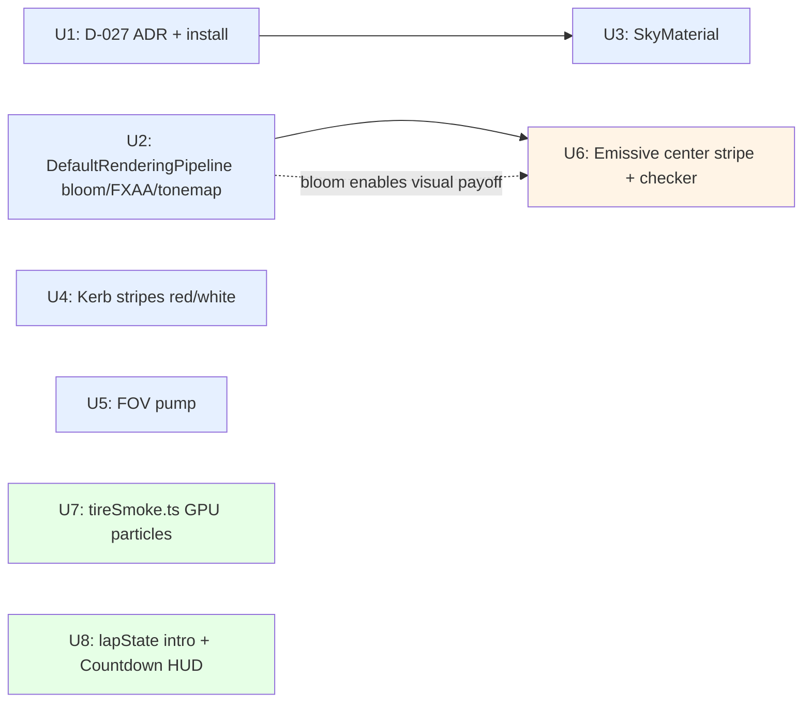
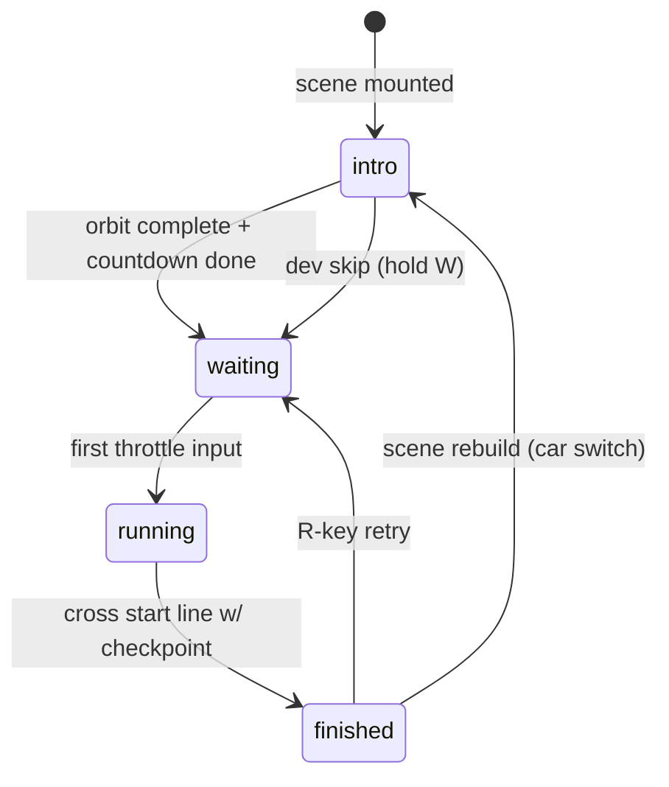

# feat: Racetrack Scene Polish

## Summary

Land 7 visual + game-feel polish items on the racetrack scene across 3 sequenced batches (environment foundation → track markings → dynamics + intro). All work concentrates in `frontend/src/track/` — extends `racetrackScene.ts` named-constant convention, adds one new module `tireSmoke.ts` mirroring `skidMarks.ts`, and extends `lapState.ts` discriminated union with an `intro` state. Adds one new runtime dependency (`@babylonjs/materials` for `SkyMaterial`) under ADR D-027. Tests scope to state-machine logic and threshold gating; pure visual config (post-processing, sky material, FOV, kerb colors) is tuned by eye, not tested.

---

## Problem Frame

The racetrack demo is shippable and physically sound, but visually minimal: flat clearColor sky, uniform-tan barriers, dark gray ribbon road, no post-processing, no particles, silent cold start. In a 30-second pitch video on a 38-day hackathon (Sui Overflow 2026, 34 days remaining), the racetrack is one of two screen-recorded features (the other is the NFT mint flow) and needs to read as a *produced* demo rather than a placeholder.

The ideation pass (origin doc) generated 7 survivors across 5 axes (Environment, Track, Post-processing, Driving feedback, HUD framing) by adversarial filtering. Counter-intuitive insight: bitmap road/sky textures — the user's first instinct — were rejected as anti-pattern (tile visibly at race speed; fight low-poly aesthetic). The Art of Rally formula is *flat colors + post-processing + emissive markings + procedural sky*, which is what this plan implements.

The plan must respect the project's deep architectural memory: skid-marks use hardcoded sizing constants (not bounding-box derivation — that approach failed twice per project memory). The new `tireSmoke.ts` module mirrors that pattern.

---

## Requirements

Origin: `docs/ideation/2026-05-18-racetrack-polish-ideation.md` — 7 survivors all accepted by user.

| R-ID | Requirement | Origin item |
|---|---|---|
| R1 | Replace flat clearColor with procedural sky that fills the frame intentionally | #2 |
| R2 | Add post-processing pipeline (bloom + FXAA + tonemap) to lift overall visual quality | #1 |
| R3 | Differentiate barrier walls so they read as racetrack kerbs, not abstract walls | #3 |
| R4 | Add emissive road markings (center stripe + checker start line) that benefit from R2 bloom | #4 |
| R5 | Add subtle FOV expansion tied to forward speed for kinetic feel | #5 |
| R6 | Add GPU-particle tire smoke when drifting, gated by existing skid threshold | #6 |
| R7 | Replace silent cold start with cinematic intro (orbit + countdown) before input enables | #7 |

ADR D-027 captures the `@babylonjs/materials` dependency decision (see Key Technical Decisions); it is a supporting artifact for R1, not a user-facing requirement.

All 7 ideation survivors (R1–R7) are independently shippable (screen-recording checkpoint between batches per origin staging).

---

## Scope Boundaries

### In scope
- All 7 ideation survivors (R1–R7) plus the supporting ADR (R8)
- Touching `frontend/src/track/racetrackScene.ts`, `lapState.ts`, plus new `tireSmoke.ts` and `Countdown.tsx`
- Extending existing test files for state machine and threshold logic changes
- ADR D-027 in `docs/decisions.md`
- Updating `docs/phase-progress.md` and ideation doc status fields after each batch

### Out of scope (rejected in ideation — do not re-introduce)
- Audio (engine pitch, tire squeal) — pitch video may be muted/voice-over
- Speedometer HUD — fights minimal aesthetic
- Off-track penalty / lap invalidation
- Sector splits, minimap, live PB-pace coloring
- Bitmap road or sky textures (anti-pattern — tile at speed)
- Distant hills/tree geometry (SkyMaterial does the work)
- Motion blur, shadows, depth-of-field, chromatic aberration
- GLB thumbnail render-to-texture for carousel
- Camera shake on barrier impact

### Deferred to Follow-Up Work
- Engine + tire audio (reconsider after pitch video script decision)
- Skid-mark emissive material (compounds with bloom but subtle gain)
- DirectionalLight + shadows (gate on perf budget if particle batch lands cleanly)

---

## Key Technical Decisions

### D-027: Adopt `@babylonjs/materials` for SkyMaterial
**Decision:** Add `@babylonjs/materials` as a runtime dependency to use `SkyMaterial` (Preetham atmospheric scattering shader) on a procedural skybox.
**Rationale:** Procedural sky beats static cube-map texture for our needs — dynamic sun-position control means we can later align a DirectionalLight without re-baking. Bundle cost is ~50KB; the module imports tree-shake to only the materials we use. Babylon's own materials library is the canonical source for this shader; building it from scratch costs days for an identical result.
**Alternatives rejected:** static cube-map skybox (no dynamic sun; texture sourcing burden); custom GLSL Preetham shader (multi-day effort for parity); flat gradient mesh (looks cheap).
**Triggers ADR write at start of U1.** Full ADR text appended to `docs/decisions.md`.

### Center stripe implementation: parallel emissive ribbon
**Decision (confirmed in Phase 0.7 synthesis):** #4 center stripe is a separate emissive ribbon mesh decoupled from the road ribbon, NOT UV-segmented into the road material.
**Rationale:** Tactical scope favors iterability. Independent stripe mesh lets us tune width, emissive color, and lateral offset without touching road geometry. Z-fight risk handled by 0.02u vertical offset above road surface.
**Alternative rejected:** UV-segmented road ribbon — would require restructuring `oval.ts` ribbon sampling to interleave stripe segments; loses single-source-of-truth for road geometry.

### Intro state placement: extend `lapState.ts` status union (flat shape)
**Decision (confirmed in Phase 0.7 synthesis; doc-review correction applied):** #7 intro state extends the existing `lapState.ts` flat interface — adds `'intro'` to the `LapStatus` string union (`'waiting' | 'running' | 'finished'` → `'waiting' | 'running' | 'finished' | 'intro'`) plus a new optional field `introStartedAtMs: number | null`. NOT a separate `introState.ts` module, and NOT a refactor to a true `kind`-discriminated union.
**Rationale:** Intro is the natural precursor to `waiting` — same conceptual scope (race lifecycle). The existing `LapState` is a flat interface keyed by `status`; minimum-change extension preserves all current consumers (TrackPage reads `state.status`, `state.startedAtMs`, `state.finishedLapMs` — none break). A true discriminated-union refactor would ripple through TrackPage + ResultOverlay and is out of scope for tactical polish.
**Alternative rejected (separate module):** separate `introState.ts` — clean boundary but doubles wiring cost.
**Alternative rejected (true discriminated union):** refactor `LapState` to `{ kind: 'waiting'|'running'|... }` shape — wider blast radius, breaks existing destructuring in TrackPage, out of scope for tactical polish.

### Test scope: state + thresholds only; visual config untested
**Decision:** Tests cover lapState transitions (U8), tireSmoke threshold gating (U7), and any new pure-math helpers. Pure visual config (bloom thresholds, sky luminance, FOV constants, kerb colors) is tuned by eye on the dev server, not asserted in tests.
**Rationale:** Asserting `bloomThreshold === 0.7` is brittle and provides zero confidence — the right value is found by recording 30s of footage and judging. Test budget concentrates where regression would silently break behavior (state machine, particle threshold).

---

## High-Level Technical Design

### Batch sequencing and visual compounding



*Directional guidance for review, not implementation specification.*

Key compounding: U2 bloom is a multiplier on U3 sky (sun reads as luminous) and U6 emissive markings (yellow stripe glows). Ship U2 first within Batch 1 so subsequent visual work is judged against the post-processed pipeline, not the raw pipeline.

### Intro state transition (U8)



*Directional. New: `intro` state and the two transitions into `waiting`. Existing transitions preserved.*

---

## Output Structure

```
frontend/src/track/
├── racetrackScene.ts          (modified: U2 U3 U4 U5 U6 U8)
├── racetrackScene.test.ts     (modified: add focus/HUD assertions if needed)
├── lapState.ts                (modified: U8 — add intro variant)
├── lapState.test.ts           (modified: U8 — intro transition coverage)
├── oval.ts                    (modified: U6 — centerline sample helper, optional)
├── tireSmoke.ts               (NEW: U7)
├── tireSmoke.test.ts          (NEW: U7 — threshold gating)
├── Countdown.tsx              (NEW: U8)
├── Countdown.test.tsx         (NEW: U8 — countdown display + completion callback)
├── TrackPage.tsx              (modified: U8 — render Countdown overlay; consume intro state)
└── TrackPage.test.tsx         (modified: U8 — intro flow assertions)

docs/decisions.md              (modified: U1 — append D-027)
frontend/package.json          (modified: U1 — add @babylonjs/materials)
```

Per-unit `**Files:**` blocks are authoritative.

---

## Implementation Units

### U1. D-027 ADR + install `@babylonjs/materials`

**Goal:** Capture the dependency decision as ADR D-027 and install the package so U3 can import `SkyMaterial`.

**Requirements:** R8.

**Dependencies:** none. First in sequence.

**Files:**
- `docs/decisions.md` (append D-027 entry per the template in project `CLAUDE.md`)
- `frontend/package.json` (add `@babylonjs/materials` to `dependencies`)

**Approach:**
- Pin `@babylonjs/materials` to the same major as `@babylonjs/core` (`^9.6.0`)
- ADR D-027 uses the lightweight ADR variant — Context (need procedural sky), Decision, Rationale, Alternatives, Consequences. Reference origin ideation doc and this plan.
- After install, run `npm install` (project uses npm workspaces — see root `package.json` for `@overflow2026/shared` workspace ref) and confirm lockfile updates committed.

**Patterns to follow:** D-022 (existing Havok adoption) for ADR shape; D-019/D-024 for recent decisions in this phase.

**Test scenarios:** none — config/docs change.
- `Test expectation: none -- ADR and dependency addition, no behavioral surface.`

**Verification:**
- D-027 present in `docs/decisions.md` and renders cleanly
- `npm run typecheck` passes
- `import { SkyMaterial } from '@babylonjs/materials/sky/skyMaterial'` resolves in tsserver
- Bundle size delta noted in the next commit message (~50KB expected)

---

### U2. DefaultRenderingPipeline (bloom + FXAA + tonemap)

**Goal:** Enable Babylon's built-in post-processing pipeline so every subsequent visual unit lands against a polished pipeline rather than raw WebGL output.

**Requirements:** R2.

**Dependencies:** none.

**Files:**
- `frontend/src/track/racetrackScene.ts` (add pipeline setup at scene init; add named constants at top)
- `frontend/src/track/racetrackScene.test.ts` (extend `vi.mock('@babylonjs/core', ...)` factory with `DefaultRenderingPipeline` no-op class exposing `bloomEnabled`, `bloomThreshold`, `bloomWeight`, `bloomKernel`, `fxaaEnabled`, `imageProcessing`, `dispose()` — without this the existing 21 tests will fail at module-eval time)

**Approach:**
- Instantiate `DefaultRenderingPipeline("racetrack", true, scene, [camera])` after camera creation
- Enable `bloomEnabled`, set `bloomThreshold` ≈ 0.7, `bloomWeight` ≈ 0.3, `bloomKernel` ≈ 64
- Enable `fxaaEnabled`
- Enable `imageProcessing.toneMappingEnabled` with the ACES preset (`TONEMAPPING_ACES`)
- Add named constants `BLOOM_THRESHOLD`, `BLOOM_WEIGHT`, `BLOOM_KERNEL` at top of file following existing convention
- Keep an explicit `pipeline.dispose()` in the scene teardown observer to match existing engine-lifecycle hygiene

**Patterns to follow:** existing `racetrackScene.ts` named-constant block at top (TRACK_WIDTH, FORWARD_IMPULSE, etc.); existing dispose pattern in scene teardown.

**Test scenarios:** none — visual config tuned by eye.
- `Test expectation: none -- pipeline constants tuned via dev-server playback, not asserted.`

**Verification:**
- `npm run typecheck` passes
- Existing `racetrackScene.test.ts` (21 tests) still passes — the fakeCanvas/headless path must not break
- Dev server renders without console errors; scene looks visibly brighter on emissive surfaces (none yet, but ground/sky should look subtly graded)

---

### U3. SkyMaterial atmospheric sky

**Goal:** Replace flat clearColor with `SkyMaterial` on a procedural skybox so the sky reads as intentional environment.

**Requirements:** R1.

**Dependencies:** U1 (dep must be installed).

**Files:**
- `frontend/src/track/racetrackScene.ts` (keep clearColor as transparent fallback; add skybox mesh + SkyMaterial that covers it)

**Approach:**
- Create a `MeshBuilder.CreateBox("skybox", { size: 1000 })`, set `infiniteDistance: true`
- Attach `SkyMaterial` with `backFaceCulling: false`
- Configure for golden-hour preset: `turbidity` ≈ 3, `luminance` ≈ 0.5, `inclination` ≈ 0.45, `azimuth` ≈ 0.25, `rayleigh` ≈ 2
- Add `SKY_TURBIDITY`, `SKY_LUMINANCE`, `SKY_INCLINATION`, `SKY_AZIMUTH` named constants at top
- Keep `scene.clearColor` set to a sky-matching color (low-bandwidth fallback before SkyMaterial finishes loading and for any error path); skybox mesh covers it during normal rendering
- Tag the skybox mesh so existing scene-disposal logic captures it

**Patterns to follow:** existing safety-ground mesh creation in `racetrackScene.ts` for `MeshBuilder` + material attach pattern.

**Test scenarios:** none — visual.
- `Test expectation: none -- sky parameters tuned via dev-server, not asserted.`

**Verification:**
- `npm run typecheck` passes
- `racetrackScene.test.ts` still passes (skybox should be a no-op in headless fakeCanvas)
- Dev server shows graded sky, sun direction visible, no flat-color artifact
- Skybox disposes cleanly on scene rebuild (carousel switch) — no engine leak

---

### U4. Red/white kerb stripes on barriers

**Goal:** Alternate barrier material color per-segment so barriers read as racetrack kerbs.

**Requirements:** R3.

**Dependencies:** none.

**Files:**
- `frontend/src/track/racetrackScene.ts` (modify barrier-creation loop)

**Approach:**
- In the barrier loop, branch on segment index `i % 2`:
  - Outer barriers: `i % 2 === 0` → red, else white
  - Inner barriers: `i % 2 === 0` → green, else white
- Reuse two shared `StandardMaterial` instances per band-color to avoid per-barrier material allocation (48 barriers × 2 colors = 4 material objects total)
- Add `KERB_OUTER_PRIMARY`, `KERB_OUTER_SECONDARY`, `KERB_INNER_PRIMARY`, `KERB_INNER_SECONDARY` constants at top
- Preserve existing barrier positioning, tangent alignment, dimensions

**Patterns to follow:** existing barrier loop in `racetrackScene.ts`; existing shared-material pattern (one material reused across N meshes).

**Test scenarios:** none for color, but verify barrier count unchanged.
- `Test expectation: regression check only -- racetrackScene.test.ts already asserts barrier count (BARRIER_COUNT_OUTER + BARRIER_COUNT_INNER); ensure that test still passes.`

**Verification:**
- `npm test` passes (existing barrier-count assertion in `racetrackScene.test.ts` is the guard)
- Dev server: barriers alternate visibly; left/right distinguishable (red/white vs green/white)

---

### U5. FOV pump on acceleration

**Goal:** Lerp `camera.fov` toward a higher value based on `forwardSpeed` so the camera kinetically "leans into" speed.

**Requirements:** R5.

**Dependencies:** none.

**Files:**
- `frontend/src/track/racetrackScene.ts` (add lerp in existing render observer)

**Approach:**
- Capture base FOV at camera creation
- In existing `scene.onBeforeRenderObservable.add(...)` (the same observer that computes `forwardSpeed`), compute target = `baseFov + Math.min(forwardSpeed / TOP_SPEED, 1) * FOV_PUMP_DELTA`
- Lerp current FOV toward target with `FOV_LERP_RATE` per frame (≈ 0.05)
- Add `FOV_BASE`, `FOV_PUMP_DELTA` (radians, ≈ 0.14), `FOV_LERP_RATE` constants at top
- Cap delta so chase-cam lerp interaction stays subtle

**Patterns to follow:** existing per-frame observer pattern in `racetrackScene.ts` that already reads `forwardSpeed`.

**Test scenarios:** none — feel-tuned visual.
- `Test expectation: none -- FOV constants tuned via dev-server playback.`

**Verification:**
- `npm run typecheck` passes
- `racetrackScene.test.ts` passes (camera.fov not asserted)
- Dev server: FOV visibly expands at speed, contracts when braking; no nausea-inducing snap

---

### U6. Emissive center stripe + checker start line

**Goal:** Add a thin yellow emissive ribbon along the road centerline (picks up U2 bloom) and replace the plain white start plane with a black/white checker pattern.

**Requirements:** R4.

**Dependencies:** U2 (bloom for visual payoff).

**Files:**
- `frontend/src/track/oval.ts` (optional helper: `sampleOvalCenterline` if not already covered by `sampleOvalCurve`)
- `frontend/src/track/racetrackScene.ts` (build stripe ribbon mesh + replace start plane)

**Approach (per Key Technical Decisions — parallel mesh, not UV segmentation):**
- Centerline ribbon: sample oval curve at high resolution (matches road sampling), build a thin ribbon (`MeshBuilder.CreateRibbon` or `CreateTube` at small radius) along the path with 0.3u width
- Material: `StandardMaterial` with `emissiveColor` = warm yellow, `diffuseColor` = same dimmer; relies on U2's `bloomThreshold` to glow
- Lift stripe 0.02u above road surface to avoid z-fight
- Dash pattern: build the stripe as N separate short segments (each spanning K curve samples, gap of K samples), OR sample with alternating visible/invisible segments — pick one based on what `oval.ts` already exposes
- Checker start line: replace existing white plane with a 4×2 grid of alternating black/white sub-meshes (8 small `MeshBuilder.CreatePlane` instances), or a single plane with a 2-color procedural `DynamicTexture` (whichever is simpler given existing patterns)

**Patterns to follow:** existing start/finish plane creation in `racetrackScene.ts`; existing oval curve sampling in `oval.ts`.

**Test scenarios:**
- If `oval.ts` gains a new helper, add a unit test: given a known control-point set, `sampleOvalCenterline(N)` returns N points and the first/last are continuous (closed loop). Covers the existing test convention in `oval.test.ts`.
- No visual assertion for stripe/checker.

**Verification:**
- `npm test` passes including any new oval helper coverage
- Dev server: yellow stripe visibly glows under bloom; start line reads as checkered; no z-fight flicker
- Stripe disposes cleanly on scene rebuild

---

### U7. GPU tire-smoke particles when drifting

**Goal:** Emit GPU particle smoke from rear wheel anchors when the car drifts, reusing the same lateral-speed gate as the skid-mark system.

**Requirements:** R6.

**Dependencies:** none architecturally (but ships in Batch 3 for video impact, after Batch 1/2 polish lands).

**Files:**
- `frontend/src/track/tireSmoke.ts` (NEW — mirrors `skidMarks.ts` structure)
- `frontend/src/track/tireSmoke.test.ts` (NEW — threshold gating logic; asserts `emitRate` setter calls + `start()`/`stop()` call counts on a mocked `GPUParticleSystem`, NOT actual particle output — GPU buffer state is not observable in jsdom)
- `frontend/src/track/racetrackScene.ts` (wire tireSmoke observer + dispose)
- `frontend/src/track/racetrackScene.test.ts` (extend `vi.mock('@babylonjs/core', ...)` factory with `GPUParticleSystem` no-op class exposing `start()`, `stop()`, `dispose()`, `emitRate` setter, `emitter`, and static `IsSupported` getter)

**Approach:**
- Mirror `skidMarks.ts` module shape exactly: named constants at top, single source of truth for sizing, factory function returning `{ update(carPosition, lateralSpeed, dt), dispose() }`
- **CRITICAL — follow project memory**: hardcoded particle anchor offsets and emission parameters at top of file. **DO NOT derive from car bounding box.** BB derivation failed twice in skidMarks history.
- Use `GPUParticleSystem` with capacity ~5000, emit rate scaled by `clamp(lateralSpeed / SMOKE_TRIGGER_SPEED, 0, 1) * SMOKE_RATE_MAX`
- Gate emission on `lateralSpeed > SMOKE_TRIGGER_SPEED` (constant; tune relative to existing skid threshold of 1.5 u/s — likely match it or be slightly more permissive)
- Additive blending, gray color tint, short lifetime (≈ 0.6s), upward + slight backward velocity
- Anchor positions: two emitters at rear-axle Y offset, X offset = `REAR_AXLE_HALF_TRACK` (constant — match `skidMarks.ts` convention)
- Provide `dispose()` to clean particle system on scene teardown

**Patterns to follow:**
- `skidMarks.ts` — file structure, top-of-file constants, factory pattern, dispose hygiene
- Project memory: skid-mark sizing is hardcoded (single source of truth at top). Apply identical rule here.

**Test scenarios** (mirror `skidMarks.test.ts` conventions):
- `tireSmoke factory creates particle system with expected capacity` — happy path
- `update() with lateralSpeed below SMOKE_TRIGGER_SPEED emits zero particles` — edge case
- `update() with lateralSpeed above threshold emits particles at scaled rate` — happy path
- `dispose() releases particle system without errors` — cleanup
- `repeated update() calls do not allocate new emitters` — memory hygiene

**Verification:**
- `npm test` passes including new `tireSmoke.test.ts`
- Dev server: drift → visible gray smoke trails from rear wheels; no FPS drop on mid-tier hardware
- Particle system disposes on carousel switch — no GPU memory leak

---

### U8. Camera intro orbit + 3-2-1 countdown

**Goal:** Replace silent cold-start with cinematic intro: 2s orbit around the car (showcases the Tripo GLB), then "3...2...1...GO!" countdown overlay, then input unlocks.

**Requirements:** R7.

**Dependencies:** U2 (intro looks better against the post-processed scene).

**Execution note:** test-first for the `lapState.ts` `intro` variant — the state machine change ripples into TrackPage and Countdown, and lapState already has a strong test suite. Add the failing `intro` transition tests before extending the reducer.

**Files:**
- `frontend/src/track/lapState.ts` (extend `LapStatus` string union; add `introStartedAtMs` field)
- `frontend/src/track/lapState.test.ts` (add intro transition coverage — write FIRST)
- `frontend/src/track/Countdown.tsx` (NEW — HUD overlay component)
- `frontend/src/track/Countdown.test.tsx` (NEW — display + completion callback)
- `frontend/src/track/racetrackScene.ts` (camera orbit animation; input gate via lapState; expose intro-complete callback to scene host)
- `frontend/src/track/racetrackScene.test.ts` (extend `vi.mock('@babylonjs/core', ...)` factory with `Animation` no-op class IF Babylon Animation API is used; lerp-per-frame path needs no mock extension and is preferred — see Approach)
- `frontend/src/track/TrackPage.tsx` (render Countdown when state is `intro` or transitioning; consume intro completion)
- `frontend/src/track/TrackPage.test.tsx` (intro flow assertions)

**Approach:**

*State machine (extends existing pure reducer in `lapState.ts`):*
- Extend `LapStatus` string union from `'waiting' | 'running' | 'finished'` to `'waiting' | 'running' | 'finished' | 'intro'`
- Add optional field `introStartedAtMs: number | null` to the existing `LapState` interface
- Initial state changes from `status: 'waiting'` to `status: 'intro'` (set `introStartedAtMs` at construction)
- Add action: `INTRO_COMPLETE` → transitions `intro → waiting`
- Add action: `INTRO_SKIP` → transitions `intro → waiting` (dev shortcut)
- All other transitions and existing fields unchanged — TrackPage consumers of `state.status`, `state.startedAtMs`, `state.finishedLapMs` are preserved

*Camera orbit (in `racetrackScene.ts`):*
- On scene mount, set `lapState = intro`
- Disable physics input (gate the existing WASD/arrow handler on `state.kind !== 'intro'`)
- Animate ArcRotateCamera alpha 0 → 2π over `INTRO_ORBIT_DURATION_MS` (≈ 2000ms) using Babylon `Animation` API or simple lerp-per-frame
- On animation complete: trigger countdown phase via callback to TrackPage
- Hold W (or up-arrow) for >200ms → fires `INTRO_SKIP` and jumps directly to `waiting`

*Countdown (`Countdown.tsx`):*
- React component, displays large centered "3" → "2" → "1" → "GO!" with ~700ms per step, fading out after GO
- On GO display: invokes `onComplete` callback (TrackPage uses this to dispatch `INTRO_COMPLETE` → lapState transitions to `waiting`)
- Styling matches existing HUD overlay aesthetic in `ResultOverlay.tsx`

*Wiring (in `TrackPage.tsx`):*
- Render `<Countdown />` when state is `intro` and orbit complete (scene exposes a `onOrbitComplete` callback prop)
- Hide `<Countdown />` once state transitions to `waiting`

**Patterns to follow:**
- `lapState.ts` discriminated union pattern (existing `waiting`/`running`/`finished`)
- `ResultOverlay.tsx` for HUD component styling and React testing patterns
- Existing `lapState.test.ts` for reducer test shape

**Test scenarios:**

*`lapState.test.ts` (extend):*
- `initial state has status === 'intro' and introStartedAtMs set` — happy path
- `Covers AE-intro. INTRO_COMPLETE while status is 'intro' → status transitions to 'waiting'` — happy path
- `INTRO_SKIP while status is 'intro' → status transitions to 'waiting'` — alt happy path
- `INTRO_COMPLETE while status is 'waiting' → no-op (status stays 'waiting')` — edge case
- `INTRO_COMPLETE while status is 'running' → no-op` — error path
- `RESET while status is 'finished' → status transitions to 'waiting' (NOT intro — scene rebuild handles intro)` — preserve existing reset semantics

*`Countdown.test.tsx` (new):*
- `renders "3", "2", "1", "GO!" in sequence at expected intervals` — happy path
- `calls onComplete callback after GO display` — integration
- `aborts cleanly if unmounted mid-countdown` — edge case (no setState-after-unmount warning)

*`TrackPage.test.tsx` (extend):*
- `mounting scene shows intro state` — happy path
- `input is ignored while in intro state` — edge case (key press → no state change)
- `holding W for >200ms during intro fires INTRO_SKIP` — alt path
- `Countdown completes → state becomes waiting → input is accepted` — integration

**Verification:**
- `npm test` passes all new + extended suites
- `npm run typecheck` passes
- Dev server: scene loads → camera orbits → countdown shows → "GO" → input works
- Hold-W skip works
- Carousel switch (scene rebuild) re-enters intro state cleanly

---

## Test Strategy

- **Vitest** is the existing runner (`npm test` → `vitest run`)
- **jsdom** environment for React component tests (existing convention — see `ResultOverlay.test.tsx`, `TrackPage.test.tsx`)
- **Pure-reducer tests** (`lapState.test.ts`, `oval.test.ts`) need no Babylon mocking — direct function calls
- **Scene tests** (`racetrackScene.test.ts`) already use a `fakeCanvas` headless setup — preserve compatibility; new pipeline/sky code must no-op gracefully under headless
- **React component tests** import from `'react'` for `act()`, NOT from `'vitest'` (per project memory — `act()` must be imported from 'react' in jsdom tests)
- Coverage targets: state machine transitions (U8), threshold gating (U7), and regression guard on barrier *count* only (U4 material assignment is visual tuning, not asserted). Scene init is covered by existing headless fakeCanvas setup; new post-processing, sky, and particle code must no-op gracefully under headless via the extended mock factory. Visual polish (bloom thresholds, sky luminance, FOV constants, kerb colors) is intentionally untested per Key Technical Decisions.

---

## Risks & Mitigations

| Risk | Likelihood | Impact | Mitigation |
|---|---|---|---|
| `@babylonjs/materials` adds unexpected bundle weight | Low | Low | Tree-shaken import path (`@babylonjs/materials/sky/skyMaterial`); note bundle delta in commit message |
| Bloom threshold over-blooms HUD text overlay | Med | Low | HUD is HTML overlay (not in 3D scene), unaffected; if needed, raise threshold |
| FOV pump interacts badly with chase-cam lerp at high speed | Med | Med | Cap pump delta at 0.14 rad; tune `FOV_LERP_RATE` to lag camera lerp |
| GPU particles cost FPS on low-end hardware | Med | Med | Cap capacity at 5000 (well under modern GPU budget); add console.warn if `GPUParticleSystem.IsSupported` returns false and fall back to silent no-op |
| Intro state breaks existing TrackPage.test.tsx assertions | High | Low | Test-first per execution note; failing tests guide the changes |
| BB derivation creeps into `tireSmoke.ts` | Low | High | Explicitly hardcoded at top per project memory; mirror `skidMarks.ts` structure |
| Skybox not disposed on carousel switch leaks GPU memory | Low | Med | Tag mesh with scene's existing dispose pattern; verify in TrackPage.test.tsx scene-rebuild assertion |
| Center stripe z-fights road at certain camera angles | Med | Low | 0.02u vertical offset; test at multiple chase-cam pitches |
| Intro animation blocks dev productivity | High | Low | Hold-W skip path; document in CLAUDE.md if it becomes annoying |

---

## Dependencies & Sequencing

**Batch 1 — Environment foundation (~2 hr):** U1 → U2, U3, U4, U5 (parallel after U1 lands)
**Batch 2 — Track markings (~1 hr):** U6 (gated on U2 for bloom payoff)
**Batch 3 — Dynamics + intro (~2.5 hr):** U7, U8 (independent; can interleave)

Between batches: record 30s of dev-server footage and re-evaluate before continuing. Batch 3 is the first to sacrifice if hackathon time runs short.

External:
- D-027 ADR must be written and committed before U3 imports `SkyMaterial`
- No external API or service dependencies
- No Move contract or backend changes
- No coordination with other in-flight branches (this is frontend-only polish on `frontend/src/track/`)

Within a batch, units can be implemented in any order and committed atomically. The Batch 1 grouping is logical, not strictly sequential after U1 — U2/U3/U4/U5 do not depend on each other and could land in parallel commits.

---

## Phase-Progress and Documentation Impact

- Update `docs/phase-progress.md` after each batch lands (per project CLAUDE.md end-of-session protocol)
- Mark ideation doc items as `Status: Explored` after each unit ships
- D-027 ADR landed in U1 (per ADR protocol — capture before implementing, not after)
- No changes to `spec.md` (polish is implementation detail within Phase 3 sample game scene scope)

---

## References

- Origin ideation: `docs/ideation/2026-05-18-racetrack-polish-ideation.md`
- Project CLAUDE.md (decision capture, plan-mode triggers, end-of-session protocol)
- Project memory: skid marks use hardcoded sizing — single source of truth in module top constants; BB derivation failed twice
- Project memory: `act()` must be imported from `'react'` not `'vitest'` in jsdom tests
- Related plans: `2026-05-17-004-feat-tiny-racetrack-game-loop-plan.md` (foundational racetrack), `2026-05-18-005-feat-throttle-brake-handbrake-drift-plan.md` (in-flight physics tuning)
- External (per ideation web research):
  - Babylon DefaultRenderingPipeline docs
  - `@babylonjs/materials` SkyMaterial docs
  - Babylon GPUParticleSystem docs
  - Art of Rally art-direction interview
  - threejs-speedup-effect (FOV pump reference)
