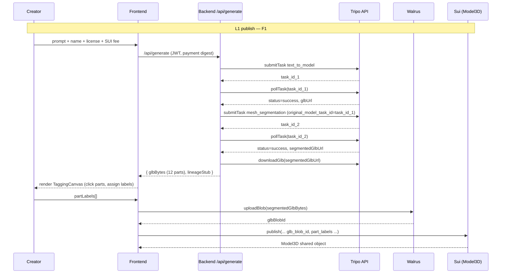
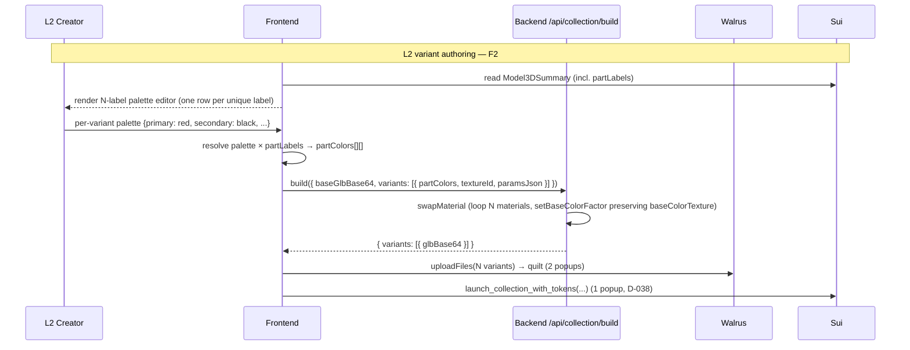

# Mesh Segmentation + Per-Part Coloring for Variants

## Summary

Chain Tripo's `mesh_segmentation` after `text_to_model` in the L1 publish flow, extend the GLB material swap to loop over N per-part materials in TINT mode, add a Babylon click-to-tag step that captures `partLabels: vector<String>` on the Model3D, and refactor the L2 variant editor from 16 raw color pickers to a per-label palette (typically 3-5 rows) that resolves to a per-part color array at build time. Move package redeploys to testnet with the new field; legacy single-material bases coexist via `partLabels = []` sentinel.

---

## Problem Frame

L1 bases today are single-mesh GLBs with one `materials[0]`; the L2 grid reads as a flat color swatch rack because every variant is "same car, body color N." The brainstorm validated Tripo's two-step segmentation API end-to-end (60 credits, ~2min/base) and confirmed segmentation cuts along natural body / wheel / glass boundaries — but Tripo exposes zero semantic labels, so the creator has to tag each part once at L1 publish for the L2 editor to surface a meaningful palette UX. (See origin: `docs/brainstorms/2026-05-23-mesh-segmentation-per-part-coloring-requirements.md`.)

---

## Requirements

- R1. The system shall call Tripo `text_to_model` then `mesh_segmentation` in sequence when an L1 creator publishes a base, total cost ~60 credits per base.
- R2. The system shall handle the variable part count produced by `mesh_segmentation` (no hard-coded N).
- R3. The system shall preserve the per-part PBR textures emitted by Tripo in the published base GLB.
- R4. The system shall present a per-part tagging UI after `mesh_segmentation` returns and before publish.
- R5. The label set shall offer four built-in presets (`primary`, `secondary`, `accent`, `detail`) plus a custom free-text option.
- R6. The system shall allow the creator to skip remaining parts and publish; unlabeled parts default to label `detail`.
- R7. The variant editor shall display one color picker per unique label on the chosen base, not one per raw part index.
- R8. The system shall resolve each variant's per-label palette to a per-part color array using the base's label mapping at variant-build time.
- R9. The swap pipeline shall loop over all materials in the segmented GLB and set `baseColorFactor` per material, preserving each material's existing `baseColorTexture` (TINT mode).
- R10. The lineage record for each variant shall store the resolved per-part color array `[ColorHex × N]` as the canonical form.
- R11. The system shall preserve the base's label mapping when a derivative is created from it.

**Origin actors:** A1 (L1 creator), A2 (L2 derivative creator), A3 (buyer), A4 (Tripo API)
**Origin flows:** F1 (L1 base publish — changed), F2 (L2 variant authoring — changed)
**Origin acceptance examples:** AE1 (covers R5, R6), AE2 (covers R7, R8), AE3 (covers R9), AE4 (covers R2)

---

## Scope Boundaries

- Auto-grouping of similar parts by geometric similarity — out of v1; future polish.
- LLM/vision-based automatic part labeling — rejected.
- Geometric heuristic auto-labeling (largest bbox = body) — rejected.
- Painter UI (option `a` from brainstorm — per-part override on top of label palette) — out of v1.
- Encrypted (Seal-wrapped) variants — orthogonal feature.
- Migration of existing single-material Model3D records — out of v1; the new shape coexists via `partLabels = []` sentinel meaning "legacy single-material; route through old single-row variant editor."

### Deferred to Follow-Up Work

- Walrus storage architecture (full GLB per variant vs `{ base, [factor × N] }` overrides reconstructed at render time): This plan ships full-GLB-per-variant for v1. The override form is the natural follow-up — see Key Technical Decisions for rationale and Open Questions for what would trigger the switch.
- Tripo segmentation cross-domain reliability validation: confirmed on the racing-car demo asset; one 60-credit spike per additional demo domain (animals, weapons, furniture) covers it. Not in this plan's units because the demo arc is car-only.

---

## Context & Research

### Relevant Code and Patterns

- `backend/src/lib/tripo-client.ts` — Tripo wire. `submitTask` hardcodes `text_to_model` body shape; extension point for `submitMeshSegmentation(originalTaskId)`. Auth + AbortSignal + retry-with-backoff polling all reusable.
- `backend/src/generators/tripo.ts` — `TripoGenerator.generate` is the natural chain insertion site: after `pollTask` resolves on step 1, submit step 2 with `original_model_task_id`, poll again, then `downloadGlb`.
- `backend/src/lib/gltf-material-swap.ts` — current single-material logic at `swapMaterial`. Header comment "R2 mitigation: only the first is touched — others pass through" is exactly the boundary this plan reverses. Loop, set `baseColorFactor` per material, leave each material's existing `baseColorTexture` alone (TINT mode).
- `backend/src/lib/gltf-material-swap.test.ts` — `makeFixtureGlb({ materialColors })` already builds N-material fixtures. The existing test asserting "only swaps first material when multiple are present" must be replaced.
- `backend/src/routes/collection.ts` — `POST /api/collection/build` endpoint. `collectionBuildRequestSchema` per-variant fields gain a positional `partColors: Array<[r,g,b,a]>`.
- `frontend/src/creator/CreateModelPage.tsx` — L1 publish state machine. Insert tagging step between `confirmed === true` and the metadata-form block (around line 481 of current file).
- `frontend/src/babylon/PreviewCanvas.tsx` — imperative Babylon read-only viewer; new `TaggingCanvas` sibling component for click-to-select + `HighlightLayer`. Do not flag-extend PreviewCanvas — that breaks read-only consumers (`LaunchCollectionPage`, base picker cards, market tiles, `/track`).
- `frontend/src/forge/VariantEditor.tsx` — controlled component; `hexToBaseColorRgb` is exported here and reused. `VariantRow.colorHex` becomes `VariantRow.palette: Record<label, hex>`.
- `frontend/src/forge/VariantPreview.tsx` — already renders one live Babylon canvas + CSS-color tiles for the rest (D-003 single-canvas WebGL cap rationale). Tile color becomes `palette.primary ?? palette[firstLabel]`.
- `frontend/src/collection/LaunchCollectionPage.tsx` — `runBuildVariants` builds the build-endpoint request; this is where the label-palette → per-part color array resolution happens, frontend-side.
- `frontend/src/sui/modelTxBuilders.ts` — `buildPublishPtb` gains `partLabels` arg via `tx.pure.vector('string', ...)`. `TRIPO_FEE_MIST` re-derivation site.
- `frontend/src/walrus/useWalrusUpload.ts` — `uploadFiles` (L2 quilt) and `uploadBlob` (L1 standalone) unchanged for full-GLB-per-variant path. Popup count stays at 2 regardless of N (D-035 quilt batching).
- `contracts/model3d/sources/model3d.move` — `Model3D` struct, `validate_publish_inputs`, `publish` entry, `destroy_model_for_testing`. `tags: vector<String>` is the precedent for adding `part_labels: vector<String>` (bounded length per element + total count).
- `shared/types.ts` (verify canonical export path) — `VariantMaterialSpec`, `collectionBuildRequestSchema`, `Model3DSummary` all gain segmentation-aware shape.

### Institutional Learnings

- `docs/solutions/kiosk-ptb-patterns/model3d-key-store-migration.md` — adding a field to a published Move struct is **NOT** a compatible upgrade; full package republish required, prior testnet objects abandoned. Hackathon scope means this is acceptable.
- `docs/solutions/integration-issues/sui-ptb-struct-arg-pitfall-2026-05-15.md` — `vector<String>` via `tx.pure.vector('string', labels)` works for `partLabels`. Any future struct-typed argument needs an on-chain `new_*` constructor; not in scope for v1.
- `docs/solutions/best-practices/cors-is-browser-only-cost-bearing-endpoints-need-server-auth-2026-05-15.md` — both Tripo calls land behind the existing `/api/generate` JWT + D-034 SUI-fee gate, treated as a single billable unit.
- `docs/solutions/tooling-decisions/sui-read-layer-indexer-vs-fullnode-2026-05-23.md` — post-publish read-back of new Model3D uses fullnode `getObject(id)` (~300ms), not GraphQL.
- `docs/solutions/integration-issues/react-strictmode-cleanup-only-effect-with-useref-2026-05-23.md` — any new `useRef` + `useEffect` mounted-flag in the tagging or variant editor refactor must set BOTH setup and cleanup; tests wrap in `<StrictMode>`.
- `docs/solutions/integration-issues/babylon-gpu-particle-emission-control-and-getactivecount-misread-2026-05-18.md` — read Babylon source on first behavior surprise. Sub-mesh picking, `HighlightLayer.addMesh`, and `albedoColor` mutation all have non-obvious contracts.
- `docs/solutions/architecture-patterns/walrus-writefilesflow-popup-batching-2026-05-15.md` — Walrus popup count is `2 + ptbs` regardless of N files. Popup count is not a tiebreaker between full-GLB-per-variant and override form.

### External References

- Tripo `mesh_segmentation` request shape: `{ type: 'mesh_segmentation', original_model_task_id: <task_id> }`. Validated via `backend/scripts/spike-tripo-segmentation.ts` (commit `0ba975c`). 40 credits per call. ~85s runtime for a `face_limit: 5000` upstream base.
- Tripo `extras` and task response carry zero semantic part labels; node names are `tripo_part_N` only.

---

## Key Technical Decisions

- **Full GLB per variant for v1; defer override form to follow-up**: Override form (`{ base_glb_uri, [factor × N] }` reconstructed at render time) saves ~16× Walrus storage cost per collection, but requires Move struct changes on `NftToken` (per-part color array) and a client-side material-swap render path. Full-GLB-per-variant requires no `NftToken` shape change and reuses the existing `LaunchCollectionPage → runBuildVariants → uploadFiles → buildLaunchCollectionWithTokensPtb` chain unchanged. Ship simple now; storage-cost optimization moves to Open Questions / follow-up if Walrus mainnet cost validates a real problem.
- **Frontend resolves label palette → per-part color array**: `LaunchCollectionPage` already fetches the base's `Model3DSummary` (which gains `partLabels: string[]`) before the editor renders. Resolving frontend-side keeps the backend label-vocabulary-agnostic and produces the canonical `[ColorHex × N]` form (R10) directly in the build request.
- **Positional `VariantMaterialSpec`**: `VariantMaterialSpec` becomes `{ partColors: Array<{ baseColorRgb, textureId? }> }` (positional), with array length matching the base's part count. Matches the swap pipeline's "iterate materials by index" loop and serializes cleanly through `collectionBuildRequestSchema`.
- **TaggingCanvas as a new sibling component**: NOT a flag on `PreviewCanvas`. Read-only consumers (`LaunchCollectionPage` base picker, market tiles, `/track`, `VariantPreview`) shouldn't pay the picking/highlight wiring cost. The new component imports `HighlightLayer` from `@babylonjs/core/Layers/highlightLayer.js` and wires `scene.onPointerObservable` for ray-pick.
- **Move struct extension via package republish**: Adding `part_labels: vector<String>` to `Model3D` is a breaking struct-shape change. Republish under a fresh package id; pin in `frontend/src/sui/networkConfig.ts` and `contracts/Published.toml`. Existing testnet objects from prior demos are abandoned — acceptable at this phase per CLAUDE.md ("Don't gold-plate during build phases").
- **Two chained Tripo calls behind one JWT + D-034 gate**: Extend `/api/generate` to chain `mesh_segmentation` internally — NOT a new `/api/segment` endpoint. The L1 creator pays one SUI fee that authorizes both calls; partial-billing risk is managed by Tripo's billing semantics (failed segmentation refunds nothing; we eat the upstream `text_to_model` cost). Acceptable cost for the simpler gate surface.
- **`paramsJson` per variant carries the label palette**: For UI round-trip on collection re-open, the human-readable `{ palette: { primary: '#ff0000', secondary: '#1a1a1a', ... }, texture: 'matte' }` lives in `paramsJson`. The canonical `[ColorHex × N]` is reconstructable from `palette + base.partLabels`; storing both is fine — the resolved array drives rendering, the palette drives the editor.
- **Legacy coexistence via `partLabels = []` sentinel**: `Model3DSummary.partLabels === []` means "legacy single-material base." `LaunchCollectionPage` routes those through the existing single-row VariantEditor unchanged. New segmented bases (post-republish) always have `partLabels.length > 0`.
- **D-034 fee gate adjustment**: `TRIPO_FEE_MIST` currently 0.1 SUI calibrated to Turbo's ~15cr cost. Segmentation flow is ~60cr (4×). Bump to **0.4 SUI** linearly. ADR captures this as D-XXX so it's reversible if creator-side friction reports want sublinear subsidy.

---

## Open Questions

### Resolved During Planning

- **Where does segmentation chain land?**: In `TripoGenerator.generate` after the first `pollTask` resolves; the route layer doesn't know about the two-step flow.
- **Babylon picking strategy?**: `HighlightLayer.addMesh` + `scene.onPointerObservable` ray-pick. Pattern grounded in repo research; new component `frontend/src/babylon/TaggingCanvas.tsx`.
- **Label palette transport?**: Frontend resolves to positional per-part color array before POSTing to `/api/collection/build`. Backend receives `partColors: Array<[r,g,b,a]>` per variant; never sees label vocabulary.
- **Variable N handling in editor?**: Editor derives `uniqueLabels = Array.from(new Set(model.partLabels))` and renders one row per unique label per variant. Number of rows is bounded by `partLabels.length`.
- **Swap pipeline error mode change?**: `NoMaterialInBaseGlbError` semantic still applies for `materials.length === 0`. New error path: `partColors.length !== materials.length` → new 422 code `part_count_mismatch`.
- **What stores `partLabels` on-chain?**: Direct field on `Model3D` struct, not in lineage. `ModelPublished` event payload extends to include `part_labels` so the indexer (D-029) populates `Model3DSummary.partLabels` without per-object `getObject`.

### Deferred to Implementation

- Tripo `mesh_segmentation` poll timeout tuning. Spike ran ~85s; production code starts at `maxWaitMs: 180_000` and tunes down if reliability holds.
- Exact `MAX_PARTS` constant in Move. Plan proposes 64 (spike showed 12; safety margin); implementer may lower based on observed Tripo behavior.
- `TaggingCanvas` keyboard navigation (arrow keys to cycle through parts vs mouse-only). UX detail; mouse-only is the v1 floor.
- Whether `texture` choice in the variant editor goes per-label (today: per-variant). Lean per-variant for v1 — fewer rows, simpler editor — but the data shape `VariantRow.palette` is forward-compatible with per-label textures.
- Auto-default unlabeled parts to `detail` happens client-side at publish (before PTB) or server-side at indexer? Both work; client-side keeps the on-chain payload authoritative.

---

## High-Level Technical Design

> *This illustrates the intended data flow and is directional guidance for review, not implementation specification. The implementing agent should treat it as context, not code to reproduce.*

---

## Implementation Units

### U1. Move contract — `part_labels` field, bounds, abort codes, tests

**Goal:** Extend `Model3D` to carry `part_labels: vector<String>` with bounded length, validate in `validate_publish_inputs`, surface in the `ModelPublished` event, update test helpers. Foundation for everything downstream — no other unit can land until Move source compiles.

**Requirements:** R2, R4

**Dependencies:** none

**Files:**
- Modify: `contracts/model3d/sources/model3d.move`
- Modify: `contracts/model3d/tests/model3d_tests.move`

**Approach:**
- Add `part_labels: vector<String>` to the `Model3D` struct after `glb_blob_id`.
- Add constants: `MAX_PARTS: u64 = 64` (spike showed 12 parts; 64 is the safety ceiling and matches the existing pattern of bounded vectors).
- Extend `validate_publish_inputs` with `vector::length(&part_labels) <= MAX_PARTS` (new abort code `ETooManyParts = 39`) and per-element `string::length(&label) <= MAX_TAG_LEN` (new abort code `EPartLabelTooLong = 40`). Reuse the existing `MAX_TAG_LEN = 32` constant.
- Pass `part_labels` into `new_model` constructor.
- Extend the `ModelPublished` event payload to include `part_labels`.
- Update `destroy_model_for_testing` to destructure the new field.
- Extend `publish` entry function signature to accept `part_labels: vector<String>` (insert after `glb_blob_id`, before `is_encrypted`).

**Patterns to follow:**
- `tags: vector<String>` enforcement in `validate_publish_inputs` — exact same shape (length check + per-element string length check).
- Abort code numbering — append, never reuse. Current next free is 39.

**Test scenarios:**
- Happy path: publish a Model3D with `part_labels = vector[utf8(b"primary"), utf8(b"secondary"), utf8(b"accent"), utf8(b"detail")]` (4 labels). Assert the Model3D shared object carries them and the emitted `ModelPublished` event payload includes them.
- Happy path (legacy coexistence): publish with `part_labels = vector::empty<String>()`. Object publishes successfully — represents legacy single-material base.
- Edge case: publish with `part_labels` length exactly `MAX_PARTS` (64) — succeeds.
- Error path: publish with `part_labels` length `MAX_PARTS + 1` (65) — aborts with `ETooManyParts`.
- Error path: publish with a label of length `MAX_TAG_LEN + 1` (33) — aborts with `EPartLabelTooLong`.
- Happy path (variable N): publish two Model3Ds with different part counts (3 labels vs 12 labels) — both succeed; both readable.

**Verification:**
- `sui move build` succeeds.
- `sui move test` passes all new and pre-existing tests.
- The contract test file's `destroy_model_for_testing` helper compiles without errors.

---

### U2. Shared types — positional `VariantMaterialSpec`, `Model3DSummary.partLabels`, build schema

**Goal:** Evolve cross-package types to the per-part shape so backend and frontend share one canonical contract. Lands second because both U3 (backend) and U6/U7 (frontend) consume these types.

**Requirements:** R2, R7, R8, R10

**Dependencies:** U1 (semantics depend on `partLabels` existing on-chain)

**Files:**
- Modify: `shared/types.ts` (and `shared/src/types.ts` if the package's canonical export is there — verify before editing)

**Approach:**
- `VariantMaterialSpec` becomes: `{ partColors: Array<{ baseColorRgb: [r,g,b,a]; textureId?: TextureId }> }`. Positional; index 0 maps to material[0], etc. Length must match the base GLB's material count at build time (backend asserts this).
- `Model3DSummary` gains `partLabels: string[]`. Empty array sentinel = "legacy single-material."
- `collectionBuildRequestSchema` per-variant validator: `partColors` is `z.array(z.object({ baseColorRgb: z.tuple([z.number(), z.number(), z.number(), z.number()]), textureId: z.enum(TEXTURE_LIBRARY).optional() })).min(1).max(MAX_PARTS_FE)`. Use a frontend-side constant `MAX_PARTS_FE = 64` mirroring Move's `MAX_PARTS`.
- The old `baseColorRgb` per-variant field at the build schema is REMOVED. Any code path that referenced it must migrate to `partColors[0].baseColorRgb` for the legacy single-material case.

**Patterns to follow:**
- Existing `collectionBuildRequestSchema` for zod conventions (`.min`, `.max`, `.enum`).
- Existing `Model3DSummary` field layout — keep `partLabels` adjacent to `tags`.

**Test scenarios:**
- Test expectation: none — pure type/schema change. Validation is exercised by route tests in U4 and editor tests in U7.

**Verification:**
- `pnpm typecheck` from repo root passes for `shared/`, `backend/`, `frontend/`.
- Importing from `@overflow2026/shared` in backend and frontend resolves the new shapes; no implicit `any` introduced.

---

### U3. Backend Tripo two-step chain

**Goal:** Wire `mesh_segmentation` after `text_to_model` in the generator, with a generous poll timeout. The L1 generation endpoint serves the segmented GLB end-to-end.

**Requirements:** R1, R3

**Dependencies:** U2 (no — actually no shared type touched; U3 can land in parallel with U2 if needed). Mark as no-dep.

**Files:**
- Modify: `backend/src/lib/tripo-client.ts` — add `submitMeshSegmentation(originalTaskId)` method.
- Modify: `backend/src/generators/tripo.ts` — chain step 2.
- Modify: `backend/src/lib/tripo-client.test.ts` — extend.
- Modify: `backend/src/generators/tripo.test.ts` — extend.

**Approach:**
- `TripoClient.submitMeshSegmentation(originalTaskId)`: same error classes, same `signal()` per-request timeout. Body: `{ type: 'mesh_segmentation', original_model_task_id: originalTaskId }`. No `model_version` field (Tripo populates internally).
- `TripoGenerator.generate` flow becomes: `submitTask(prompt) → pollTask(taskId, { maxWaitMs: 90_000 }) → submitMeshSegmentation(taskId) → pollTask(segTaskId, { maxWaitMs: 180_000 }) → downloadGlb(segUrl)`. The `lineageStub` returned at the end still references the original prompt; `generatorSource: 'tripo'` unchanged.
- Reference: `backend/scripts/spike-tripo-segmentation.ts` carries the validated two-step flow (commit `0ba975c`).

**Patterns to follow:**
- `submitTask` for the request/error/abort shape — `submitMeshSegmentation` mirrors it line-for-line modulo the body.
- `pollTask` is reused unchanged; just call it twice with different timeouts.

**Test scenarios:**
- Happy path (`tripo-client.test.ts`): `submitMeshSegmentation('task-abc')` → mock fetch returns `{ data: { task_id: 'seg-xyz' } }` → returns `'seg-xyz'`.
- Error path: 401 from segmentation submit → throws `TripoAuthError`.
- Error path: timeout via `AbortSignal.timeout` → throws `TripoTimeoutError`.
- Error path: missing `task_id` in response → throws `TripoFormatError`.
- Integration (`tripo.test.ts`): mocked `submitTask + pollTask + submitMeshSegmentation + pollTask + downloadGlb` → `generate({ shape: 'tripo', prompt: 'racing car' })` returns `{ glbBytes, lineageStub }` with both polls observed; assert call order via `mock.calls` indices.
- Edge case: step 1 succeeds but step 2 polls forever then aborts → `TripoTimeoutError` surfaces from the generator; step 1's bytes are not returned.

**Verification:**
- `pnpm --filter backend test` passes including new tests.
- Manual smoke: run `backend/scripts/spike-tripo-segmentation.ts` once more end-to-end and confirm two-step behavior unchanged (uses ~60 credits — only if real-API regression is suspected; otherwise skip).

---

### U4. Backend swap pipeline N-material refactor + route schema

**Goal:** Loop over N materials in `swapMaterial`, set `baseColorFactor` per material while preserving each material's `baseColorTexture` (TINT mode). Extend the `/api/collection/build` route to accept and validate the new per-part request shape.

**Requirements:** R8, R9

**Dependencies:** U2

**Files:**
- Modify: `backend/src/lib/gltf-material-swap.ts`
- Modify: `backend/src/lib/gltf-material-swap.test.ts`
- Modify: `backend/src/routes/collection.ts`
- Modify: `backend/src/routes/collection.test.ts`

**Approach:**
- `swapMaterial(baseGlb, spec, textureLoader)`: spec is now `{ partColors: Array<{baseColorRgb, textureId?}> }`. After loading the doc, assert `materials.length === spec.partColors.length`; if not, throw a new `PartCountMismatchError`. Loop: for each `[i, partSpec]`, `materials[i].setBaseColorFactor(partSpec.baseColorRgb)`; if `partSpec.textureId` is set, `setBaseColorTexture(loadedPng)` for THAT material only. DO NOT touch any material's existing `baseColorTexture` unless `textureId` is set (preserve baked PBR — TINT mode).
- Header comment "R2 mitigation: only the first is touched" is removed; replace with a brief comment explaining TINT-mode N-material loop.
- `collection.ts`: map `partColors` from the request straight into the `spec` passed to `swapMaterial`. Add 422 error envelope for new `PartCountMismatchError` → `error: 'part_count_mismatch'`.
- Test fixture `makeFixtureGlb({ materialColors })` already supports N materials — reuse.

**Patterns to follow:**
- Existing `swapMaterial` for NodeIO + meshopt + extensions registration boilerplate.
- Existing route 422 error pattern.

**Test scenarios:**
- Happy path (`gltf-material-swap.test.ts`): 4-material fixture, `partColors` has 4 entries → all four materials get the assigned `baseColorFactor`; existing `baseColorTexture` on each material is unchanged.
- Happy path: legacy 1-material fixture, `partColors` has 1 entry → behaves identically to old single-material path.
- Edge case: 4-material fixture, `partColors[2].textureId = 'matte'` → material[2] gets both factor and a new texture; materials [0,1,3] only get factor (texture preserved).
- Error path: 4-material fixture, `partColors` has 3 entries → throws `PartCountMismatchError`.
- Error path: 0-material fixture (`NoMaterialInBaseGlbError`) unchanged.
- The old "only swaps first material when multiple are present" test is REPLACED, not preserved.
- Integration (`collection.test.ts`): `POST /api/collection/build` with valid per-part body → 200 + variant base64 glTF magic. **Covers AE3.**
- Integration: route returns 422 `part_count_mismatch` when `partColors.length` mismatches base material count.

**Verification:**
- `pnpm --filter backend test` passes including replaced and new tests.
- Output GLB from a test run is loadable in `frontend/src/babylon/PreviewCanvas.tsx` (manual visual check — re-use `/dev/compare` page if useful).

---

### U5. Frontend TaggingCanvas — click-to-select Babylon picker

**Goal:** New sibling component to PreviewCanvas that loads a GLB, highlights the meshes by node-index, lets the user pick one part at a time, and exposes a callback `onPartSelect(meshIndex: number)`. Surface for the L1 tagging UX in U6.

**Requirements:** R4

**Dependencies:** none (parallel with U3/U4)

**Files:**
- Create: `frontend/src/babylon/TaggingCanvas.tsx`
- Create: `frontend/src/babylon/TaggingCanvas.test.tsx`

**Approach:**
- Component shape: `<TaggingCanvas glbUrl={...} selectedIndex={...} onPartSelect={(i)=>...} />`. Controlled — parent owns `selectedIndex`.
- Imperative Babylon setup mirrors `PreviewCanvas`: `Engine`, `Scene`, `ArcRotateCamera`, `HemisphericLight`, `LoadAssetContainerAsync` for the GLB.
- After load: enumerate loaded meshes; index by the GLB's node order (Tripo's `tripo_part_N` naming gives us a stable index; assume each node has exactly one mesh — assert otherwise).
- `HighlightLayer` instance per scene; when `selectedIndex` changes, `removeAllMeshes()` then `addMesh(meshes[selectedIndex], Color3.FromHexString(tokens.color.accent))`.
- `scene.onPointerObservable.add(pointerInfo => { if (pointerInfo.type === PointerEventTypes.POINTERPICK) { const picked = pointerInfo.pickInfo?.pickedMesh; const idx = meshes.indexOf(picked); if (idx >= 0) onPartSelect(idx); } })`.
- Single-canvas live render — same WebGL context-cap rationale as `VariantPreview`.
- Apply `tokens.viewerWell` from `frontend/src/ux/tokens.ts` for the well container (D-044 brutalist).

**Execution note:** Read Babylon source on first behavior surprise (`@babylonjs/core/Layers/highlightLayer.ts`, `Meshes/abstractMesh.ts`, `Materials/pbrMaterial.ts`). See `docs/solutions/integration-issues/babylon-gpu-particle-emission-control-and-getactivecount-misread-2026-05-18.md`.

**Patterns to follow:**
- `frontend/src/babylon/PreviewCanvas.tsx` for the imperative Engine/Scene lifecycle, `LoadAssetContainerAsync` usage, `frameCameraToMeshes` helper (reuse — scoped to all meshes for the wide shot, or scoped to the selected mesh to camera-focus).
- React StrictMode pattern: any `useRef` for engine/scene MUST set both setup and cleanup. See `docs/solutions/integration-issues/react-strictmode-cleanup-only-effect-with-useref-2026-05-23.md`. Tests wrap render in `<StrictMode>`.

**Test scenarios:**
- Happy path: mount with a stub `glbUrl` → calls `LoadAssetContainerAsync` with the URL + `pluginExtension: '.glb'`.
- Happy path: clicking on a mesh fires `onPartSelect(idx)` once with the mesh index (mock `scene.onPointerObservable` and `scene.pick`).
- Edge case: `selectedIndex` prop changes → `HighlightLayer.removeAllMeshes` then `addMesh` called with the new mesh.
- Edge case: component unmount → `Engine.dispose()` called; `aliveRef` set false in cleanup.
- StrictMode: render wrapped in `<StrictMode>` does not break `aliveRef` (validates the setup-and-cleanup discipline).

**Verification:**
- `pnpm --filter frontend test` passes.
- Manual: load `/dev/compare`'s `spike-seg-2026-05-23T12-05-45.glb` through a one-off test page; clicking parts highlights them; selectedIndex prop drives the highlight from outside.

---

### U6. L1 publish — tagging step in CreateModelPage + Move PTB extension

**Goal:** Insert the tagging UI between Tripo generation confirmation and the metadata form; thread `partLabels` through the publish PTB to Move. Re-derive `TRIPO_FEE_MIST` for the 4× credit cost.

**Requirements:** R1, R4, R5, R6

**Dependencies:** U1, U2, U3, U5

**Files:**
- Modify: `frontend/src/creator/CreateModelPage.tsx`
- Modify: `frontend/src/sui/modelTxBuilders.ts`
- Modify: `frontend/src/creator/CreateModelPage.test.tsx`

**Approach:**
- After `confirmed === true` (post-generation, pre-metadata), render a new local step component (or inline block) `<TaggingStep glb={glbBytes} onComplete={(partLabels: string[]) => setPartLabels(partLabels)} />`.
- `TaggingStep` UI: `<TaggingCanvas>` on the left, label dropdown + custom free-text input on the right, plus a progress indicator like `"5 of 12 labeled"`. Buttons: "Skip remaining" and "Continue". On "Continue": call `onComplete(partLabels)` where unlabeled indices default to `'detail'` (per AE1, R6).
- `partLabels` state is held by `CreateModelPage`. Passed to `buildPublishPtb`.
- `buildPublishPtb`: add `partLabels: string[]` argument. Encode via `tx.pure.vector('string', args.partLabels)`. Insert call argument between `glb_blob_id` and `is_encrypted`, matching the Move entry function's new signature.
- For legacy bypass (upload mode, NOT Tripo-segmentation): when source is `upload`, the tagging step is skipped and `partLabels = []` is passed to `buildPublishPtb`. The Move bounds tolerate `length 0` (legacy single-material).
- Re-derive `TRIPO_FEE_MIST` from `100_000_000n` (0.1 SUI, calibrated for ~15cr Turbo) to `400_000_000n` (0.4 SUI for ~60cr two-step). Single constant change; document in commit message.
- Brutalist UI primitives from `frontend/src/ux/tokens.ts`: dropdown styled per `tokens.input`, custom text field same, progress indicator as `tokens.monoLabel`, skip/continue buttons as `tokens.buttonOutline` / `tokens.buttonPrimary`.

**Patterns to follow:**
- `CreateModelPage.tsx` existing state machine and conditional render blocks.
- `modelTxBuilders.ts` `buildPublishPtb` pure encoding pattern.
- `frontend/src/creator/CreateModelPage.test.tsx` for the dapp-kit/walrus/PreviewCanvas mock setup.

**Test scenarios:**
- Happy path: after Tripo generation success and `confirmed = true`, the tagging step renders. Mock `TaggingCanvas` as a stub; click "Continue" without labeling anything → `partLabels` resolves to 12 entries all `'detail'` (assuming a 12-part mock GLB). **Covers AE1, R6.**
- Happy path: select 4 different labels in order across 4 parts → continue → `partLabels` is `['primary','secondary','accent','detail',...,'detail']` (remaining 8 default to `'detail'`).
- Happy path: upload mode (`sourceMode = 'upload'`) → tagging step is skipped → `buildPublishPtb` receives `partLabels = []`.
- Edge case: free-text custom label "fur" entered for part 3 → after publish, `partLabels[3] === 'fur'`.
- Edge case: switching back from tagging step to "regenerate" resets `partLabels` to `[]`.
- Integration (test PTB builder via existing `dryRunTransactionBlock` pattern if used in this repo, or assert via PTB inspection): the `partLabels` vector reaches the Move call argument in the correct position.

**Verification:**
- `pnpm --filter frontend test` passes including new tests.
- Manual: end-to-end on testnet — generate, tag 4 parts of 12, publish; the Model3D shared object's `part_labels` field reflects the 4 labels + 8 `'detail'` fallbacks (read via fullnode `getObject`).

---

### U7. L2 variant editor — label-grouped palette + LaunchCollectionPage resolution

**Goal:** Variant editor renders one color row per unique label (typically 3-5 rows), not N raw color slots. LaunchCollectionPage resolves per-variant label palettes to positional per-part color arrays before posting to the build endpoint. Legacy `partLabels = []` bases route through the existing single-row editor unchanged.

**Requirements:** R7, R8, R10, R11

**Dependencies:** U1, U2, U4 (backend must accept the new request shape)

**Files:**
- Modify: `frontend/src/forge/VariantEditor.tsx`
- Modify: `frontend/src/forge/VariantEditor.test.tsx`
- Modify: `frontend/src/forge/VariantPreview.tsx`
- Modify: `frontend/src/collection/LaunchCollectionPage.tsx`
- Modify: `frontend/src/collection/LaunchCollectionPage.test.tsx`

**Approach:**
- `VariantRow` shape: `{ palette: Record<string, string>; textureId: TextureId; priceMist: bigint }`. `colorHex` removed; `palette[label]` carries each label's hex.
- `VariantEditor` props gain `partLabels: string[]`. Internally derives `uniqueLabels = Array.from(new Set(partLabels))` once. Renders one color-picker row per `uniqueLabel` per variant. Variant count stepper, pricing toggle, MAX_VARIANTS=16 cap all unchanged. Table columns become `[ #, label-1 color, label-2 color, ..., texture, price ]` when expanded — or per-variant collapsed view with a "details" expander if column count gets unwieldy (implementer call; the `uniqueLabels.length` is typically 3-5).
- When `partLabels.length === 0` (legacy), `uniqueLabels = ['primary']` and the editor renders exactly one color picker per variant — the legacy UX preserved.
- New `newVariantRow({ uniqueLabels })`: initializes `palette` with `Object.fromEntries(uniqueLabels.map(l => [l, '#cc3333']))`.
- `VariantPreview` tile color: `row.palette.primary ?? row.palette[uniqueLabels[0]]` for the swatch tile.
- `LaunchCollectionPage.runBuildVariants`: for each variant, resolve `partColors = base.partLabels.map((label, i) => ({ baseColorRgb: hexToBaseColorRgb(row.palette[label] ?? '#cccccc'), textureId: row.textureId }))`. Build request: `variants: variants.map(v => ({ partColors: resolve(v), paramsJson: JSON.stringify({ palette: v.palette, texture: v.textureId }) }))`.
- `paramsJson` per variant stores the human-readable palette for round-trip on collection re-open.

**Patterns to follow:**
- Existing `VariantEditor.tsx` for the controlled component shape, `Harness` test pattern, brutalist styling via `tokens.ts`.
- `hexToBaseColorRgb` (exported from VariantEditor.tsx already — direct reuse).
- `LaunchCollectionPage.tsx` `runBuildVariants` for the existing build-request shape — extend, don't rewrite.

**Test scenarios:**
- Happy path: render `VariantEditor` with `partLabels = ['primary','secondary','accent','detail']` and 1 variant → table shows 4 color pickers per variant row.
- Happy path: render with `partLabels = ['primary','primary','primary','secondary','secondary','accent','accent','detail','detail','detail','detail','detail']` (12 parts → 4 unique labels) → still 4 color pickers per variant row. **Covers AE2, AE4.**
- Happy path: render with `partLabels = []` (legacy) → 1 color picker per variant row (`'primary'` default).
- Happy path: changing a variant's `primary` color → only the `palette.primary` entry updates; other label entries unchanged.
- Edge case: 16 variants × 5 unique labels = 80 color pickers total — does not exceed render budget (jsdom test runs in <1s).
- Edge case: `partLabels` with a custom free-text label `'fur'` → editor renders the `'fur'` row alongside the four defaults.
- Integration (`LaunchCollectionPage.test.tsx`): mock the build endpoint; assert the POST request body's `variants[0].partColors` length equals `partLabels.length` and each entry's `baseColorRgb` is resolved from the variant's palette by label-lookup. **Covers AE2, AE4.**
- Integration: mock build endpoint and verify resolution for a variant with `palette = { primary: '#ff0000', accent: '#00ff00' }` and `partLabels = ['primary','primary','accent']` produces `partColors[0..1].baseColorRgb` mapping to red and `partColors[2].baseColorRgb` mapping to green.

**Verification:**
- `pnpm --filter frontend test` passes.
- Manual: end-to-end on testnet — pick a new segmented base, set a 3-label palette, build 4 variants, launch; the on-chain `paramsJson` for each `NftToken` carries the palette JSON; the variant GLBs visible on `/market` show per-segment colors as designed.

---

## System-Wide Impact

- **Interaction graph:** L1 publish flow gains a new tagging step; L2 build endpoint gains a per-part input. `/api/collection/build` is the cross-cutting backend touchpoint. Tripo dispatch in `/api/generate` chains a second task internally — caller (frontend) sees no behavior change beyond longer latency (~2min instead of ~35s).
- **Error propagation:** `PartCountMismatchError` is a new 422 envelope on `/api/collection/build`. Frontend should display "Variant build failed: part count mismatch — try regenerating the base." Tripo step-2 timeout surfaces same as today's `TripoTimeoutError`. Tagging step's "Skip remaining" never errors; defaulting unlabeled parts to `'detail'` is silent.
- **State lifecycle risks:** `aliveRef` patterns in `TaggingCanvas` and any new async polling MUST set both setup and cleanup (see `docs/solutions/integration-issues/react-strictmode-cleanup-only-effect-with-useref-2026-05-23.md`). Risk of partial publish if the user closes the tab between Tripo segmentation and Walrus upload — same risk as today; not worse.
- **API surface parity:** No external API consumers besides the frontend; the `/api/collection/build` shape change is coordinated within this monorepo. `Model3DSummary.partLabels` is consumed by `LaunchCollectionPage` and any future market or detail page that wants label-aware previews.
- **Integration coverage:** Cross-layer scenarios — (a) Move struct change visible via fullnode `getObject` post-publish, (b) backend swap loop processes a Tripo-generated 12-part GLB end-to-end, (c) frontend resolves a palette → per-part array and round-trips through the build endpoint. Each of U6, U4, U7 carries one integration scenario; together they verify the full chain.
- **Unchanged invariants:** D-038 single-popup `launch_collection_with_tokens` PTB unchanged. D-035 quilt-based variant storage unchanged. D-037 base-GLB-as-standalone-blob unchanged. The 16-variant cap (`MAX_VARIANTS`) unchanged. Per-variant pricing toggle unchanged. License policy enforcement unchanged. The `NftToken` struct unchanged in v1 (only Model3D extended).

---

## Risks & Dependencies

| Risk | Mitigation |
|---|---|
| Move package republish abandons existing testnet demo objects | Acceptable per hackathon phase. UPGRADE.md ceremony documented; package id pin in `frontend/src/sui/networkConfig.ts` and `contracts/Published.toml` updated; one round-trip publish + read-back smoke test before user-visible demo recording. |
| Tripo `mesh_segmentation` reliability across non-car prompts is unverified | Demo arc is car-only. One 60-credit spike per additional domain confirms or fails. Out of v1 scope. |
| TINT-mode color result depends on baked PBR texture luminance — very dark baked colors will make any tint look muddy | Mitigation in product: the editor's color picker exists at a layer above the baked texture, so creators get visual feedback. Mitigation in plan: spike-validated against `spike-seg-tint-red.glb` (visible at `/dev/compare`); the racing-car demo asset reads cleanly. |
| Babylon picking may return sub-meshes (e.g., a child of a transform node) instead of the top-level part node | `TaggingCanvas` enumerates meshes via the GLB's node order, NOT raw mesh count. `pickInfo.pickedMesh` is walked up to its parent transform node before index lookup. Test scenario specifically asserts the picked index matches the node order. |
| L2 creator opens an existing legacy single-material collection after the deploy → `Model3DSummary.partLabels = []` | Editor routes through the single-row legacy path. No data migration needed. Verified by U7's `partLabels = []` test scenario. |
| 0.4 SUI fee (4× current) creates creator-side friction | Reversible via single constant in `modelTxBuilders.ts`. Document as a tunable; collect demo-day feedback. |
| Walrus storage cost growth (6 MB × 16 variants per collection) at mainnet | Deferred to follow-up — see Scope Boundaries. Override-form is the next plan if this becomes a real constraint. |

---

## Documentation / Operational Notes

- **ADR captures required before implementation lands**: Append entries D-XXX through D-XXX to `docs/decisions.md` for the brainstorm-baked decisions and this plan's plan-time additions:
  - Two-step Tripo flow (mesh_segmentation API contract).
  - TINT mode over FLAT for variant coloring.
  - Manual tagging at L1 publish over geometric/AI auto-labeling.
  - Free-text labels with 4 dropdown presets.
  - Lineage canonical = positional per-part color array.
  - Full-GLB-per-variant v1 (defer override form).
  - `TRIPO_FEE_MIST` raised from 0.1 SUI to 0.4 SUI.
  - Move package republish ceremony for `part_labels` struct field addition.
- **UPGRADE.md ceremony**: After U1 lands, run the documented Move redeploy steps. Update `contracts/Published.toml` with the new package id and pin in `frontend/src/sui/networkConfig.ts`. The existing pattern from Phase 2 → Phase 4 migration applies.
- **`/dev/compare` extension**: After U6 ships, optionally extend `frontend/src/dev/CompareGlbsPage.tsx` with a sample of a freshly-generated + tagged segmented base for visual reference. Low priority.
- **Phase progress update**: `docs/phase-progress.md` updated at session boundaries; this plan's completion notes feed into the L2 variant story for the U15 demo recording.

---

## Sources & References

- **Origin document:** [docs/brainstorms/2026-05-23-mesh-segmentation-per-part-coloring-requirements.md](../brainstorms/2026-05-23-mesh-segmentation-per-part-coloring-requirements.md)
- Related spike scripts: `backend/scripts/spike-tripo-segmentation.ts` (validated two-step Tripo flow), `backend/scripts/spike-seg-color-modes.ts` (generated TINT/FLAT/MULTI-FLAT visual references).
- Related dev artifacts: `frontend/src/dev/CompareGlbsPage.tsx` (`/dev/compare` route shows 4 spike GLBs for visual reference).
- Move struct precedent: `contracts/model3d/sources/model3d.move` `tags` field pattern.
- Babylon source-first discipline: `docs/solutions/integration-issues/babylon-gpu-particle-emission-control-and-getactivecount-misread-2026-05-18.md`.
- StrictMode useRef pattern: `docs/solutions/integration-issues/react-strictmode-cleanup-only-effect-with-useref-2026-05-23.md`.
- Walrus popup batching: `docs/solutions/architecture-patterns/walrus-writefilesflow-popup-batching-2026-05-15.md`.
- Sui read layer: `docs/solutions/tooling-decisions/sui-read-layer-indexer-vs-fullnode-2026-05-23.md`.
- Move ability migration precedent: `docs/solutions/kiosk-ptb-patterns/model3d-key-store-migration.md`.
