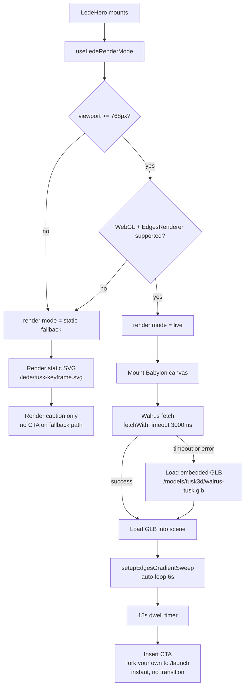

# Tusk3D Landing Lede (S1)

## Summary

Implement the S1 lede component for the new Tusk3D landing at `/`: a live Babylon scene rendering a walrus tusk with a PBR ↔ EdgesRenderer dual-mesh + clipPlane gradient sweep, fetched from Walrus with a 3-second timeout and embedded-GLB fallback, gated by a viewport/WebGL render-mode hook that routes mobile and incapable clients to a pre-rendered static SVG. Factor the gradient-sweep primitive and the timeout fetch helper into shared modules so subsequent landing survivors (S3 identity mark, S4 panel 2) reuse the same scene config for their pre-rendered SVG exports.

---

## Problem Frame

The brainstorm (`docs/brainstorms/2026-05-28-tusk3d-landing-lede-requirements.md`) established WHAT the lede must deliver: a screencap-friendly first surface that simultaneously demonstrates a working live Walrus read and instantiates the brand visually. This plan establishes HOW to ship it in 24 days without regressing the existing Babylon stack and while honoring the two high-severity React pitfalls (StrictMode + hooks-after-early-return) the team has already paid for elsewhere.

---

## Requirements

This plan inherits all 22 requirements from the origin doc. Implementation units cite specific R-IDs.

**Origin actors:** A1 (visitor / judge), A2 (asset producer — Rick)

**Origin flows:** F1 (desktop happy path), F2 (mobile / no-WebGL fallback), F3 (Walrus timeout fallback), F4 (asset producer pre-flight)

**Origin acceptance examples:** AE1 (mobile → static SVG), AE2 (WebGL disabled → static SVG), AE3 (Walrus timeout → embedded GLB), AE4 (15s dwell → CTA), AE5 (gradient screencap), AE6 (S3 variant cycling)

---

## Scope Boundaries

- The route table (`frontend/src/App.tsx`) is not modified. The existing BrowsePage at `/` will be moved to `/browse` by a separate survivor's plan. This plan only adds the new `LedeHero` component; integration into a route is the surrounding-survivor's responsibility.
- No `/create`, `/launch`, `/market`, `/track` route modifications. F4 (asset producer pre-flight) uses existing production routes unchanged.
- No L2 variant color hex value selection — not visible in S1's line-drawing aesthetic.
- No `spec.md` L2 stale-reference cleanup — deferred to Phase 5 polish per CLAUDE.md submission-deadline discipline.
- No code-splitting / lazy-loading of Babylon. Matches repo precedent (`frontend/src/track/`, `frontend/src/launch/`, etc. all eagerly import Babylon). Mobile clients skip Babylon entirely via the static-fallback path.
- No automated SVG export pipeline. Asset producer or implementer manually exports the key-frame SVG once.

### Deferred to Follow-Up Work

- **S3 identity mark + S4 panel 2 design-time SVG export** (covers R18, R19) — Surrounding-survivor plans consume U2's `edgesGradientSweep` primitive to render and export SVGs at design time. This plan ships the primitive and U5 places the S1 key-frame SVG; the per-variant cycle SVGs (4 of them for S3) and the panel-2 SVG export are owned by surrounding plans. R21 (2/3 well + 1/3 caption vertical split) is satisfied by U4's JSX layout — viewerWell hosts the canvas / static image; the caption block sits below on the paper surface.
- **Route move BrowsePage → `/browse`** — Owned by separate survivor's plan (one of S2/S6/S7 will own the route integration depending on planning order).
- **OG card + Twitter card + pitch-deck + README hero reuse of the key-frame SVG** — Asset placement is in U5; consumption at those surfaces is downstream (social meta tags, pitch deck file edits, README edits) and not in this plan.
- **D-069 CDN switch** — When `plan-018` lands, U1's fetch helper picks up the configured aggregator URL automatically; no rework required in S1.

---

## Context & Research

### Relevant Code and Patterns

- **`frontend/src/babylon/PreviewCanvas.tsx`** — Canonical Babylon mount pattern (D-007 / D-063). Engine effect (lines 214-228), scene effect (lines 235-291) with the `if (!engine.isDisposed)` cleanup guard, GLB load effect (lines 303-354) with cross-cycle race guards. `frameCameraToMeshes` helper (lines 37-61) reusable for any GLB.
- **`frontend/src/babylon/applyCanvasMode.ts`** — Pure-helper module shape to mirror for U2 (`edgesGradientSweep`). Note: existing `wireframe` mode is raw triangle-edge rendering via `material.wireframe = true`; the lede needs `EdgesRenderer` (silhouette + crease), which is currently unused in the codebase.
- **`frontend/src/walrus/aggregator.ts`** — Walrus URL builders (`glbUrlForSummary`, `glbUrlForToken`). The lede uses a fixed blob CID (the canonical tusk), so URL construction is a single string concat against the configured base.
- **`frontend/src/market/useListings.ts:78-96`** — `withFetchTimeout` pattern using `AbortSignal.timeout` + `AbortSignal.any` with jsdom fallback. U1 lifts this into shared `frontend/src/walrus/`.
- **`frontend/src/track/TrackPage.tsx:243-301`** — AbortController + double-guard (`cancelled` flag + `controller.abort()`) cleanup pattern. U4 mirrors this.
- **`frontend/src/babylon/MeshInfoPanel.tsx:88`** — `truncateBlobId` helper for "first 8 + ellipsis + last 4" CID display. Reuse in caption.
- **`frontend/src/ux/tokens.ts`** — `viewerWell` (`#000` background canvas container), `displayHeadline`, `eyebrow`, `monoLabel`, typography ladder, `tokens.color.accent` (`#FF4500` — rationed ≤5 instances/page, S1 consumes one for the CTA).
- **`frontend/src/ux/TopNav.tsx`** — Masthead context (S7 issue-number masthead and S3 identity mark sit here in surrounding scope).
- **`frontend/public/models/nature/`** — Static GLB asset convention (absolute path string references in code, e.g., `/models/nature/tree_default.glb`).
- **`frontend/src/test/setup.ts`** + **`frontend/src/babylon/PreviewCanvas.test.tsx:13-90`** — vitest + jsdom test setup; Babylon fully mocked via top-of-file `state` object + `vi.mock('@babylonjs/core', ...)` stub. U2 and U4 mirror this. Note: vitest `render()` does NOT wrap in `<StrictMode>` by default — test files must wrap explicitly.

### Institutional Learnings

- **`docs/solutions/integration-issues/react-strictmode-cleanup-only-effect-with-useref-2026-05-23.md`** *(high severity, direct hit)* — StrictMode double-mount in dev silently breaks cleanup-only `useEffect` + `useRef` patterns. `aliveRef.current = true` must be set in the effect body, not just initialized via `useRef(true)`. Tests must wrap in `<StrictMode>` to catch this; vitest does not by default.
- **`docs/solutions/integration-issues/react-hooks-after-early-return-oauth-mask-2026-05-28.md`** *(high severity, direct hit)* — Hooks declared after a conditional early return crash with "Rendered fewer hooks than expected" when the branch flips at runtime. All hooks in U3 and U4 declare unconditionally at component top; viewport / WebGL / Walrus-timeout branches live only in the JSX return.
- **`docs/solutions/integration-issues/babylon-gpu-particle-emission-control-and-getactivecount-misread-2026-05-18.md`** *(medium, adjacent)* — Babylon API surprise pattern: docs and intuition lie, source is canonical. EdgesRenderer and clipPlane are exactly the API-surprise zone. U2's implementer reads `@babylonjs/core/Rendering/edgesRenderer.ts` and `@babylonjs/core/Materials/material.ts` clipPlane path **before** iterating on values.
- **`docs/solutions/integration-issues/walrus-encoder-oom-investigation-2026-05-28.md`** *(high severity, not applicable)* — Walrus encoder OOM is WRITE-path only (Reed-Solomon WASM encoder). The lede only reads; the 3-second timeout primitive is the correct mitigation.
- **`docs/plans/2026-05-28-018-feat-walrus-cdn-read-cache-plan.md`** — When D-069 CDN lands, U1's helper uses the configured base URL automatically; cold-cache reads still cross to origin aggregator, so the 3s timeout + embedded GLB fallback remains aligned.

### External References

External research deliberately skipped. Local Babylon patterns are well-established; learnings explicitly warn that Babylon docs mislead — source is canonical. ce-best-practices for landing pages also skipped — the brainstorm already consumed external research in its grounding phase.

---

## Key Technical Decisions

- **`edgesGradientSweep` lives in `frontend/src/babylon/`, not inline in `LedeHero`** — S3 identity mark and S4 panel 2 (surrounding-survivor plans) need the same scene config for design-time SVG export. Inline would force per-surface duplication. Cost: one extra module + tests; benefit: single source of truth for camera, lighting, and sweep parameters across three surfaces.
- **`fetchWithTimeout` lifted from `useListings` into `frontend/src/walrus/`** — Lede needs a 3s timeout; future Walrus consumers (including plan-018 CDN migration) benefit from a shared helper. Cost: lift + targeted tests; benefit: one helper consumed by current `useListings` (optional refactor in a follow-up) and S1 lede.
- **No code-splitting for Babylon in S1** — Matches repo precedent; mobile / no-WebGL path already skips Babylon via static SVG, which is the main FCP-budget concern. Introducing `React.lazy` + Vite `manualChunks` is net-new infra worth a separate plan if FCP measurement after S1 ships indicates need.
- **Combined `useLedeRenderMode()` hook returning `'live' | 'static-fallback'`** — Single decision surface; consumer JSX has one branch, not two (viewport AND WebGL). Easier to test and survives StrictMode cleanly with a single aliveRef pattern.
- **Static caption is JSX (no runtime Sui RPC)** — Brainstorm decision carried forward; the Walrus blob CID, Tripo prompt text, and mint date are immutable chain artifacts. The caption template carries a `2026-05-NN` placeholder; final substitution happens at ship time after Rick mints.
- **Render-mode decision happens before Babylon mount, not as an error-boundary catch** — No route-level error boundary infrastructure exists in the repo; failed WebGL init would bubble to React. Pre-mount detection avoids this entirely.
- **Manual SVG export, not build-time pipeline** — 24-day timeline; 1 key frame for S1 + 4 variant frames for S3 = 5 manual exports total. Automation cost vastly exceeds manual repeat cost.

---

## Open Questions

### Resolved During Planning

- **Where does the lede component live?** Decision: new `frontend/src/landing/` directory. BrowsePage is moving out of `/` per surrounding-survivor plan; the new landing component shouldn't co-locate with the page it replaces.
- **Does the gradient sweep primitive belong in `babylon/` or `landing/`?** Decision: `babylon/`. It's a Babylon scene primitive consumed by multiple surfaces, not a landing-specific component.
- **Should viewport detection and WebGL detection be separate hooks or combined?** Decision: combined (`useLedeRenderMode`). Single output, single test matrix, single StrictMode-safe lifecycle.
- **What does the `fetchWithTimeout` helper return on timeout?** Decision: named error classes (`WalrusFetchTimeoutError`, `WalrusFetchAbortedError`) so callers can distinguish from generic network errors without parsing strings.

### Deferred to Implementation

- **Exact `EdgesRenderer.edgesWidth`, `epsilon`, and angle-threshold values** — Iteration by visual inspection; implementer reads `@babylonjs/core/Rendering/edgesRenderer.ts` first, then tunes.
- **Sweep timing curve — linear vs eased** — Linear is the U2 default; if visual review wants easing, implementer adjusts the `setProgress` interpolation. Cheap to swap.
- **Camera framing details** (distance, FOV, vertical offset) — Implementer iterates against Rick's actual tusk output. `frameCameraToMeshes` provides a sane default with `1.3` padding multiplier (PreviewCanvas.tsx line 49); adjust if too tight or too loose.
- **Exact Walrus blob CID and mint date** — Pending Rick's pre-flight `/create` + `/launch` run. URL constant in U4 starts as a placeholder; final values land before deploy.
- **Embedded GLB file size after gltf-transform optimization** — Target ≤ 500 KB; final size measured during U5 asset placement. If size pressure surfaces, gltf-transform options (Draco compression, texture stripping) are the lever.
- **Should `useListings` refactor to consume the lifted `fetchBlobWithTimeout`?** Optional follow-up; not in this plan's scope. Note that the new helper is NOT a drop-in replacement for `useListings`'s existing `withFetchTimeout` (which returns `AbortSignal`); the new helper is a higher-level wrapper returning `ArrayBuffer`. A future refactor would restructure `useListings`'s fetch call sites to delegate URL construction and response handling to the new helper.
- **SVG vs PNG for the key frame** — Babylon doesn't natively export SVG. If SVG-via-screen-trace proves impractical, high-resolution PNG is acceptable for OG card / Twitter card / pitch deck / README (rasters are standard at those surfaces). Mobile fallback `` element accepts either format.

---

## High-Level Technical Design

> *This illustrates the intended approach and is directional guidance for review, not implementation specification. The implementing agent should treat it as context, not code to reproduce.*

### Render-mode decision flow



### Dual-mesh + clipPlane sweep primitive (U2 shape)

```text
setupEdgesGradientSweep(scene, sourceMeshes):
  edgesClones = []
  for each mesh in sourceMeshes:
    clone = mesh.clone()
    clone.enableEdgesRenderer(epsilon)
    // clone material is invisible PBR; only the edges layer renders
    edgesClones.push(clone)

  progressRef = { current: null }    // null => auto-loop; number => frozen
  observer = scene.onBeforeRenderObservable.add(() => {
    t = progressRef.current ?? ((now() % 6000) / 6000)
    bbox = unionBoundingBox(sourceMeshes)
    sweepX = bbox.minX + t * (bbox.maxX - bbox.minX)
    // PBR meshes clip everything to right of sweepX
    // Edges meshes clip everything to left of sweepX
    // (exact clipPlane API determined by reading @babylonjs/core source)
  })

  return {
    setProgress(t) { progressRef.current = t },
    dispose() {
      scene.onBeforeRenderObservable.remove(observer)
      for clone in edgesClones: clone.dispose()
      scene.clipPlane = null
    }
  }
```

Render-mode decision matrix (U3 hook truth table):

| Viewport ≥ 768px | WebGL available | Output |
|---|---|---|
| Yes | Yes | `'live'` |
| Yes | No | `'static-fallback'` |
| No | Yes | `'static-fallback'` |
| No | No | `'static-fallback'` |

---

## Implementation Units

### U1. Walrus fetch helper with timeout and abort

**Goal:** Shared helper for Walrus blob fetches with a configurable timeout and external `AbortSignal` support, returning typed errors so callers distinguish timeout from generic network failure.

**Requirements:** R12 (3s Walrus timeout)

**Dependencies:** None

**Files:**
- Create: `frontend/src/walrus/fetchWithTimeout.ts`
- Test: `frontend/src/walrus/fetchWithTimeout.test.ts`

**Approach:**
- Lift the `withFetchTimeout` pattern from `frontend/src/market/useListings.ts:78-96` into a shared module.
- Signature: `fetchBlobWithTimeout(url: string, opts: { timeoutMs: number; signal?: AbortSignal }) => Promise<ArrayBuffer>`.
- Use `AbortSignal.timeout(timeoutMs)`; combine with the external `signal` via `AbortSignal.any` with a manual-merge fallback for jsdom (matches `useListings` precedent).
- On abort: distinguish whether the trigger was the timeout signal or the external signal. Reject with `WalrusFetchTimeoutError` or `WalrusFetchAbortedError`.
- On other failures (network, non-2xx): reject with the original error, wrapped only with the URL for context.
- Return the response `ArrayBuffer` for caller-side wrapping into Babylon `Blob` URLs.

**Patterns to follow:**
- `frontend/src/market/useListings.ts:78-96` (`withFetchTimeout`)
- `frontend/src/track/TrackPage.tsx:243-301` (AbortController + cleanup discipline)

**Test scenarios:**
- Happy path — fetch returns within timeout → resolves with `ArrayBuffer`.
- Happy path — external `AbortSignal` provided but never aborted → resolves normally.
- Error path — `AbortSignal.timeout` fires before fetch returns → rejects with `WalrusFetchTimeoutError`; error names the timeout duration.
- Error path — external `AbortSignal` fires before fetch returns → rejects with `WalrusFetchAbortedError`.
- Error path — fetch returns non-2xx status → rejects with a labeled error (status + URL).
- Edge case — jsdom test environment lacks `AbortSignal.any` → manual-merge fallback path engages and behaviorally matches the native path.

**Verification:**
- Helper exported from `frontend/src/walrus/fetchWithTimeout.ts`.
- All test scenarios pass under vitest.
- Existing `useListings.ts` continues to compile and pass tests (no consumer changes in this unit).

---

### U2. `edgesGradientSweep` Babylon primitive

**Goal:** Reusable Babylon scene primitive that sets up a dual-mesh PBR ↔ EdgesRenderer pair and a `clipPlane`-driven sweep across X. Supports an auto-loop (~6s) and a frozen-progress mode for design-time SVG export.

**Requirements:** R3, R4 (gradient mechanism), R5 (academic / scientific-illustration line drawing via EdgesRenderer, not raw wireframe), R17 (shared scene config for S1 + S3 + S4)

**Dependencies:** None (pure Babylon API)

**Files:**
- Create: `frontend/src/babylon/edgesGradientSweep.ts`
- Test: `frontend/src/babylon/edgesGradientSweep.test.ts`

**Approach:**
- Function `setupEdgesGradientSweep(scene, sourceMeshes)` returns a control object `{ setProgress(t: 0..1 | null): void; dispose(): void }`. Passing `null` (default) re-enables the auto-loop; a number freezes at that progress.
- For each source mesh: clone it, enable `EdgesRenderer` on the clone, leave the original to PBR rendering.
- Register a `scene.onBeforeRenderObservable` callback that computes the current progress `t`, the union bounding box across source meshes, and applies `clipPlane` to PBR vs Edges meshes in mirror-image halves.
- Auto-loop uses `Date.now() % 6000 / 6000` (linear); easing deferred to implementation iteration.
- `dispose()` removes the observer, disposes clones, and sets `scene.clipPlane = null`. Idempotent.

**Execution note:** Babylon API surprise risk (learnings #3). Implementer MUST read `@babylonjs/core/Rendering/edgesRenderer.ts` and `@babylonjs/core/Materials/material.ts` (clipPlane code path) **before** iterating on values. Do not tune by trial and error against runtime behavior.

**Technical design:** See "High-Level Technical Design" above — the dual-mesh + clipPlane sketch is directional only; exact clipPlane application (per-mesh override vs scene-level plus material clip toggle) is implementer's call per source reading.

**Patterns to follow:**
- `frontend/src/babylon/applyCanvasMode.ts` (pure-helper module shape — accepts scene/meshes, returns control object, fully testable with Babylon mocks)
- `frontend/src/babylon/PreviewCanvas.tsx:37-61` (`frameCameraToMeshes` — reuse for camera framing once integrated in U4)
- `frontend/src/babylon/PreviewCanvas.tsx:235-291` (Scene effect dispose pattern, including the `if (!engine.isDisposed)` cleanup guard)

**Test scenarios:**
- Happy path — call `setupEdgesGradientSweep` with 1 mesh → control object returned; auto-loop observer is registered on the scene.
- Happy path — call `setProgress(0)` → next observer fire applies clipPlane(s) at `bbox.minX`; mesh-clone count remains 1.
- Happy path — call `setProgress(0.45)` → next observer fire applies clipPlane(s) at 45% of `bbox.minX..maxX` range.
- Happy path — call `setProgress(1)` → next observer fire applies clipPlane(s) at `bbox.maxX`.
- Edge case — empty `sourceMeshes` array → returned control object's `setProgress` and `dispose` are no-ops; nothing is added to the scene.
- Edge case — `dispose()` called twice → second call is a no-op; no exceptions.
- Integration — after `dispose()`, the scene's `onBeforeRenderObservable` no longer contains the registered callback; cloned meshes are removed from the scene; `scene.clipPlane === null`.
- Integration — `setProgress(null)` after a frozen value resumes auto-loop on subsequent frames.

**Verification:**
- Helper exported from `frontend/src/babylon/edgesGradientSweep.ts`.
- All test scenarios pass with the same Babylon-mock pattern used in `PreviewCanvas.test.tsx`.
- Manual sandbox verification (e.g., dev `/dev/compare` or a one-off test page during implementation) confirms the visual gradient sweep on a real GLB without artifacts on Chrome / Safari / Firefox.

---

### U3. `useLedeRenderMode` hook

**Goal:** React hook that decides whether the lede should mount Babylon (`'live'`) or render the static SVG fallback (`'static-fallback'`), based on viewport width and WebGL availability.

**Requirements:** R10 (fallback decision composition), R11 (viewport / WebGL gate)

**Dependencies:** None

**Files:**
- Create: `frontend/src/landing/useLedeRenderMode.ts`
- Test: `frontend/src/landing/useLedeRenderMode.test.tsx`

**Approach:**
- Hook returns `'live' | 'static-fallback'`.
- All hook calls (`useState`, `useEffect`, `useRef`) declare unconditionally at the top — no conditional hook declarations.
- Viewport detection via `window.matchMedia('(min-width: 768px)')` with `MediaQueryList.addEventListener('change')` for reactive updates. Initial value via `matchMedia(...).matches` synchronously on first render to avoid SSR-style flicker (the app is SPA, but still avoid a "live → fallback → live" flicker chain).
- WebGL detection: attempt `document.createElement('canvas').getContext('webgl2') || .getContext('webgl')` once on mount, cache result in a `useState`. If either context creation throws, treat as unavailable.
- Live mode requires BOTH viewport ≥ 768 AND WebGL available; any failure routes to `'static-fallback'`.
- StrictMode-safe: `aliveRef.current = true` set in effect body (not just at `useRef` init), and reset to `false` in cleanup. Any async WebGL check guards setState behind `aliveRef.current`.
- Defensive default — if `window.matchMedia` is undefined (very old browsers, certain test environments), return `'static-fallback'`.

**Patterns to follow:**
- `docs/solutions/integration-issues/react-strictmode-cleanup-only-effect-with-useref-2026-05-23.md` (StrictMode aliveRef pattern)
- `docs/solutions/integration-issues/react-hooks-after-early-return-oauth-mask-2026-05-28.md` (hooks-first declaration rule)

**Test scenarios:**
- Happy path — `matchMedia` returns `matches: true` AND `getContext('webgl2')` returns a context → hook returns `'live'`.
- Edge case — `matchMedia` returns `matches: false` → returns `'static-fallback'` regardless of WebGL.
- Edge case — `matchMedia` returns `matches: true` AND both `getContext('webgl2')` and `getContext('webgl')` return null → returns `'static-fallback'`.
- Edge case — `matchMedia` returns `matches: true` AND `getContext` throws → returns `'static-fallback'`.
- Edge case — `window.matchMedia` is undefined → returns `'static-fallback'`.
- Integration — viewport `change` event fires after mount (resize) → hook re-renders with the new value.
- Integration — hook is mounted inside `<StrictMode>` (double-mount) → no leaked listeners, no setState-after-unmount warning, final returned value is correct.
- Technique — `vi.stubGlobal('matchMedia', vi.fn().mockImplementation(query => ({ matches: ..., addEventListener: vi.fn(), removeEventListener: vi.fn() })))`; stub `HTMLCanvasElement.prototype.getContext` via `vi.spyOn`.

**Verification:**
- Hook exported from `frontend/src/landing/useLedeRenderMode.ts`.
- All test scenarios pass; tests explicitly wrap rendering in `<StrictMode>` to catch double-mount bugs.

---

### U4. `LedeHero` component

**Goal:** Compose U1 + U2 + U3 + `frameCameraToMeshes` into the full S1 lede surface: live Babylon canvas with rotation, gradient sweep, Walrus fetch with embedded fallback, static caption, and 15-second dwell CTA.

**Requirements:** R1, R2, R3, R5, R8, R9, R12, R13, R14, R15, R16, R20

**Dependencies:** U1, U2, U3. (U5 is a prerequisite asset, not a code dependency; U4 consumes static assets placed by U5 via URL constants. U4 code can be written and tested with mock paths before U5 lands.)

**Files:**
- Create: `frontend/src/landing/LedeHero.tsx`
- Test: `frontend/src/landing/LedeHero.test.tsx`

**Approach:**
- All hooks declared unconditionally at component top: `useLedeRenderMode`, `useState` for fetched mesh source (Walrus blob URL or embedded GLB URL), `useState` for dwell-elapsed flag, `useState` for canvas element ref toggling, `useRef`s for engine / scene / dispose tracking (mirroring `PreviewCanvas` discipline).
- JSX branches on `renderMode`:
  - `'live'`: render `viewerWell`-styled wrapper containing a `<canvas>` (Babylon attaches via ref). Caption rendered below in three mono lines using `truncateBlobId` for the CID. CTA rendered conditionally on dwell-elapsed.
  - `'static-fallback'`: render the same `viewerWell` wrapper containing ``. Caption rendered below identically. No CTA.
- Live path effect — Walrus fetch:
  - On mount (gated by `renderMode === 'live'`), construct fetch URL from the canonical Walrus blob CID (declared as a module-level constant).
  - Call `fetchBlobWithTimeout(url, { timeoutMs: 3000, signal: controller.signal })`.
  - On success → set source URL state to a `URL.createObjectURL` of the fetched bytes.
  - On `WalrusFetchTimeoutError` → set source URL state to `EMBEDDED_GLB_URL` constant.
  - On `WalrusFetchAbortedError` → no-op (component unmounted).
  - Cleanup: `controller.abort()`.
- Live path effect — Babylon mount (keyed on source URL state):
  - Mirror `PreviewCanvas` engine + scene effect discipline, including `if (!engine.isDisposed)` cleanup guard, `engine.wipeCaches(true)` on unmount, `aliveRef` discipline.
  - Use `LoadAssetContainerAsync(url, scene, { pluginExtension: '.glb' })` per `PreviewCanvas` precedent for blob/data URLs.
  - On load success: `frameCameraToMeshes(camera, container.meshes)`, then `setupEdgesGradientSweep(scene, container.meshes)`. Stored control object for dispose.
  - Continuous tusk rotation via `scene.onBeforeRenderObservable` updating `camera.alpha` (or rotating root mesh — implementer's call against `frameCameraToMeshes`'s camera setup).
- Live path effect — dwell timer:
  - Single `setTimeout` for 15000ms on mount; sets dwell-elapsed state.
  - Cleanup: `clearTimeout`.
  - No reset on interaction in v1 (brainstorm scope; if interaction reset is desired, deferred to follow-up).
- Caption (rendered in both branches):
  - Three lines, JetBrains Mono, color tokens.color.muted.
  - Line 1: `// L1 Collection #001 · prompt: "a low-poly walrus tusk"`
  - Line 2: `// live from Walrus · {truncateBlobId(CID)}`
  - Line 3: `// minted 2026-05-NN · Tusk3D testnet` (placeholder; final date substituted at ship time after Rick mints)
- CTA element (live path, post-dwell):
  - `<a href="/launch">` styled per `tokens.color.accent` + `displayHeadline`-ish weight. Text: `fork your own →`.
  - **Instant render — no CSS transition, no opacity fade.** At `t=15s` the dwell-elapsed state flips and the CTA is conditionally inserted into the DOM. This honors D-044 §7 (`all transition: 0.0s`). Brainstorm R14's "slides up" framing was creative-direction language, not a binding animation requirement; the locked design system's "instant" is the lede's signature.

**Execution note:** Test-first for the render-mode decision matrix (4 combinations × StrictMode wrap). The decision branches are where the high-severity learnings #1 and #2 historically bit; build them under tests first, then layer Babylon mount on top.

**Patterns to follow:**
- `frontend/src/babylon/PreviewCanvas.tsx` (engine/scene effect lifecycle, dispose pattern, GLB load race guards)
- `frontend/src/track/TrackPage.tsx:243-301` (AbortController + cleanup discipline for the Walrus fetch effect)
- `frontend/src/browse/BrowsePage.tsx:49-78` (existing hero structure as a layout reference — `heroStack`, `displayHeadline`, `eyebrow`)
- `frontend/src/ux/tokens.ts` (`viewerWell`, `pagePaper`, typography ladder, accent budget)
- `frontend/src/babylon/MeshInfoPanel.tsx:88` (`truncateBlobId`)

**Test scenarios:**
- Happy path / live — render-mode is `'live'`, Walrus fetch resolves quickly with mock `ArrayBuffer` → Babylon mocks called in order: `new Engine`, `new Scene`, `LoadAssetContainerAsync`, `frameCameraToMeshes`, `setupEdgesGradientSweep`. Component renders the canvas element with `viewerWell` styling. Caption visible.
- Happy path / static-fallback — `useLedeRenderMode` returns `'static-fallback'` → no Babylon mocks called; component renders `` with the SVG src; caption visible; no CTA.
- Error path — Walrus fetch times out (vitest `useFakeTimers` advancing 3000ms while fetch promise hangs) → effect catches `WalrusFetchTimeoutError` → re-loads scene from `EMBEDDED_GLB_URL`. Engine remains alive across the swap; second `LoadAssetContainerAsync` is invoked.
- Edge case — Walrus fetch succeeds within timeout → embedded GLB URL is never loaded.
- Integration — 15-second dwell timer fires (fake timers advance 15000ms) → state updates; CTA element becomes visible with `href="/launch"` and the accent-colored marker.
- Edge case — render-mode is `'static-fallback'` and 15 seconds elapse → CTA still NOT rendered (no dwell hook on fallback path per R15).
- Integration — StrictMode double-mount of the live path → no leaked engine across cycles, no "Engine already disposed" error, in-flight Walrus fetch is aborted on the first cleanup.
- Edge case — component unmounts mid-fetch → AbortController `abort()` fires; no setState-after-unmount React warning.
- Edge case — embedded GLB load fails (mock `LoadAssetContainerAsync` rejecting on the second call after the Walrus timeout selects the embedded URL) → component logs but does not crash; error does not bubble to React.

**Verification:**
- Component exported from `frontend/src/landing/LedeHero.tsx`.
- All test scenarios pass under StrictMode wrap.
- Test file imports the lifted `fetchBlobWithTimeout` (U1) and mocks the network at that boundary, NOT at the component's internal decision boundary (learnings: mock at the network/API boundary, not the decision boundary).
- The component is consumable as a route-level element by the surrounding-survivor plan (no external props required; render-mode is internal; canonical CID + caption are module-internal constants).

---

### U5. Static lede assets — SVG keyframe + embedded GLB

**Goal:** Place the manually-exported key-frame SVG and the embedded GLB at conventional `frontend/public/` paths consumed by U4 and (in surrounding plans) S3 + S4.

**Requirements:** R6 (Tripo asset spec), R7 (L1 Collection #001 + 4 variants forked via /launch), R11 (static SVG fallback), R12 (embedded GLB fallback), R13 (embedded GLB byte-identical to Walrus blob), R22 (key-frame SVG reuse across 6 surfaces)

**Dependencies:** Asset producer pre-flight (F4) provides the Walrus blob; U2 provides the scene for SVG export

**Files:**
- Create: `frontend/public/models/tusk3d/walrus-tusk.glb`
- Create: `frontend/public/lede/tusk-keyframe.svg` (or `.png` if SVG export proves impractical; consumer code in U4 accepts either)

**Approach:**
- Asset producer (Rick) drives Tripo via the locked prompt at `/create`, captures the resulting GLB. Same GLB is copied to `frontend/public/models/tusk3d/walrus-tusk.glb`.
- GLB compression target ≤ 500 KB. Use `gltf-transform` (Draco compression, texture stripping if present, `prune()` post-strip — note plan-013 lesson about manual prune needed after texture strip).
- For the key-frame SVG: run U2's `setupEdgesGradientSweep` in a sandbox page, call `setProgress(0.45)`, render at the canonical 3/4 camera angle and target viewport, capture via Babylon's screencap utility, post-process. If SVG export is impractical, capture as high-resolution PNG (≥ 1200×630 for OG card compatibility).
- URL constants in U4: `EMBEDDED_GLB_URL = '/models/tusk3d/walrus-tusk.glb'`, `STATIC_KEYFRAME_URL = '/lede/tusk-keyframe.svg'` (or `.png`).

**Patterns to follow:**
- `frontend/public/models/nature/` (existing GLB asset placement convention)
- `frontend/src/track/foliage.ts:9-13` (absolute URL string reference convention)
- `docs/solutions/design-patterns/gltf-transform-manual-prune-required-after-texture-strip-2026-05-23.md` (if it exists — plan-013 lesson on `prune()` after `setBaseColorTexture(null)`)

**Test expectation:** none — pure asset placement. Asset consumption is verified by U4's static-fallback test scenario (renders `` with the URL) and Walrus-timeout test scenario (Babylon load receives the embedded URL).

**Verification:**
- Both asset files exist at the listed paths.
- File sizes documented in a comment near U4's URL constants for future bundle-budget tracking.
- Visual verification at desktop and mobile viewports against the canonical key-frame composition.

---

## System-Wide Impact

- **Interaction graph:** The new `LedeHero` consumes shared `frontend/src/walrus/fetchWithTimeout.ts` (U1) and `frontend/src/babylon/edgesGradientSweep.ts` (U2). Surrounding-survivor plans (S3, S4) will consume `edgesGradientSweep.ts` directly for their design-time SVG exports.
- **Error propagation:** `fetchBlobWithTimeout` raises typed errors (`WalrusFetchTimeoutError`, `WalrusFetchAbortedError`) that the `LedeHero` effect distinguishes and handles inline. No exceptions bubble to React; no error boundary is required or added.
- **State lifecycle risks:**
  - Babylon engine leak if `LedeHero` unmounts mid-load without proper cleanup → mitigated by `aliveRef` + the `if (!engine.isDisposed)` cleanup pattern from `PreviewCanvas`.
  - Walrus fetch ongoing after unmount → mitigated by `AbortController` in the effect cleanup.
  - WebGL context cap on Chrome (~8–16): current `BrowsePage` mounts one canvas per `CollectionCard`. While the lede co-exists with the catalog on `/` (until the route move ships), the page may approach the cap. Mitigated by the route-move plan; flagged as a transient risk during the rollout window.
- **API surface parity:** No public-facing API additions. `fetchBlobWithTimeout` is module-internal to `frontend/src/walrus/`; consumers within the frontend may adopt it (optional follow-up for `useListings`).
- **Integration coverage:** Cross-layer scenarios covered by U4 tests: StrictMode double-mount, Walrus timeout → embedded GLB swap, render-mode flip on viewport resize. These are not provable by mocked unit tests alone for U1/U2/U3 individually; U4's integration tests are load-bearing.
- **Unchanged invariants:** `PreviewCanvas` and `applyCanvasMode` are NOT modified — the existing 4-mode standard (D-055) and its tests continue to pass without changes. The lede's `EdgesRenderer` work introduces a new primitive alongside, not a regression to existing modes.

---

## Risks & Dependencies

| Risk | Mitigation |
|------|------------|
| Babylon `clipPlane` interacts non-obviously with `EdgesRenderer` or PBR transparency, causing visual artifacts (learnings #3 — known Babylon API-surprise zone). | U2 execution note requires the implementer to read `@babylonjs/core/Rendering/edgesRenderer.ts` and the clipPlane material code path BEFORE iterating on values. Manual sandbox verification on three browsers before merge. |
| StrictMode double-mount silently breaks the engine lifecycle or the Walrus fetch effect (learnings #1). | U3 + U4 test files explicitly wrap rendered components in `<StrictMode>`. `aliveRef.current = true` is set in effect body. `engine.dispose()` guards against double-call. |
| Hooks declared after a render-mode early return crash on viewport resize or WebGL state transition (learnings #2). | All hooks declared unconditionally at component top in U3 and U4. Branching lives only in the JSX return. Tests cover viewport `change` event firing post-mount. |
| Walrus testnet outage between submission (6/21) and shortlisting (7/8) breaks the "live from Walrus" credibility on every page load. | U4 Walrus-timeout effect falls back to embedded GLB after 3s. Caption still displays the canonical CID, which judges can verify on Walrus aggregator separately. |
| Babylon bundle size pushes lede FCP past acceptable threshold on slower connections, dragging perceived load time. | Mobile / no-WebGL path skips Babylon entirely via U3 + U5 static SVG. Desktop FCP impact accepted in v1; code-splitting is a separate plan if measurement after ship indicates need. |
| SVG export from Babylon proves impractical → key-frame asset ships as PNG instead of SVG, affecting scalability across surfaces (OG cards typically PNG, but pitch deck and README may want higher fidelity). | U5 explicitly accepts PNG as fallback. ≥ 1200×630 PNG covers OG card and Twitter card directly; pitch-deck enlargement is acceptable at that resolution. |
| The `2026-05-NN` placeholder in the caption ships to production unmodified because Rick's mint date arrives later than expected. | Caption template noted in U4 as a placeholder requiring substitution at ship time; checklist item for pre-deploy verification. |
| `EdgesRenderer` enabled on cloned meshes causes invisible-PBR-clone artifacts when alpha or transparency is involved. | U2 sets clone material to fully transparent or alpha-zero PBR (implementer's call per source reading); test scenarios verify no extra geometry renders in PBR mode at any sweep position. |

---

## Documentation / Operational Notes

- Frontend verification protocol (CLAUDE.md): any commit that ships a user-visible frontend change browser-verified via `agent-browser` / `ce-test-browser` skill across the full demo arc — `/`, `/create`, `/launch`, `/market`, `/track`, `/model/:id`, `/collection/:id`. Lede touches `/`; full arc verification applies.
- Default review roster for frontend-touching plans: include `ce-julik-frontend-races-reviewer` alongside `ce-correctness-reviewer`, `ce-testing-reviewer`, `ce-api-contract-reviewer`, `ce-adversarial-reviewer`. Lede has async fetch + viewport-detection races + StrictMode lifecycle — direct julik wheelhouse.
- Pre-commit checklist: walk `docs/ux/frontend-checklist.md` items relevant to the change before declaring done.
- After ship, capture: actual GLB size, actual SVG/PNG size, observed Walrus median read latency, FCP measurement. Feeds `docs/solutions/` for the next landing-survivor plan.

---

## Sources & References

- **Origin document:** [docs/brainstorms/2026-05-28-tusk3d-landing-lede-requirements.md](../brainstorms/2026-05-28-tusk3d-landing-lede-requirements.md)
- **Upstream ideation:** [docs/ideation/2026-05-28-tusk3d-landing-page-ideation.md](../ideation/2026-05-28-tusk3d-landing-page-ideation.md)
- Related decisions: D-007 (Babylon imperative), D-022 (Havok), D-044 (brutalist editorial), D-055 (PreviewCanvas 4-mode), D-063 (PreviewCanvas dispose), D-068 (Tusk3D brand), D-069 (Walrus CDN — relevant to U1 base URL)
- Related plan: [docs/plans/2026-05-28-018-feat-walrus-cdn-read-cache-plan.md](2026-05-28-018-feat-walrus-cdn-read-cache-plan.md)
- Related learnings: `docs/solutions/integration-issues/react-strictmode-cleanup-only-effect-with-useref-2026-05-23.md`, `docs/solutions/integration-issues/react-hooks-after-early-return-oauth-mask-2026-05-28.md`, `docs/solutions/integration-issues/babylon-gpu-particle-emission-control-and-getactivecount-misread-2026-05-18.md`
- Related code references: `frontend/src/babylon/PreviewCanvas.tsx`, `frontend/src/babylon/applyCanvasMode.ts`, `frontend/src/walrus/aggregator.ts`, `frontend/src/market/useListings.ts`, `frontend/src/track/TrackPage.tsx`, `frontend/src/babylon/MeshInfoPanel.tsx`, `frontend/src/ux/tokens.ts`
