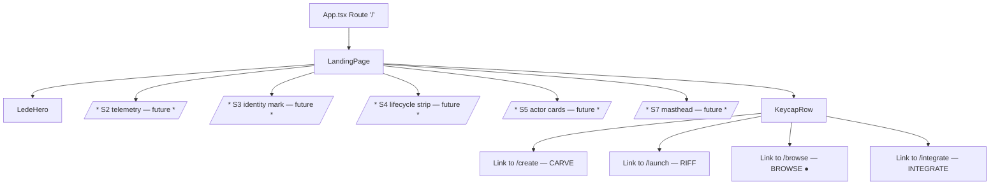

# Tusk3D Landing S6 — Keycap Dispatch Row + Route Migration

## Summary

Add the 4-keycap dispatch row (`CARVE / RIFF / BROWSE / INTEGRATE`) at the foot of the new Tusk3D landing page, and execute the route migration that makes the lede actually reachable — `BrowsePage` moves from `/` to `/browse`, and `/` mounts a new `LandingPage` wrapper that composes the shipped `LedeHero` (plan-019) + the new `KeycapRow`. Single milestone: when this lands, a first-time visitor opening `/` sees the lede + the 4-verb dispatch row, and `/browse` continues to serve the existing catalog grid unchanged.

---

## Problem Frame

`LedeHero` exists on main after plan-019 but is unreachable — `/` still mounts `BrowsePage`. A judge or first-time visitor lands on an internal-tool catalog with no orientation and no brand explanation. The brainstorm (`docs/brainstorms/2026-05-28-tusk3d-landing-s6-dispatch-requirements.md`) established WHAT to ship: a 4-keycap dispatch row + route swap. This plan establishes HOW to ship it without breaking existing internal navigation, existing tests, or the brand accent-budget rule (≤5 `#FF4500` per page; this plan adds 1).

---

## Requirements

This plan inherits all 17 requirements from the origin doc. Implementation units cite specific R-IDs.

**Origin actors:** A1 (visitor / judge — primary), A2 (asset producer — secondary, doesn't dispatch via S6 day-to-day)

**Origin flows:** F1 (browse-first — the default), F2 (CARVE → /create), F3 (RIFF → /launch), F4 (INTEGRATE → /integrate), F5 (legacy `/` link → lands on lede, no redirect)

**Origin acceptance examples:** AE1 (desktop landing render), AE2 (mobile 2×2 grid), AE3 (BROWSE click → /browse), AE4 (legacy bookmark lands on lede), AE5 (CARVE click → /create with wallet gate intact), AE6 (agent-browser smoke arc — KeycapRow only on /, LedeHero only on /)

---

## Scope Boundaries

- `frontend/src/browse/BrowsePage.tsx` is NOT modified — only its mounted route changes (App.tsx swap). The component renders identically at its new path.
- `frontend/src/ux/TopNav.tsx` is NOT modified. The TopNav brand-mark `<Link to="/">` legitimately points to `/` (new landing) and stays as-is.
- `frontend/src/landing/LedeHero.tsx` is NOT modified. It already exposes no props and is consumable by the new wrapper as-is.
- No `/` → `/browse` redirect (origin R13). Clean break.
- No live-Babylon path verification in agent-browser (no WebGL in its Chromium); rely on the `useLedeRenderMode` static-fallback path for headless verification per origin R15.

### Deferred to Follow-Up Work

- **S2 telemetry strip, S3 identity mark, S4 lifecycle strip, S5 actor cards, S7 issue masthead** — all separate survivor plans. The `LandingPage` wrapper in this plan provides clear insertion points but leaves them as comment markers.
- **The `/track` route mapping itself** stays at `/track` — the demo route is not renamed or moved. The `<Link to="/">` callsite inside `TrackPage.tsx`'s empty state IS in scope of U4 (it must flip to `/browse` along with the other catalog-meant callsites).
- **Replacing TopNav's verb language with keycap-row vocabulary** on non-landing pages — out of scope.
- **Internal links from `/track` empty-state and `/integrate` to the new `/browse`** — included in this plan (U4) because they're tightly coupled to the route migration; if they're missed, a "Back to Browse" link from those pages lands on the lede instead of the catalog.

---

## Context & Research

### Relevant Code and Patterns

- **`frontend/src/App.tsx`** (45 lines, 9 routes) — single edit site for the route table. The change is local to the `<Routes>` block.
- **`frontend/src/landing/LedeHero.tsx`** — props-free component, consumes module constants. Composable directly into the `LandingPage` wrapper without modification.
- **`frontend/src/browse/BrowsePage.tsx`** — the existing catalog grid. Unchanged by this plan; its tests get path-fixture updates only.
- **`frontend/src/ux/tokens.ts`** — D-044 tokens (`tokens.color.accent` = `#FF4500`, `tokens.font.mono`, `tokens.border.primary` = `1.5px solid #000`, `tokens.radius = 0`). `pagePaper`, `monoLabel` etc. consumed by the wrapper layout.
- **`frontend/src/ux/TopNav.tsx`** — brand-mark `<Link to="/" data-testid="brand-mark">` (line 85) stays unchanged; semantically "go home" = "go to landing" still.
- **`frontend/src/collection/CollectionDetailPage.tsx:50,72`** — two `<Link to="/">` callsites labelled "Back to Browse" / breadcrumb. Both flip to `/browse`.
- **`frontend/src/integration/RegisterIntegrationPage.tsx:120`** — `<Link to="/">← Browse</Link>` callsite. Flips to `/browse`.
- **`frontend/src/track/TrackPage.tsx:448`** — `<Link to="/" data-testid="track-empty-browse">` callsite in the empty-state. Flips to `/browse`.
- **`frontend/src/collection/CollectionDetailPage.tsx`** (line 1) — existing use of `Link` from `react-router-dom`. Same import path U1 uses.
- **`frontend/src/landing/LedeHero.test.tsx`** — vitest pattern with `MemoryRouter` wrapping. Mirror for KeycapRow + LandingPage tests.
- **`frontend/src/browse/BrowsePage.test.tsx:59`** — `MemoryRouter initialEntries={[path]}` pattern. Existing tests that use `path = '/'` for catalog need to update to `/browse`.
- **`frontend/src/ux/TopNav.test.tsx`** — pattern for testing routes that vary by pathname.

### Institutional Learnings

- **`docs/solutions/integration-issues/react-hooks-after-early-return-oauth-mask-2026-05-28.md`** *(low relevance for this plan)* — KeycapRow has no hooks, no branching; LandingPage is a thin wrapper. Not applicable.
- **`docs/solutions/integration-issues/react-strictmode-cleanup-only-effect-with-useref-2026-05-23.md`** *(low relevance)* — no effects in KeycapRow / LandingPage that need StrictMode discipline. Not applicable.

### External References

External research deliberately skipped. The repo has 5+ existing pages using React Router `Link`, all using the same `import { Link } from 'react-router-dom'` pattern from react-router-dom v6.x. No new dependency, no new API surface beyond what's already in use.

---

## Key Technical Decisions

- **`KeycapRow` is a flat function component with no props** — origin R1. All labels and routes are module-level constants. Reuse across surfaces (a future `/dev/landing-preview` page, say) doesn't require parameterization; the keycap row's identity is fixed.
- **`LandingPage` is a thin wrapper component, not inlined into App.tsx** — origin R12. Separates "the landing page composition" from "the route table"; future survivors (S2-S7) insert into `LandingPage`, not `App.tsx`. Cost: one extra file; benefit: route table stays one-line-per-route + composition is colocated.
- **2×2 mobile grid via CSS Grid (`grid-template-columns: 1fr 1fr` + flex-wrap fallback unnecessary)** — origin R8. CSS Grid is in every browser the repo targets; no fallback needed.
- **Hover state via plain CSS `:hover` selector with inline-style trick** — CSS-in-JS via inline `style` doesn't support pseudo-classes, so the keycap needs either a separate CSS module file or styled-components. Repo precedent: existing components use inline-style + plain CSS for hover (e.g., `frontend/src/ux/HelpIcon.tsx`). U1 adds a small CSS module `KeycapRow.module.css` co-located with the component for the hover-border-thickening rule. D-044 §7 instant rule means no `transition` declaration.
- **Single App.tsx commit landing the route swap + the 4 internal callsite flips** — keeps the migration atomic. If the route swap landed without the flips, "Back to Browse" links would dump users onto the lede mid-flow, a confusing bug for ~24 hours until the second commit. Both go together.
- **BrowsePage test path update is the only existing-test change** — the other tests that use `MemoryRouter` already specify their own paths (`/collection/:slug`, `/track`, etc.), so they're unaffected by the route swap.
- **Verification per CLAUDE.md** — agent-browser drives `/` and `/browse` after merge. Live-Babylon path on `/` isn't drivable in agent-browser (no WebGL), so verification asserts the static-fallback render + the keycap row's testids. Real Chrome verification is the user's pass.

---

## Open Questions

### Resolved During Planning

- **Should KeycapRow be inlined in LandingPage or live as its own file?** Decision: own file. S3/S4/S5/S7 survivors will mount their own components into `LandingPage`; treating each survivor's surface as its own file keeps composition clear and per-survivor PRs small.
- **Should the LandingPage wrapper own any state (e.g. scroll position, intersection observers for lazy-mount of S4)?** Decision: stateless in v1. Future survivors that need scroll observation will own their own hooks; LandingPage stays a layout wrapper.
- **Hover state implementation — inline style vs CSS module?** Decision: CSS module. Inline `:hover` doesn't work in React; the alternatives (styled-components, useState-on-mouseenter) add weight for one rule. A 10-line CSS module is the cleanest fit.

### Deferred to Implementation

- **Exact keycap padding / size** — implementer iterates against the lede's `pagePaper` container width and the typography ladder in `tokens.size`. Start with `padding: 24px 16px; font-size: 22px` for the verb, `font-size: 11px` for the route; tune by visual review.
- **Mobile breakpoint enforcement** — origin R6 uses 768px to match `useLedeRenderMode`. Implement via `@media (max-width: 767px)` in the CSS module; verify the grid swap aligns with the lede's render-mode flip in browser.
- **Whether `LandingPage` needs any vertical-spacing override between sections** — let inline margin / padding handle it for v1; revisit when S2/S3/S4/S5/S7 land and the cumulative spacing reads.

---

## High-Level Technical Design

> *Directional only. The implementing agent treats this as context, not code to reproduce.*

### Route table after migration

```text
BEFORE                                AFTER
/             → BrowsePage            /             → LandingPage (= LedeHero + KeycapRow)
                                      /browse       → BrowsePage          ← new
/create       → CreateModelPage       /create       → CreateModelPage     unchanged
/launch       → LaunchCollectionPage  /launch       → LaunchCollectionPage unchanged
/integrate    → RegisterIntegrationPage  /integrate → RegisterIntegrationPage unchanged
…etc (no other changes)               …etc
```

### KeycapRow layout shape

```text
Desktop ≥768px:
┌──────────┬──────────┬──────────┬──────────┐
│  CARVE   │   RIFF   │ BROWSE ● │INTEGRATE │
│ /CREATE  │ /LAUNCH  │ /BROWSE  │/INTEGRATE│
└──────────┴──────────┴──────────┴──────────┘

Mobile <768px:
┌──────────┬──────────┐
│  CARVE   │   RIFF   │
│ /CREATE  │ /LAUNCH  │
├──────────┼──────────┤
│ BROWSE ● │INTEGRATE │
│ /BROWSE  │/INTEGRATE│
└──────────┴──────────┘
```

### Component composition



---

## Implementation Units

### U1. `KeycapRow` component + tests

**Goal:** A self-contained 4-keycap dispatch row component renderable at the foot of `LandingPage`. No props; constants for labels + routes; CSS module for hover + 2×2 mobile grid; React Router `Link` for SPA navigation.

**Requirements:** R1 (single component), R2 (4 keycaps with verb + route + correct order), R3 (two-line label), R4 (BROWSE accent dot), R5 (hover thickens border, no transition), R6 (SPA Link), R7 (desktop equal-width row), R8 (mobile 2×2 grid), R9 (no data badges), R17 (1 accent slot)

**Dependencies:** None

**Files:**
- Create: `frontend/src/landing/KeycapRow.tsx`
- Create: `frontend/src/landing/KeycapRow.module.css`
- Test: `frontend/src/landing/KeycapRow.test.tsx`

**Approach:**
- Module-level constant `KEYCAPS` is a 4-tuple array of `{ verb, route, accent? }` in the locked order `CARVE → /create`, `RIFF → /launch`, `BROWSE → /browse` (accent: true), `INTEGRATE → /integrate`.
- Function component renders a `<nav data-testid="keycap-row" aria-label="Site sections">` containing a `<ul>` of 4 `<li>` keycaps. The `aria-label` distinguishes this nav landmark from the existing `TopNav` (which is also a `<nav>` — without distinct labels, screen readers announce "navigation, navigation" with no differentiation, failing WCAG 4.1.2). Each `<li>` wraps a `<Link to={route}>` with two stacked `<span>`s: the verb (mono caps, larger) and the route path (mono caps uppercase, smaller, hint color).
- The accent dot for BROWSE is rendered as a `<span data-testid="keycap-accent-dot" aria-hidden="true">` sibling of the verb, styled with `tokens.color.accent` background and `width: 6px; height: 6px` — a 6px×6px square (radius: 0 per D-044) reads as a brutalist editorial bullet, more on-brand than a circle. The `aria-hidden="true"` keeps screen readers from announcing the empty inline element mid-link-label.
- CSS module provides: `.keycaps { display: grid; grid-template-columns: repeat(4, 1fr); gap: 0; border-top: 1.5px solid #000 }`, `.keycap { border-right: 1.5px solid #000; padding: 24px 16px; ... }` (last keycap drops right border via `:last-child`).
- **Hover via inset `box-shadow`, not border-width change** — `.keycap:hover { box-shadow: inset 0 0 0 3px #000 }`. A `border-width` jump from 1.5px to 3px would push the keycap's box-model out and shift adjacent neighbors by 1.5px on every hover (visible jitter); `box-shadow` is layout-neutral and produces the same visual thickening without reflow.
- **Keyboard focus indicator** — `.keycap:focus-visible { outline: 3px solid #000; outline-offset: 2px }`. D-044 black borders swallow browser-default focus rings; this rule restores visible focus for keyboard users without breaking brand.
- Hint-color for the route path line resolves to `#595959` on `#F5F5F0` paper — `5.9:1` contrast, comfortably above WCAG AA `4.5:1` at 11px. Reference it via a new `tokens.color.subtle` entry rather than hardcoding the hex in the CSS module; if `tokens.ts` doesn't already export a passing low-contrast value, add one.
- Mobile breakpoint: `@media (max-width: 767px) { .keycaps { grid-template-columns: 1fr 1fr } .keycap:nth-child(2), .keycap:last-child { border-right: none } .keycap:nth-child(1), .keycap:nth-child(2) { border-bottom: 1.5px solid #000 } }`.
- No `transition` anywhere in the CSS module (D-044 §7 instant).

**Patterns to follow:**
- `frontend/src/landing/LedeHero.tsx` (props-free component, uses `tokens` from `../ux/tokens`)
- `frontend/src/collection/CollectionDetailPage.tsx` (Link from react-router-dom)
- `frontend/src/ux/HelpIcon.tsx` (inline style + plain CSS for hover precedent)

**Test scenarios:**
- Happy path — Component renders without crashing inside `MemoryRouter`. The 4 testid'd keycaps are present in DOM in CARVE/RIFF/BROWSE/INTEGRATE order. Covers AE1.
- Happy path — Each keycap's `<Link>` has the correct `href` attribute after Router resolution: `/create`, `/launch`, `/browse`, `/integrate`.
- Happy path — The accent dot testid is present inside the BROWSE keycap and ONLY the BROWSE keycap (assert `queryAllByTestId('keycap-accent-dot').length === 1` and that it's a descendant of the BROWSE `<li>`).
- Edge case — `nav` element has `data-testid="keycap-row"` so the LandingPage and verification layer can scope queries.
- Edge case — Clicking a keycap fires React Router navigation (use `useNavigate` testing or assert the rendered `<a href="...">` since `Link` renders an `<a>`).
- Visual / CSS — N/A in jsdom (CSS modules don't apply visible styles in jsdom). Verify the module class names attach: assert `nav.className.includes(...)` if Vite's CSS-module hash is preserved in tests, or fall back to asserting `data-*` attributes that act as test handles.

**Verification:**
- KeycapRow exported from `frontend/src/landing/KeycapRow.tsx`.
- All test scenarios pass (`pnpm --dir frontend vitest run src/landing/KeycapRow.test.tsx`).
- TypeScript clean (`pnpm --dir frontend tsc --noEmit`).

---

### U2. `LandingPage` wrapper component + tests

**Goal:** A layout wrapper component that composes `LedeHero` (above the fold) + `KeycapRow` (footer) into the single component mounted by App.tsx at `/`. Provides comment-only insertion points for S2/S3/S4/S5/S7 to land in later plans.

**Requirements:** R1 (KeycapRow rendered as last child of landing), R10 (KeycapRow ONLY on `/`), R12 (LandingPage wrapper)

**Dependencies:** U1

**Files:**
- Create: `frontend/src/landing/LandingPage.tsx`
- Test: `frontend/src/landing/LandingPage.test.tsx`

**Approach:**
- Function component, no props. Renders a `<main data-testid="landing-page">` styled with `pagePaper` token. Inside:
  1. `<LedeHero />` (top, above the fold)
  2. Comment placeholders for S2/S3/S4/S5/S7 (so the surrounding-survivor plans know exactly where to land)
  3. `<KeycapRow />` (bottom)
- Empty (truly empty, not even a wrapping div) between LedeHero and KeycapRow for v1. When S2 / S4 / etc. land, they slot in as additional children.
- Use `tokens` from `../ux/tokens` for any outer wrapper styling (background, default font).

**Patterns to follow:**
- `frontend/src/browse/BrowsePage.tsx` (page-level component, uses `pagePaper` from `tokens`)
- `frontend/src/landing/LedeHero.tsx` (props-free pattern)

**Test scenarios:**
- Happy path — `LandingPage` renders inside `MemoryRouter`. Both `lede-hero` testid AND `keycap-row` testid are present in DOM.
- Happy path — Order in DOM: LedeHero appears before KeycapRow in document order (lede at top of page, keycaps at foot).
- Happy path — `landing-page` testid is on the root element; usable by route-level tests and agent-browser scoping.
- Edge case — Mocking LedeHero (which has Babylon deps and Walrus fetch effects) at the module boundary using vitest's `vi.mock('./LedeHero', ...)` pattern so the LandingPage test doesn't have to mock Babylon. Returns a stub `<div data-testid="lede-hero">stub</div>`.

**Verification:**
- LandingPage exported from `frontend/src/landing/LandingPage.tsx`.
- Tests pass with LedeHero mocked at module boundary.
- TypeScript clean.

---

### U3. App.tsx route table swap

**Goal:** Replace the `/` route's element from `BrowsePage` to `LandingPage`, and add a new `/browse` route mapping to `BrowsePage`. Import `LandingPage` from the new path.

**Requirements:** R11 (route table edit)

**Dependencies:** U2

**Files:**
- Modify: `frontend/src/App.tsx`

**Approach:**
- Single edit to the `<Routes>` block: change `<Route path="/" element={<BrowsePage />} />` to `<Route path="/" element={<LandingPage />} />`, and insert `<Route path="/browse" element={<BrowsePage />} />` immediately below (keep BrowsePage import).
- Add `import { LandingPage } from './landing/LandingPage';` alongside existing page imports.
- Order in the route block is cosmetic but follow existing precedent (alphabetical-ish, or grouped by domain). Place `/browse` near `/` for readability.

**Patterns to follow:**
- `frontend/src/App.tsx` lines 26-36 (existing `<Routes>` block; mirror the same `<Route path="..." element={<Component />} />` shape).

**Test scenarios:**
- The existing App.tsx has no dedicated unit test (it's mostly route wiring). If a smoke test exists, verify it still passes; otherwise rely on the per-page tests + agent-browser verification.

**Verification:**
- App.tsx compiles (tsc clean).
- Manual dev-server smoke: `pnpm --dir frontend dev`, open `http://localhost:5173/`, confirm the lede renders (or static SVG); open `http://localhost:5173/browse`, confirm the catalog grid renders.

---

### U4. Internal callsite flips + BrowsePage test fixture update

**Goal:** Flip the 4 internal `<Link to="/">` callsites that semantically mean "go to catalog" to `<Link to="/browse">`. Update BrowsePage test's `MemoryRouter` entry path from `/` to `/browse`. Leave the TopNav brand-mark `<Link to="/">` (which semantically means "go home" → landing) untouched.

**Requirements:** R13 (no `/` → `/browse` redirect — handled by explicit callsite flips), R14 (existing tests that hit `/` for catalog get updated)

**Dependencies:** U3 (the route must exist before callers point at it; otherwise dev-mode hot reload between U3 and U4 would 404)

**Files:**
- Modify: `frontend/src/collection/CollectionDetailPage.tsx` (two `<Link to="/">` callsites, lines ~50 and ~72)
- Modify: `frontend/src/integration/RegisterIntegrationPage.tsx` (one callsite, line ~120)
- Modify: `frontend/src/track/TrackPage.tsx` (one callsite, line ~448, has `data-testid="track-empty-browse"`)
- Modify: `frontend/src/track/TrackPage.test.tsx` (line 160 directly asserts `expect(link.getAttribute('href')).toBe('/')` — this WILL break on the callsite flip; update to `'/browse'`)
- Modify: `frontend/src/browse/BrowsePage.test.tsx` (path fixture in MemoryRouter — update `renderPage('/?filter=integration')` at line ~214 to `renderPage('/browse?filter=integration')` for hygiene; the test still passes either way because `renderPage` mounts `BrowsePage` directly without a `<Routes>` wrapper, but the path should match the deployed URL)
- Optional: `frontend/src/browse/BrowsePage.tsx` — add a root `data-testid="browse-page"` to the page root div so U5 agent-browser smoke can positively assert the catalog mount at `/browse` (alternative: U5 scopes to negative-only assertion; see U5 Approach)

**Approach:**
- For each callsite: replace `to="/"` with `to="/browse"`. Text content of the link ("Back to Browse", "← Browse") stays the same — it was already accurate semantics; just the URL was wrong because BrowsePage used to live at `/`.
- For `BrowsePage.test.tsx`: the `path` variable passed to `MemoryRouter initialEntries={[path]}` currently uses `/` in some tests for catalog content. Change to `/browse` so the tests still mount on the correct route. Verify no test asserts on the literal path `/` (would be a brittle test; should be hitting testids or DOM, not the URL).
- Do NOT touch `frontend/src/ux/TopNav.tsx:85` brand-mark — that `<Link to="/">` correctly resolves to the new landing page.

**Patterns to follow:**
- Existing internal Link patterns in the same files (no new pattern needed).

**Test scenarios:**
- Run existing CollectionDetailPage tests — the link click test (if any) must now navigate to `/browse` not `/`. Adjust assertions if a test explicitly asserts the navigated path. Optionally tighten the error-state test (currently asserts only the empty-state testid) to also assert the "Back to Browse" link's `href` is `/browse` — closes a silent coverage gap.
- Run TrackPage tests — the empty-state link test at `TrackPage.test.tsx:160` directly asserts `getAttribute('href') === '/'` and WILL break on the callsite flip. Update the assertion to `'/browse'` as part of this unit.
- Run RegisterIntegrationPage tests — verify the test (if any) that touches the "← Browse" link reflects the new `/browse` href. If no such assertion exists today, add one to close the coverage gap (since this plan is the moment the destination changes).
- Run BrowsePage tests — assert they still pass after the fixture path change. The CollectionCard grid and filter UI should render identically under `/browse` (the route doesn't affect component rendering, only the URL bar).

**Verification:**
- All existing tests in the 4 modified files still pass (no behavioral assertions change — only the asserted URLs flip if they're asserted at all).
- Full frontend test suite passes (`pnpm --dir frontend vitest run`).
- TypeScript clean.

---

### U5. Frontend verification — agent-browser smoke on / and /browse

**Goal:** Per CLAUDE.md Frontend Verification Protocol, drive the new `/` and `/browse` routes in `agent-browser` to confirm the route migration shipped correctly and the keycap row renders at `/` only.

**Requirements:** R15 (agent-browser verification of both routes), R16 (no wallet flows affected)

**Dependencies:** U1, U2, U3, U4 (all code merged; dev server runnable)

**Files:**
- Test expectation: none — this is a manual verification step, not a code-bearing unit. No new files; no test fixture changes beyond what U4 already does.

**Approach:**
- Start `pnpm --dir frontend dev` (if not already running).
- Invoke `agent-browser` via the `ce-test-browser` skill at `http://localhost:5173/`.
- Assert: `landing-page` testid present, `lede-hero` testid present (rendering static-fallback path since agent-browser's Chromium lacks WebGL), `keycap-row` testid present with 4 keycaps, BROWSE keycap contains `keycap-accent-dot` testid.
- Click the BROWSE keycap. Assert URL → `/browse`. Assert `landing-page` testid NOT present anymore (negative — proves the route swap fired). Assert `browse-page` testid IS present (positive — added to BrowsePage root in U4 per the optional file in U4's Files list). Assert `keycap-row` testid is NOT present on `/browse` (proves R10's landing-only scope).
- Navigate to `http://localhost:5173/integrate` (existing route). Assert the "← Browse" Link's `href` is `/browse` (post-U4 flip), not `/`.
- Pre-commit checklist self-review (CLAUDE.md): walk `docs/ux/frontend-checklist.md` items for any frontend-touching change — cross-component state, async UX feedback, real-data drift, source-of-truth drift, effect deps. Most are non-applicable for a pure-render keycap row + route swap.
- The live-Babylon path on `/` cannot be driven in agent-browser (no WebGL). User runs that step in real Chrome and reports back.

**Verification:**
- agent-browser smoke passes on both `/` and `/browse`.
- No console errors, no React warnings.
- User-side real-Chrome confirmation that the live Babylon lede renders at `/` (asset verification is gated on Rick's Tripo mint per plan-019; placeholder SVG renders on the static-fallback path regardless).

---

## System-Wide Impact

- **Interaction graph:** `App.tsx` now imports `LandingPage` from `frontend/src/landing/LandingPage.tsx`, which composes `LedeHero` + `KeycapRow`. BrowsePage's mount path moves from `/` to `/browse` but its component code is identical (modulo the optional U4 root testid addition).
- **Terminology bridge:** the origin requirements doc uses the placeholder name `TheNewLandingPage` (R11/R12); this plan implements it as `LandingPage` at `frontend/src/landing/LandingPage.tsx`. Same component, real name.
- **Error propagation:** No new error paths. `KeycapRow` is stateless; `LandingPage` is a layout wrapper. Existing error boundaries (none today on the landing) cover what they covered before.
- **State lifecycle risks:** None new. LedeHero's effect lifecycle is unchanged. KeycapRow has no effects.
- **API surface parity:** No public-facing API changes. Two new internal component exports (`KeycapRow`, `LandingPage`) usable elsewhere in the frontend if needed (no specific reuse planned in v1).
- **Integration coverage:** Cross-layer behavior covered by U5 (agent-browser smoke on both `/` and `/browse` + the internal callsite flip verification). U5's scope is the two routes this plan changes; the broader demo arc (`/create`, `/launch`, `/integrate`, `/market`, `/track`, `/model/:id`, `/collection/:id`) is verified by its respective owning plans' protocols and is touched here only insofar as the 4 internal callsite flips affect their behavior — which U4's test scenarios cover.
- **Unchanged invariants:** `BrowsePage`, `TopNav`, `LedeHero`, `useLedeRenderMode`, `edgesGradientSweep`, `fetchBlobWithTimeout` are all untouched. The plan-019 test suite (24 tests across U1+U2+U3+U4 of plan-019) continues to pass without modification.

---

## Risks & Dependencies

| Risk | Mitigation |
|------|------------|
| A `<Link to="/">` callsite I missed in U4 still routes users to the landing when they expect the catalog. | Grep for `to="/"\|to={"/"\|to='/'` across `frontend/src/` before declaring U4 done; confirm each remaining hit is either the TopNav brand-mark (legitimate) or a test fixture (also legitimate when path-resolving). |
| BrowsePage test fixture update breaks a test that asserted on the literal URL `/` rather than DOM content. | If U4 surfaces such an assertion, change the test to assert on rendered content (testid, text) rather than URL. URL-asserting tests are brittle and worth fixing. |
| CSS module class-name hashing under Vite test mode means `KeycapRow.module.css` rules don't visibly apply in jsdom. | Tests verify presence of testids and DOM structure, not CSS-applied visual style. Visual verification is the agent-browser + real-Chrome step in U5. |
| The accent budget (≤5 per page) gets exceeded if a future survivor plan adds more than the unallocated slots assume. After this plan ships, **consumed = 2** (S1 lede CTA + S6 BROWSE dot); **reserved-not-yet-consumed = 1** (S2 telemetry ●live, in the brainstorm but not yet implemented); **unallocated = 2**. | Track accent slot usage explicitly in each future survivor plan's `## Key Technical Decisions` section. The brainstorm doc reserves S2's slot; S3/S4/S5/S7 compete for the 2 unallocated. |
| If the user's real-Chrome verification reveals a layout regression I can't see in agent-browser (e.g., the 2×2 mobile grid overflows the page-paper container), iterate on CSS in a follow-up commit. | Implementation note in U1: the implementer can adjust padding / breakpoint trigger / gap as needed during browser verification before merging. The plan's CSS guidance is directional. |

---

## Documentation / Operational Notes

- Frontend verification protocol per CLAUDE.md: agent-browser drives `/` and `/browse`; user runs the live-Babylon path in real Chrome.
- Default review roster for frontend-touching plans per CLAUDE.md: include `ce-julik-frontend-races-reviewer` alongside `ce-correctness-reviewer`, `ce-testing-reviewer`, `ce-api-contract-reviewer`, `ce-adversarial-reviewer`. (For this plan, frontend-race risk is lower than plan-019's because there are no async effects, no AbortControllers, no Babylon lifecycle — but the protocol's default is the default.)
- Pre-commit checklist: walk `docs/ux/frontend-checklist.md` items relevant to the change before declaring done.
- After ship, the landing milestone is "user opening `/` sees lede + 4 keycaps". Subsequent landing survivor plans (S2-S7) slot into the same `LandingPage` wrapper without further App.tsx changes.

---

## Sources & References

- **Origin document:** [docs/brainstorms/2026-05-28-tusk3d-landing-s6-dispatch-requirements.md](../brainstorms/2026-05-28-tusk3d-landing-s6-dispatch-requirements.md)
- **Upstream ideation:** [docs/ideation/2026-05-28-tusk3d-landing-page-ideation.md](../ideation/2026-05-28-tusk3d-landing-page-ideation.md) (entry #6, page layout)
- **Sibling shipped plan:** [docs/plans/2026-05-28-019-feat-tusk3d-landing-lede-plan.md](2026-05-28-019-feat-tusk3d-landing-lede-plan.md) (S1 lede — provides `LedeHero` that this plan composes)
- Related decisions: D-007 (Babylon imperative — affects LedeHero, not S6 directly), D-044 (brutalist editorial — accent budget + tokens), D-068 (Tusk3D brand)
- Related code references: `frontend/src/App.tsx`, `frontend/src/landing/LedeHero.tsx`, `frontend/src/browse/BrowsePage.tsx`, `frontend/src/ux/TopNav.tsx`, `frontend/src/ux/tokens.ts`, `frontend/src/collection/CollectionDetailPage.tsx`, `frontend/src/integration/RegisterIntegrationPage.tsx`, `frontend/src/track/TrackPage.tsx`
