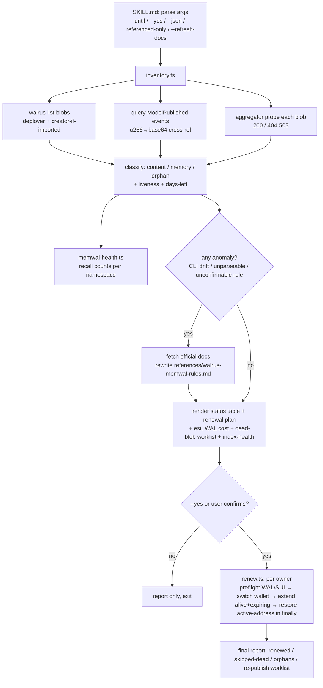

# feat: Walrus + MemWal Blob Keep-Alive Skill

> **Origin:** `docs/brainstorms/2026-06-18-walrus-memwal-renewal-skill-requirements.md` (D-a…D-g).
> **Skill home:** personal `~/.claude/skills/tusk3d-blob-keepalive/` — not committed to the repo (D-g: avoids the accident vector of pushing a secret to the public GitHub remote; lives with the keystore it drives). Paths below the skill root are written relative to that root; repo files it reads are repo-relative.

## Summary

A personal Claude Code skill that, in one run, inventories every Walrus blob the Tusk3D demo depends on — content blobs **and** MemWal memory blobs — cross-references each to its on-chain `Model3D`, probes the aggregator for true liveness, and renews everything salvageable to a target epoch after a confirm gate. It automates exactly the manual archaeology done on 2026-06-18 (query `ModelPublished` events, convert blob-id encodings, probe 404/503, switch wallets, `walrus extend` one-by-one). The skill is an **agent-procedure skill** (`SKILL.md` the agent follows) backed by **deterministic `tsx` helpers** run through the repo's backend env, plus a **bundled reference** of verified Walrus/MemWal rules that self-heals from official docs on anomaly.

## Problem Frame

Walrus testnet blobs expire (1 epoch = 1 day; GC'd the moment `end_epoch` passes). Tusk3D's demo content and its MemWal memory pool both ride on testnet blobs and rot silently — on 2026-06-18, 4 of 7 demo models were already 404/503 (both encrypted models dead), one was hours from expiry, and the MemWal `global` namespace had collapsed to a single record. Keeping the demo alive currently means repeating a long, error-prone manual process every few days through 7/20–21. This skill collapses it to one command + one confirmation, and surfaces what is already dead and must be re-published.

**Hard-won invariant (baked in, non-negotiable):** on-chain `end_epoch ≥ current` does NOT mean readable — storage nodes drop slivers as expiry nears, so a blob can be on-chain-valid but already 404/503, and `walrus extend` "succeeds" on it while the data stays dead. The skill **always aggregator-probes first and only extends blobs that return 200.**

---

## Requirements Traceability

| Req (origin) | Advanced by |
|---|---|
| R1 — list blobs with expiry + model context | U3, U6 |
| R2 — renew salvageable blobs (default max, `--until DATE`) | U5, U6 |
| R3 — MemWal expiry + renewal (list-blobs heuristic) | U3, U5 |
| R4 — aggregator-200 guard before extend | U3, U5 |
| R5 — status + plan, confirm to sign (`--yes`) | U6 |
| R6 — dead-blob → which-model worklist | U3, U6 |
| R7 — MemWal index-health report | U4, U6 |
| R8 — bundled reference + auto-fetch on anomaly + `--refresh-docs` | U2, U6 |
| R9 — WAL/SUI balance preflight | U5 |
| R10 — wallet auto-switch + restore-on-exit (incl. failure) | U5 |
| R11 — never write keys/seed to disk; warn on secret-in-args | U3, U5, U6 |
| R12 — `--json` output; idempotent re-runs | U3, U6 |

---

## Key Technical Decisions

**KTD-1 — Agent-procedure skill + deterministic `tsx` helpers (D-a).** `SKILL.md` is the procedure the agent executes (parse args → inventory → present → confirm → renew → report); the gnarly deterministic work (u256→base64, `ModelPublished` cross-ref, aggregator probe, MemWal SDK calls, SEAL classification, extend-with-restore) lives in `tsx` helpers that emit/consume structured JSON. Rationale: the confirm gate, dead-blob reasoning, and doc-refresh-on-anomaly need agent judgment; the data engine needs determinism + testability.

**KTD-2 — Run helpers through the repo's backend env (chosen fork b).** Helpers run via `pnpm --dir <repo>/backend exec tsx <skill>/scripts/<x>.ts`, reusing `@mysten/sui`, `@mysten-incubation/memwal`, and `shared/` builders. Trade-off: the skill only works from within the Tusk3D repo with backend deps installed — already true, since it reads `backend/.env`, `contracts/networks/testnet.json`, and `frontend/src/walrus/aggregator.ts`. Rejected: self-contained bash+curl (would reimplement u256→base64 and lose the MemWal SDK for health).

**KTD-3 — MemWal memory-blob detection = `list-blobs` heuristic, no SDK enumeration.** Confirmed from the SDK surface (`@mysten-incubation/memwal`): it exports `remember/recall/health/embed/analyze/restore` but **no list-all-memories** call. So memory blobs are detected from `walrus list-blobs` on the deployer account by a **four-signal classifier**: deployer-owned **AND** small (< size threshold, observed 557–630 B) **AND** **not referenced by any `ModelPublished` event** (content/preview blobs always are; memories never are — the strongest signal) **AND** leading bytes match the observed SEAL/IBE envelope. The skill prints its classification before signing (R5 safety net). Resolves origin open-Q #2 and #3.

**KTD-4 — Liveness is the aggregator, not the chain (R4).** Each blob is probed at the resolved aggregator (`/v1/blobs/<id>` for plain; `/v1/blobs/by-quilt-patch-id/<patchId>` for encrypted quilts) → `alive` (200) / `dead` (404·503). Only `alive` blobs are eligible to extend; `dead` ones route to the re-publish worklist. Edge state (on-chain `end_epoch == current`) is reported but trusted only if it probes 200.

**KTD-5 — Renew-all-readable by default; flag orphans; `--referenced-only` for thrift (chosen fork).** Default renews every readable blob owned by the demo wallets (matches the safe 2026-06-18 manual pass), labels blobs that no live `Model3D` references as **orphan**, and offers `--referenced-only` to renew just the model-backed ones to save WAL. Target epoch: default **max** (`current + 53`); `--until <DATE>` renews only what expires before that date, mapping the date to an epoch via the live epoch clock (D-e).

**KTD-6 — Doc currency: bundled reference, auto-fetch on anomaly, `--refresh-docs` (D-d, R8).** Normal runs read `references/walrus-memwal-rules.md` offline. The agent fetches official docs only on an anomaly (CLI flag/exit-code drift, a `walrus` "client outdated" warning, an unparseable output shape, or a rule it cannot confirm), then adapts and rewrites the bundled reference. The reference ships with **candidate** doc entry URLs marked "verify on first fetch" — no URL is asserted as canonical without a live check (avoids baking a wrong URL).

**KTD-7 — Secret hygiene (R11).** Helpers read `backend/.env` MemWal keys at runtime, never echo or persist them; output is scrubbed. If a mnemonic/private-key-shaped token appears in args, the skill refuses and warns (keys belong in the `sui` keystore, imported out-of-band).

---

## Output Structure

```
~/.claude/skills/tusk3d-blob-keepalive/
├── SKILL.md                      # U1, U6 — frontmatter + agent procedure
├── references/
│   └── walrus-memwal-rules.md    # U2 — bundled verified rules (R8 offline source)
└── scripts/
    ├── inventory.ts              # U3 — list+classify+cross-ref+probe → JSON
    ├── memwal-health.ts          # U4 — recall index-health per namespace → JSON
    ├── renew.ts                  # U5 — execute extend plan, switch+restore wallet
    └── lib/
        ├── blobid.ts             # u256→base64url + encoding helpers (pure)
        ├── classify.ts           # blob classification (pure)
        ├── epochs.ts             # epoch↔date↔days, target-epoch calc (pure)
        └── *.test.ts             # node:test units for the pure libs
```

The pure logic is isolated under `scripts/lib/` so it is unit-testable in isolation; the integration scripts (`inventory/memwal-health/renew`) are verified via `--dry-run` against live testnet.

---

## High-Level Technical Design

The run pipeline, both blob classes flowing through one path, with the confirm gate and the anomaly→refresh branch:



Authoritative content is the prose + unit definitions below; the diagram conveys shape.

---

## Implementation Units

### U1. Skill scaffold + frontmatter
**Goal:** Create the skill directory, `SKILL.md` frontmatter, and empty `references/` + `scripts/` so the skill is discoverable and declares its tools.
**Requirements:** Enables all.
**Dependencies:** none.
**Files:** `~/.claude/skills/tusk3d-blob-keepalive/SKILL.md` (frontmatter + procedure stub), `scripts/`, `references/` dirs.
**Approach:** Frontmatter mirrors existing personal skills (`name`, `version`, `description`, `triggers`, `allowed-tools`). `allowed-tools`: `Bash`, `Read`, `WebFetch`, `WebSearch` (last two for R8 refresh). Triggers: e.g. "renew walrus blobs", "keep demo alive", "check blob expiry", "tusk3d keepalive". Procedure body filled in U6.
**Patterns to follow:** `~/.claude/skills/careful/SKILL.md` frontmatter shape.
**Test scenarios:** `Test expectation: none — scaffold/metadata; validated by the skill loading and U6's end-to-end.`
**Verification:** Skill appears in the skill list; `allowed-tools` includes Bash/Read/WebFetch/WebSearch.

### U2. Bundled Walrus/MemWal reference
**Goal:** Capture the verified rules the skill relies on offline (R8 source of truth).
**Requirements:** R8.
**Dependencies:** U1.
**Files:** `references/walrus-memwal-rules.md`.
**Approach:** Document, from the 2026-06-18 verified session: epoch model (1 epoch = 1 day testnet, boundary 16:18 UTC), 53-epoch max-ahead cap, `walrus list-blobs`/`extend --blob-obj-id … --epochs-extended N`/`blob-status` semantics, the **aggregator-200 guard** rationale, blob-id u256-LE→base64url encoding + quilt-patch-id shape, `ModelPublished` cross-ref fields, MemWal ownership model (deployer-owned SEAL blobs, relayer-sponsored storage, `GLOBAL_NAMESPACE='global'`, no SDK enumeration), and the SEAL-envelope classifier. Include **candidate** official doc URLs flagged "verify on first fetch" (no asserted-canonical URL). Cross-link the project memory `project_walrus_testnet_blob_expiry`.
**Patterns to follow:** the project memory `project_walrus_testnet_blob_expiry` (already holds most facts).
**Test scenarios:** `Test expectation: none — reference content; correctness checked by U6 runs and refresh-on-anomaly.`
**Verification:** A fresh reader can run every operation from this doc alone; numbers match `walrus info`.

### U3. Inventory + classify + cross-ref helper
**Goal:** Produce the structured inventory: every demo-wallet blob with owner, liveness, expiry epoch + days-left, classification (content/memory/orphan), and cross-referenced `Model3D` (id, name, encrypted?, creator).
**Requirements:** R1, R3 (detection), R4 (probe), R6 (cross-ref data), R11, R12.
**Dependencies:** U1.
**Files:** `scripts/inventory.ts`, `scripts/lib/blobid.ts`, `scripts/lib/classify.ts`, `scripts/lib/epochs.ts`, `scripts/lib/blobid.test.ts`, `scripts/lib/classify.test.ts`, `scripts/lib/epochs.test.ts`.
**Approach:** Read accounts (deployer always; creator only if its key is in the keystore — D-f). Run `walrus list-blobs` (JSON) per account; query `<model3d_package_id>::model3d::ModelPublished` events (package id from `contracts/networks/testnet.json`); convert Blob-object u256 ids → base64url and match against event `lineage_blob_id`/`preview_blob_ids` (encrypted = quilt-patch suffix). Probe each blob at the aggregator resolved from `frontend/src/walrus/aggregator.ts` (env override aware — never a hardcoded guess). Classify: **content** (referenced + non-SEAL), **memory** (deployer-owned + small + unreferenced + SEAL envelope, KTD-3), **orphan** (readable, unreferenced, not a memory). Emit JSON; `--json` passes it through, default renders nothing here (U6 renders). Scrub any secret read from `backend/.env`.
**Patterns to follow:** `ModelPublished` query shape used this session (`suix_queryEvents` MoveEventType filter); aggregator constant in `frontend/src/walrus/aggregator.ts`; MemWal config read in `backend/src/lib/memwal-client.ts`.
**Test scenarios:**
- `blobid`: u256 `55263270805781128053964002397120792805227526079307779873008860555396372071302` → `hoMNJJ3hEq_eF53gi9EsfMYF4vixLflZt3yQzB_nLXo` (known 2026-06-18 vector); round-trip base64url→u256→base64url is identity.
- `epochs`: current epoch 432 + boundary 2026-06-18T16:18Z → `--until 2026-07-21` maps to the correct target epoch; days-left for `end_epoch 440` at epoch 432 = 8; target never exceeds `current + 53`.
- `classify`: a referenced non-SEAL blob → content; a 600 B deployer-owned unreferenced SEAL-envelope blob → memory; a readable unreferenced non-SEAL blob → orphan; a referenced encrypted quilt-patch id → content (not memory).
- Edge: blob on-chain `end_epoch ≥ current` but aggregator 503 → liveness `dead` (KTD-4), excluded from renewable set.
- Integration (`--dry-run`, live testnet): emits ≥1 alive content blob mapped to a real `Model3D` name; no secret appears in output.
**Verification:** `--json` output lists each blob with correct class, liveness, days-left, and model mapping cross-checked against `walrus blob-status` + the aggregator.

### U4. MemWal index-health helper
**Goal:** Report how many records each known namespace's `recall` actually surfaces, flagging a starved index (R7).
**Requirements:** R7, R11.
**Dependencies:** U1.
**Files:** `scripts/memwal-health.ts`.
**Approach:** Using the MemWal config from `backend/.env`, run `recall` for a small probe set across `global` + known demo-wallet namespaces; report distinct-record counts and an `errored/degraded` flag (cold-start timeout tolerated). Flag "index starved — re-index needed" when distinct global records fall below a threshold. Read-only; never renews; never prints keys.
**Patterns to follow:** `backend/src/lib/memwal-client.ts` (`getMemwalClient`, fail-soft recall), `backend/src/lib/memoryConfig.ts` (`GLOBAL_NAMESPACE`).
**Test scenarios:**
- Distinct-count logic: multiple queries returning the same single `blob_id` collapse to a count of 1 (the 2026-06-18 "mechanical dog" state) and trip the starved flag.
- A cold-start `recall` timeout surfaces as `errored`, not as count 0.
- Integration (live): reports a non-negative global count without leaking MemWal keys.
**Verification:** Output count matches a manual `recall` spot-check; starved flag fires on the current global namespace.

### U5. Renewal executor (extend with wallet switch + restore)
**Goal:** Execute the confirmed renewal plan: per owner, preflight funds, switch wallet, extend each alive+expiring blob toward target, and always restore the original active-address (R2, R9, R10).
**Requirements:** R2, R3 (renewal), R4 (only alive), R9, R10, R11.
**Dependencies:** U1.
**Files:** `scripts/renew.ts`.
**Approach:** Input = a plan JSON (list of `{blobObjId, owner, epochsExtended}` already filtered to alive + expiring by U3/U6). Per distinct owner: check WAL + SUI balance ≥ estimated cost (skip + warn if short, R9); `sui client switch` to owner; `walrus extend --blob-obj-id <id> --epochs-extended <N>` per blob; collect per-blob success/failure. **Restore the original active-address in a `finally` so it happens even on failure (R10).** Re-runnable: a blob already at/above target is a no-op (R12). Refuses if a seed/key-shaped arg is present (R11).
**Patterns to follow:** the 2026-06-18 manual sequence (`sui client switch` → `walrus extend --blob-obj-id … --epochs-extended …`).
**Test scenarios:**
- Plan-builder/target math (pure, shared with U3 epochs lib): `end_epoch 440 → target 485` yields `epochs-extended 45`; never exceeds `current + 53`.
- Owner grouping: a plan spanning deployer + creator switches twice and restores the pre-run active-address exactly once at the end.
- `finally` restore: an extend throwing mid-plan still restores the original active-address (simulated failure).
- Preflight: an owner with insufficient WAL is skipped with a warning, not attempted.
- Idempotency: re-running a plan whose blobs already meet target performs no extends.
- Integration (`--dry-run`): prints the exact extend commands + est. WAL per owner, signs nothing.
**Verification:** After a real run, `walrus blob-status` shows each targeted blob at the target epoch; active-address is unchanged from before the run.

### U6. SKILL.md procedure — orchestration, confirm gate, reporting, doc-refresh
**Goal:** Tie the helpers into the user-facing flow with the confirm gate, status table, worklist, index-health, args, and doc-refresh-on-anomaly.
**Requirements:** R1, R2, R5, R6, R7, R8, R12.
**Dependencies:** U2, U3, U4, U5.
**Files:** `SKILL.md` (procedure body).
**Approach:** Procedure the agent follows: (1) parse `--until DATE`, `--yes`, `--json`, `--referenced-only`, `--refresh-docs`; (2) run `inventory.ts` + `memwal-health.ts`; (3) on any anomaly, fetch official docs and rewrite `references/walrus-memwal-rules.md` before proceeding (KTD-6); (4) render the **status table** (model id + name + encrypted? + creator + owner + alive/edge/dead + days-left), the **renewal plan** (which blobs → which epoch, est. WAL per wallet), the **dead-blob → re-publish worklist** (named `Model3D`s), and the **index-health** line; (5) **confirm gate** — proceed only on explicit confirm or `--yes`; (6) build the plan JSON (apply `--referenced-only`, target from `--until`/max), run `renew.ts`; (7) final report. `--json` emits machine-readable inventory + plan and skips prose. `--refresh-docs` runs the fetch+rewrite unconditionally then exits.
**Patterns to follow:** agent-procedure skills with bundled helpers (e.g. `~/.claude/skills/canary`, `careful`).
**Test scenarios:**
- Default (no `--yes`): renders status table + plan, then stops at the confirm gate without signing.
- `--yes`: proceeds through `renew.ts` without prompting.
- `--referenced-only`: orphan blobs appear in the table but are excluded from the renewal plan.
- `--until 2026-07-21`: only blobs expiring before that epoch are in the plan; later-expiring ones shown as "ok, skipped".
- Dead blob present: appears in the re-publish worklist with its `Model3D` name, never in the renewal plan.
- Anomaly (simulated `walrus` "client outdated" / unparseable output): triggers a doc fetch + reference rewrite before the table renders.
- `--json`: emits structured inventory + plan, no prose, no secrets.
**Verification:** End-to-end on live testnet: one run renews all alive+expiring demo + memory blobs to target after one confirmation, restores active-address, and prints an accurate worklist + index-health; `--json` round-trips.

---

## Scope Boundaries

### In scope
U1–U6: inventory + cross-ref + liveness, renew content + memory blobs to target with the aggregator-200 guard, confirm-gated multi-wallet signing with restore-on-exit, dead-blob worklist, MemWal index-health, bundled-reference-with-anomaly-refresh, and the baked defaults (WAL/SUI preflight, secret hygiene, `--json`, idempotency).

### Deferred for later (skill reports; user acts)
- Auto re-publish of dead content — worklist only.
- Auto re-`remember` / re-index of a starved MemWal namespace — health report only.
- Mainnet support — testnet-only; mainnet `walrus` context is a later add.
- Scheduled/cron auto-renewal — manual invocation only.

### Deferred to Follow-Up Work
- Reusing the inventory engine for a CI/pre-demo health gate (the `--json` shape is built to allow it later).

### Outside this tool's identity
- Not a general-purpose multi-project Walrus tool — zero-config Tusk3D is deliberate (D-a).
- Not a content uploader/minter.

---

## Risks & Dependencies

- **Dependencies:** `walrus` CLI (verified 1.48.1) + `sui` CLI with testnet context; the Tusk3D repo present with `backend` deps installed (helpers run via `pnpm --dir backend exec tsx`); `backend/.env` MemWal keys; `contracts/networks/testnet.json`; `frontend/src/walrus/aggregator.ts`; `@mysten-incubation/memwal` (recall/health).
- **Creator wallet (D-f):** `0xc731848b…` is renewed only when its key is imported into the keystore (out-of-band, separate terminal). Deployer `0x3116881c…` is always active. The skill detects which are available and reports the rest as "skipped — key not imported." Wallet **addresses** are public (in committed `testnet.json`); the seed must never enter the skill (R11).
- **Risk — SEAL classifier false-positive/negative:** a small non-memory blob could be misclassified. Mitigation: the "unreferenced by any `Model3D`" signal is the primary discriminator (KTD-3), and the skill prints its classification before signing (R5).
- **Risk — epoch boundary mid-run:** the live epoch can tick over (16:18 UTC) during a run, shifting `current+53`. Mitigation: read the epoch once at inventory and compute targets against that snapshot; a one-epoch drift is harmless (target is a ceiling).
- **Risk — doc-refresh churn:** official-doc structure changes could destabilize a refresh right before demo. Mitigation: refresh only on anomaly or explicit `--refresh-docs`; normal runs stay offline (KTD-6).
- **Risk — extend on a 503 blob wastes WAL:** prevented by the aggregator-200 guard (KTD-4) — the core invariant this tool exists to enforce.

---

## Open Questions (deferred to implementation)

- **Skill name** — planned as `tusk3d-blob-keepalive`; adjust at U1 if a better trigger phrase emerges.
- **Official doc entry URLs** — captured as "verify on first fetch" candidates in U2; the canonical URLs are confirmed live at the first `--refresh-docs`/anomaly fetch rather than asserted now.
- **Size threshold for the memory classifier** — start from the observed 557–630 B band (e.g. `< 4 KB`) and confirm against live `list-blobs` during U3; the unreferenced-by-Model3D signal carries the classification even if the threshold is loose.

---

## Sources & Research

- Origin requirements: `docs/brainstorms/2026-06-18-walrus-memwal-renewal-skill-requirements.md`.
- First-hand verification (2026-06-18 session): `walrus` 1.48.1 / `sui` 1.72.1 behavior; epoch 432; the u256→base64 test vector; aggregator 200/404/503 probing; MemWal memory blobs as deployer-owned SEAL records; extend-with-restore across two wallets.
- Project memory `project_walrus_testnet_blob_expiry` (updated this session with the `extend` + MemWal findings).
- MemWal SDK surface (`backend/node_modules/@mysten-incubation/memwal` `.d.ts`): `remember/recall/health/embed/analyze/restore`, **no enumeration** → KTD-3.
- Repo constants: `frontend/src/walrus/aggregator.ts`, `contracts/networks/testnet.json`, `backend/src/lib/memwal-client.ts`, `backend/src/lib/memoryConfig.ts`.
- No `docs/solutions/` entry on blob expiry/renewal — grounding is first-hand + the project memory.
