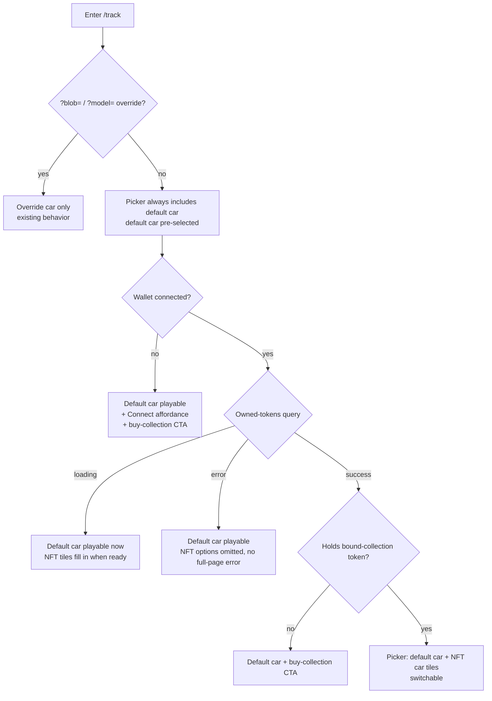

# feat: /track default car + NFT unlock (free-to-play flip)

Flip `/track` (Rage Racing) from **own-or-die** to **free-to-play + NFT unlock**.
A procedurally-built primitive default car is always drivable with no wallet; a
car-picker gains the player's NFT car(s) when they hold a token from one bound
collection; the wallet gate and empty-garage dead-end are removed; non-owners see
a "buy the collection to drive it here" prompt.

Frontend-only. No contract, backend, or Walrus changes.

> Origin: `docs/brainstorms/2026-06-18-track-default-car-nft-unlock-requirements.md`.
> All R-IDs below trace to that doc.

---

## Problem Frame

`frontend/src/track/TrackPage.tsx` hard-requires a connected wallet (early return
at ~L439), queries the player's owned `NftToken`s, and renders a dead-end "Your
garage is empty" screen when they own none. A first-time visitor — including a
hackathon judge — cannot play without first acquiring an NFT, so the pitch wedge
("your Tusk3D asset, driven in someone else's game") is invisible to anyone who
hasn't already bought in.

**Goal:** anyone can drive a default car immediately; owning a bound-collection
NFT unlocks driving that NFT car; the page never dead-ends.

---

## Requirements (traceability)

Carried from origin:
- **R1** — Default car: Babylon primitives, no GLB/Walrus, drivable with no wallet, spartan blocky + one accent color.
- **R2** — Car-selection menu: `[default car] + [owned NFT cars from bound collection]`; default always present and pre-selected.
- **R3** — Collection binding: single collection id in a config constant; owned tokens filtered to it.
- **R4** — Remove hard gate; never block default car on a failed/in-flight owned-tokens query.
- **R5** — Non-owner conversion prompt linking to the collection page (also shown to the no-wallet visitor).
- **R6** — Provenance caption: NFT car keeps on-chain proof line; default car gets a distinct caption.
- **R7** — Personal-best: synthetic stable key for the default car.

Bound collection id: `0xa1945554a7cb572ff9fdf48469bbaebcbf367e4a70c66fd5034550c1a4dd1242`.

---

## Key Technical Decisions

- **KTD-1 — Default car = Babylon primitives, zero asset dependency.** Built from
  `MeshBuilder` box (body) + cylinders (wheels), no GLB fetch, no Walrus blob.
  Avoids testnet blob-expiry 404/503s (see origin; MEMORY `project_walrus_testnet_blob_expiry`).
- **KTD-2 — Model the default car as a synthetic `OwnedToken`.** Reuse the
  established `?blob=` synthetic-token literal pattern (`TrackPage.tsx` ~L196–209):
  `tokenId: 'default-car'`, empty chain fields. It flows through the existing
  carousel, scene-build, and PB paths; branch points are only at the carousel
  tile caption (U5), the provenance caption (U4), and the scene-build fetch (U3).
- **KTD-3 — Scene gains a default-car build path behind a discriminator.** Make
  `carGlbBytes` optional on `RacetrackSceneOptions` and add `useDefaultCar?: boolean`.
  The primitive build produces the same `carParts → carPivot → PhysicsAggregate`
  contract the GLB path produces (the span downstream of ~L786 is decoupled from
  how geometry was made), skipping `LoadAssetContainerAsync` and
  `computeUniformScale` (primitive controls its own native dimensions). Mirror the
  barrier-box style at `racetrackScene.ts` ~L599–615.
- **KTD-4 — Bound collection id lives outside the parity-checked config.**
  `TESTNET` in `frontend/src/sui/networkConfig.ts` is asserted field-for-field
  against `contracts/networks/testnet.json` by `networkConfig.test.ts`; adding a
  frontend-only id there breaks parity. Store it as a standalone game-config
  constant in `frontend/src/track/rageRacing/brand.ts` (the Rage Racing
  identity/config home). Filtering is a client-side
  `t.collectionId === BOUND_COLLECTION_ID` in `TrackPage`'s token assembly
  (keeps the shared `useOwnedTokens` hook generic).
- **KTD-5 — Free-to-play gate restructure.** The page always renders the game with
  the default car selected. Wallet connection and ownership only *add* picker
  entries. Owned-tokens `loading`/`error` degrade to "default car still playable"
  — never a full-page error or empty dead-end.
- **KTD-6 — Test strategy.** Add primitive-car scene coverage as a *separate*
  `describe` block; leave the existing exact-mesh-count GLB assertions in
  `racetrackScene.test.ts` untouched. Rewrite the `track-needs-signin` and
  `track-empty` gate-state tests for free-to-play. Wrap `/track` component tests in
  `<StrictMode>` (see Risks).

---

## High-Level Technical Design

Entry-state resolution after the flip (R2/R4/R5) — the default car is the floor,
ownership only adds options:



Scene-build branch (KTD-3): selected car carries `tokenId === 'default-car'` →
build primitives, no fetch; otherwise → existing `glbUrlForToken` fetch → GLB load.
Both converge on the shared pivot/scale/physics block.

---

## Implementation Units

### U1. Game-config constants for the bound collection + default car
**Goal:** Single source of truth for the bound collection id and the default-car
synthetic identity.
**Requirements:** R3, R1.
**Dependencies:** none.
**Files:**
- `frontend/src/track/rageRacing/brand.ts` (modify) — add `BOUND_COLLECTION_ID` and default-car identity constants (`DEFAULT_CAR_TOKEN_ID = 'default-car'`, display name).
- `frontend/src/track/rageRacing/brand.test.ts` (modify) — assert the constants exist and the collection id is a well-formed 0x object id.
**Approach:** Plain exported constants co-located with the other Rage Racing
identity config. Do **not** add the id to `TESTNET` (KTD-4 — would break
`networkConfig.test.ts` parity). Keep the default-car token id a stable string
that doubles as the PB key (R7) and the synthetic `OwnedToken.tokenId`.
**Patterns to follow:** existing exports in `rageRacing/brand.ts`.
**Test scenarios:**
- `BOUND_COLLECTION_ID` matches `^0x[0-9a-f]{64}$`.
- `DEFAULT_CAR_TOKEN_ID` is a non-empty stable string.

### U2. Primitive default-car build path in the scene
**Goal:** `createRacetrackScene` can build a drivable primitive car instead of
loading GLB bytes.
**Requirements:** R1.
**Dependencies:** none (U1 not required — scene takes a flag, not the constant).
**Files:**
- `frontend/src/track/racetrackScene.ts` (modify) — make `carGlbBytes` optional on `RacetrackSceneOptions`; add `useDefaultCar?: boolean`; add a primitive build branch producing the `carParts`-equivalent mesh array; run the shared parent/scale/physics block.
- `frontend/src/track/racetrackScene.test.ts` (modify) — new `describe('default car', …)` block; do not touch existing GLB exact-count assertions (KTD-6).
**Approach:** Box body + 4 cylinders (wheels), one `StandardMaterial` with the
Rage Racing accent `diffuseColor`; mirror the barrier box at ~L599–615. Skip
`LoadAssetContainerAsync` and `computeUniformScale` (hardcode native dims /
scale 1); feed the resulting meshes into the existing `carPivot` parent +
`PhysicsAggregate(BOX, mass=CAR_MASS)` block so handling matches GLB cars
(R-scope: no stat difference). **Build the body to ~`TARGET_CAR_LENGTH` (2.8u)
overall length** so the BOX collider extents match the GLB path and the tuned
handling constants (`LATERAL_GRIP_PER_FRAME`, `STEER_ANGULAR_VELOCITY`,
`MAX_FORWARD_SPEED`) transfer without re-tuning. Preserve the existing dispose
contract.
**Technical design (directional, not spec):** branch shape —
```
if (useDefaultCar) { carParts = buildPrimitiveCar(scene, accentColor); carScale = 1 }
else { /* existing GLB load → carParts, carScale = computeUniformScale(...) */ }
// shared: parent carParts to carPivot, apply scale, shadows, physics
```
**Patterns to follow:** barrier box (`racetrackScene.ts` ~L599–615); dispose-and-recreate discipline (`docs/solutions/.../babylon-extrudeshape-...` ; `skidMarks.ts`).
**Test scenarios:**
- Calling with `{ useDefaultCar: true }` (no `carGlbBytes`) resolves scene handles without calling `LoadAssetContainerAsync` (assert the loader mock is not called).
- Primitive build creates the expected box + cylinder meshes (assert the new `CreateBox`/`CreateCylinder` spy calls for the car).
- A `PhysicsAggregate` is created for the car pivot (car is drivable).
- Lap/reset handles work identically to the GLB path (reuse an existing GLB-path behavioral assertion against the default-car scene).

### U3. Token-list assembly: bound-collection filter + synthetic default car + scene-build branch
**Goal:** The default car is always first in the picker and pre-selected; owned
tokens are filtered to the bound collection; the scene builds the default car
without any fetch.
**Requirements:** R2, R3, R7.
**Dependencies:** U1, U2.
**Files:**
- `frontend/src/track/TrackPage.tsx` (modify) — prepend a synthetic default-car `OwnedToken`; filter `ownedTokens` to `collectionId === BOUND_COLLECTION_ID`; default `selectedIdx` to the default car; in the scene-build effect, branch on `selected.tokenId === DEFAULT_CAR_TOKEN_ID` → `createRacetrackScene({ useDefaultCar: true })` (skip `glbUrlForToken`/fetch) else existing fetch path.
- `frontend/src/track/TrackPage.test.tsx` (modify) — collection-filter + default-car-present/selected scenarios.
**Approach:** Build `tokensList` as `[defaultCarToken, ...filteredOwned]`. The
synthetic default-car token sets `name` to the U1 display constant (so the
carousel tile shows a clean label, not a `truncateId` fallback) and `tokenId:
DEFAULT_CAR_TOKEN_ID`. `filteredOwned` is ordered newest-first by `acquiredAtMs`
(mirror the `/market` "Your NFTs" ordering) so multi-token owners get a stable,
deterministic order. Keep the override modes (`?blob=` / `?model=`) behaving as
today (override replaces the list — out of scope to merge with default). PB
already keys off `selected.tokenId`, so the default car's `'default-car'` id
satisfies R7 with no change to `personalBest.ts`. Preserve the AbortController +
`cancelled` teardown; the default-car branch is synchronous (like `?blob=`) so it
skips fetch/abort but still disposes the prior `sceneRef.current`.

**Selection preservation (load-bearing — flagged by both feasibility and design
review):** owned tokens resolve *after* first paint, growing the list from
`[defaultCar]` to `[defaultCar, ...nfts]`. Selection must be **preserved by
token identity, not index**, across this async fill-in and across post-mint
refreshes — a player who switched to their NFT car must not be snapped back to
the default car, and a player driving the default car must not have the scene
rebuilt when NFT tiles appear. Concretely: replace the index-only clamp
(`selectedIdx >= length → 0`) with identity-aware reconciliation (track the
selected `tokenId`; only fall back to the default car when the selected token
genuinely disappears). No auto-select of the NFT car (R2). Because the
scene-build effect keys on `selected`, preserving identity also prevents a
spurious rebuild of the currently-driving default car.
**Patterns to follow:** `?blob=` synthetic-token literal (`TrackPage.tsx` ~L196–209); existing scene-build effect (~L281–344).
**Test scenarios:**
- With no wallet / empty owned list, `tokensList` still contains exactly the default car and it is selected.
- Owned tokens from a non-bound collection are filtered out; tokens from the bound collection appear after the default car.
- Selecting the default car builds the scene with `useDefaultCar` and does **not** call `fetch`/`glbUrlForToken`.
- Selecting an NFT car still fetches its GLB via the aggregator.
- Default car PB reads/writes under the `default-car` key without colliding with a real token id.
- Mid-session fill-in: with the default car selected, owned tokens resolving and growing the list does **not** change selection and does **not** rebuild the scene.
- Mid-session preservation: after switching to an NFT car (idx 1+), a token-list refresh/re-order keeps the NFT car selected (selection tracked by `tokenId`, not index).
- The synthetic default-car token's `name` is the U1 display constant (tile shows the clean label, not a `truncateId` fallback).

### U4. Free-to-play gate restructure + non-owner CTA + default provenance caption
**Goal:** Remove own-or-die; the game always renders; loading/error degrade;
non-owners and no-wallet visitors get the buy-collection CTA; default car shows a
distinct provenance caption.
**Requirements:** R4, R5, R6.
**Dependencies:** U3.
**Files:**
- `frontend/src/track/TrackPage.tsx` (modify) — remove the wallet-required early return and the empty-garage dead-end; make owned-tokens `loading`/`error` non-blocking (default car remains playable; surface a quiet inline note instead of a full-page error); add a secondary "Connect to unlock your car" affordance for no-wallet; add the non-owner CTA linking to `/collection/<BOUND_COLLECTION_ID>`; branch the provenance caption for the default car.
- `frontend/src/track/TrackPage.test.tsx` (modify) — rewrite `track-needs-signin` and `track-empty` tests; add degrade + CTA + caption scenarios.
**Approach:** The page shell renders the canvas + picker unconditionally. Wallet
state only controls whether NFT tiles and the connect affordance show.

Resolved UX-state decisions (each would otherwise force implementer guesses —
from feasibility + design review):
- **Override modes keep their full-page states.** Removing the
  `tokensLoading`/`tokensError`/empty-list early returns must be **guarded by
  `!isOverrideMode`** — the `?model=`/`?blob=` paths share those returns
  (`tokensLoading`/`tokensError` derive from `modelLoading`/`modelError` when
  `isOverrideMode`). The race-on-mint demo arc auto-navigates to `?model=`, so its
  loading / error / not-found rendering must be preserved (scoped to override
  mode), not deleted along with the free-to-play flip.
- **Loading carousel** shows **only the default car tile** (no skeleton NFT
  slots); NFT tiles append when the query resolves.
- **CTA placement:** a single short line rendered **below the carousel**,
  distinct from the provenance caption slot (which R6 already claims). Same CTA
  element for the no-wallet visitor and the connected-non-owner.
- **Provenance caption (R6) is identity-only** for the default car — "Default car
  · not an NFT" — for **both** no-wallet and connected-non-owner states (no
  "connect to drive yours" copy, which is wrong once connected; the CTA carries
  the conversion prompt). NFT cars keep the existing on-chain proof line
  (`track-provenance`).
- **Mid-race car switch** triggers a full scene teardown + lap-timer reset
  (existing dispose behavior). Accepted as-is for now — no "confirm switch"
  dialog, no picker lock during active play.
**Patterns to follow:** existing provenance block (`TrackPage.tsx` ~L569–580); secondary-link styling already in the file.
**Test scenarios:**
- No wallet: game renders with default car (testid present), connect affordance + buy-collection CTA visible, no `track-needs-signin` dead-end.
- Owned-tokens `error`: default car still playable, no full-page `track-variants-error` blocking the canvas.
- Owned-tokens `loading`: default car playable immediately (not gated behind `track-loading-variants`).
- Wallet connected, no bound-collection token: buy-collection CTA shown, links to `/collection/<id>`.
- Default car selected → identity-only caption ("not an NFT"); NFT car selected → on-chain provenance caption.
- Connected-non-owner: default-car caption is identity-only (no "connect" copy); the buy-collection CTA is the conversion prompt.
- (Covers origin R5) buy-collection CTA target is the collection page, not the generic market.
- Override mode (`?model=`) loading → scoped loading state still renders (not deleted with the gate removal).
- Override mode (`?model=`) not-found / error → scoped error state still renders.

### U5. CarCarousel default-car tile
**Goal:** The default car renders as a distinct tile (not labelled "imported").
**Requirements:** R2, R6.
**Dependencies:** U1.
**Files:**
- `frontend/src/track/carCarousel.tsx` (modify) — branch the tile caption when `t.tokenId === DEFAULT_CAR_TOKEN_ID` (e.g. "default · starter") instead of the hardcoded "imported ·" line; keep swatch/selection behavior.
- `frontend/src/track/carCarousel.test.tsx` (modify) — default-tile caption scenario.
**Approach:** Minimal branch in the existing tile render; the default car still
gets a deterministic swatch from its id hash. No new props — the discriminator is
the known token id.
**Patterns to follow:** existing tile render (`carCarousel.tsx` ~L101–120).
**Test scenarios:**
- Default-car tile shows the default label, not "imported".
- NFT tile still shows "imported · <id>".
- Selecting either fires `onSelect` with the right index.

---

## Scope Boundaries

**In scope:** R1–R7, frontend only.

### Deferred to Follow-Up Work
- Multiple default-car skins / a free-car garage (one default car for now).
- Capturing a `docs/solutions/` read-path doc on "default assets must avoid Walrus" (currently only in MEMORY + ADRs) — run `/ce-compound` after this lands.

### Outside this product's identity
- No contract / Move changes; no change to mint or launch flows.
- **No gameplay/stat difference** between default and NFT cars — same physics; the NFT car's value is identity, not performance.
- `?model=` / `?blob=` demo override modes keep current behavior.
- Multi-collection support — intentionally bound to one collection.

---

## Risks & Mitigations

- **`racetrackScene.test.ts` exact-count brittleness.** A primitive car adds
  `CreateBox`/`CreateCylinder`/`PhysicsAggregate` calls that break the existing
  exact-count assertions. *Mitigation (KTD-6):* keep the GLB path the default test
  path; add primitive coverage in a separate `describe`; do not edit the existing
  count assertions.
- **StrictMode + cleanup-only effect = silent no-op** (`docs/solutions/.../react-strictmode-cleanup-only-effect-with-useref-...`). Any
  alive/abort ref must pair setup + cleanup. `@testing-library/react` `render()`
  does not wrap in StrictMode → false-green. *Mitigation:* wrap `/track` component
  tests in `<StrictMode>`; keep the existing AbortController init inside the effect
  body, not cleanup-only.
- **Dispose race on carousel switch.** The default-car build is synchronous and
  must still dispose the prior scene. *Mitigation:* reuse the existing
  AbortController + `cancelled` teardown; assert no stacked engines on rapid switch.
- **Default-car handling feel.** Mass/damping tuning so the primitive car drives
  acceptably is execution-time work, not a planning decision. *Deferred to
  implementation* — start from `CAR_MASS` parity with GLB cars and tune in-browser.

---

## Verification

- Browser-verify the full demo arc (CLAUDE.md frontend protocol), focused on
  `/track`: no-wallet default-car play, connect → (no NFT) CTA, (with NFT) picker
  shows + drives the NFT car, default-car provenance caption.
- 5-reviewer parallel pass including `ce-julik-frontend-races-reviewer` (scene
  rebuild + owned-tokens fetch are async/race-prone).
- `pnpm --dir frontend test` green; `pnpm --dir frontend typecheck` clean.

---

## Sources & Research

- Origin requirements: `docs/brainstorms/2026-06-18-track-default-car-nft-unlock-requirements.md`.
- Repo research: scene seam (`racetrackScene.ts` ~L711–786 GLB span, decoupled downstream), carousel/PB/config shapes, exact-count test brittleness, parity-test caveat on `TESTNET`.
- Learnings (`docs/solutions/`): StrictMode cleanup-only effect; Babylon dispose-and-recreate; Sui read-layer by-id vs by-filter; GraphQL events schema drift.
- No external research — strong local patterns, frontend-only, Babylon primitives well-trodden.
